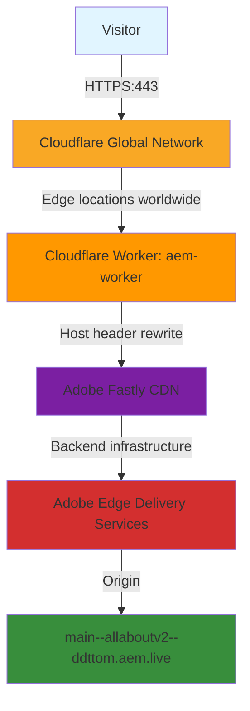

# allabout.network Cloudflare Configuration Reference

## Document Purpose

This document serves as a knowledge base for AI assistants helping with allabout.network. 
It contains the complete current Cloudflare CDN configuration, Adobe Edge Delivery Services integration, and operational details.

**Last Updated:** 9 December 2025  
**Configuration Status:** Active and operational

---

## Domain Overview

**Domain:** allabout.network  
**Registrar:** GoDaddy  
**DNS Management:** Cloudflare  
**Primary Purpose:** Personal/professional website powered by Adobe Edge Delivery Services  
**Owner:** Tom Cranstoun (Principal Consultant, Digital Domain Technologies Ltd)

---

## Current Architecture

```
┌─────────────┐
│   Visitor   │
└──────┬──────┘
       │ HTTPS (443)
       ▼
┌─────────────────────────────────┐
│  Cloudflare Global Network      │
│  - Edge locations worldwide     │
│  - SSL termination              │
│  - DDoS protection              │
│  - CDN caching                  │
└──────┬──────────────────────────┘
       │
       │ Cloudflare Worker
       │ (aem-worker)
       │ - Host header rewrite
       │ - Push invalidation handler
       │
       ▼
┌─────────────────────────────────┐
│  Adobe Fastly CDN               │
│  (Adobe's backend infrastructure)│
└──────┬──────────────────────────┘
       │
       ▼
┌─────────────────────────────────┐
│  Adobe Edge Delivery Services   │
│  Origin: main--allaboutv2--     │
│  ddttom.aem.live                │
└─────────────────────────────────┘
```

**Mermaid Diagram** (for supporting viewers):



**Key Points:**
- Double CDN architecture (Cloudflare → Adobe's Fastly)
- This is normal and expected for Adobe EDS
- Worker handles the routing between CDNs
- Both Cloudflare and Fastly headers will appear in responses

---

## Cloudflare Account Details

**Account:** tom.cranstoun@gmail.com
**Plan:** Pro ($20/month)  

### Nameservers

**Current:**
- angela.ns.cloudflare.com
- george.ns.cloudflare.com

---

## DNS Configuration

### Active DNS Records

| Type | Name | Target/Content | Proxy Status | TTL | Purpose |
|------|------|----------------|--------------|-----|---------|
| CNAME | @ | main--allaboutv2--ddttom.aem.live | Proxied (orange) | Auto | Apex domain |
| CNAME | www | main--allaboutv2--ddttom.aem.live | Proxied (orange) | Auto | WWW subdomain |

**Critical Settings:**
- Both records MUST be Proxied (orange cloud icon)
- Both point to same Adobe EDS origin
- No A records for web traffic (using CNAME)
- Auto TTL allows Cloudflare to optimise

**Important:** No email services are configured on this domain. If email is needed in future, MX and TXT records will need to be added.

---

## SSL/TLS Configuration

**Encryption Mode:** Full  
**Always Use HTTPS:** Enabled  
**Minimum TLS Version:** 1.2  
**Automatic HTTPS Rewrites:** Enabled  
**Certificate Type:** Cloudflare Universal SSL  

### Why Full (not Full strict)?

Adobe Edge Delivery Services uses Fastly's SSL certificates. These certificates don't specifically cover allabout.network, so Full (strict) mode causes certificate validation errors (HTTP 526).

**Full mode provides:**
- HTTPS encryption: Browser → Cloudflare ✓
- HTTPS encryption: Cloudflare → Origin ✓
- Certificate validation: Disabled (necessary for this setup)

**Security note:** Traffic is fully encrypted end-to-end. The lack of strict certificate validation is acceptable because Adobe EDS is a trusted origin.

---

## Cloudflare Worker Configuration

### Worker Details

**Worker Name:** aem-worker
**Type:** Cloudflare Worker (JavaScript)
**Code Source:** Adobe official repository
**GitHub URL:** https://github.com/adobe/aem-cloudflare-prod-worker
**Code URL:** https://raw.githubusercontent.com/adobe/aem-cloudflare-prod-worker/main/src/index.mjs
**Status:** Active

### Custom Worker Implementation

**Note:** This project uses a **modified version** of the Adobe EDS Cloudflare Worker with additional features.

**Custom features:**
- Version header (`cfw`) in all responses for deployment tracking
- CORS headers on all responses
- JSON-LD structured data generation from page metadata
- Metadata cleanup (removes EDS error tags)
- Trigger mechanism via authoring error workaround

**Version Management:**
- Current version: `1.0.0` (semantic versioning)
- Check deployed version: `curl -I https://allabout.network | grep cfw`
- **MUST increment** version for ALL changes to worker code
- Version validated by automated tests (45 tests passing)

**Complete documentation:** `cloudflare/files/README.md` (584 lines)
**Worker code:** `cloudflare/files/cloudflare-worker.js` (8.9 KB)

**Why custom?**
- Enables cross-origin requests for API integrations
- Improves SEO with rich structured data
- Cleans up HTML output (removes error scripts and non-social meta tags)

**Deployment notes:**
- Follow deployment steps in `cloudflare/files/README.md`
- Uses same environment variables as standard worker (ORIGIN_HOSTNAME, PUSH_INVALIDATION)
- Additional trigger: Add `| json-ld | article |` to EDS metadata

### Testing & Validation

**Automated Testing:**
- Single unified test file: `cloudflare/files/cloudflare-worker.test.js`
- 45 tests covering unit and integration testing (includes version header validation)
- Test approach: Pure functions + mocked HTMLRewriter
- Run tests: `cd cloudflare/files && npm test`
- Coverage report: `npm run test:coverage`
- Documentation: See `cloudflare/files/TESTING.md`

**Production Validation:**
- Adobe CDN validator: https://www.aem.live/tools/cdn-validator
- Manual testing via curl (see Troubleshooting section)
- Monitor worker metrics in Cloudflare Dashboard
- View real-time logs: Dashboard → Workers & Pages → aem-worker → Logs

**Test Strategy:**
The worker uses a two-file approach: one production file (`cloudflare-worker.js`) and one test file (`cloudflare-worker.test.js`). The test suite combines unit tests for helper functions with integration tests for the complete request flow, using lightweight mocks instead of complex E2E infrastructure. This ensures reliable testing without the overhead of local dev servers or port management.

### Environment Variables

| Variable Name | Value | Purpose |
|--------------|-------|---------|
| ORIGIN_HOSTNAME | main--allaboutv2--ddttom.aem.live | Adobe EDS origin hostname |
| PUSH_INVALIDATION | enabled | Enable automatic cache clearing |

**Critical:** `ORIGIN_HOSTNAME` must match exactly the Adobe EDS hostname. No https://, no trailing slash.

### Worker Routes

| Route | Zone | Failure Mode |
|-------|------|--------------|
| allabout.network/* | allabout.network | Fail closed (block) |
| www.allabout.network/* | allabout.network | Fail closed (block) |

**Route Configuration:**
- Specific routes for apex and www (not wildcard)
- Wildcard routes (`*.allabout.network/*`) avoided for security and SEO
- Fail closed means errors block requests rather than bypass worker

### What the Worker Does

1. **Intercepts requests** to allabout.network and www.allabout.network
2. **Rewrites Host header** from `allabout.network` to `main--allaboutv2--ddttom.aem.live`
3. **Forwards request** to Adobe Edge Delivery Services
4. **Handles responses** including caching headers
5. **Processes push invalidation** requests from Adobe EDS
6. **Returns content** to visitor via Cloudflare

**Why the Worker is necessary:** Cloudflare Pro plan supports Transform Rules, but the Worker approach is battle-tested and proven. Transform Rules could potentially replace the Worker for host header rewriting, but the current Worker implementation is stable and efficient (0.8ms CPU time). Consider evaluating Transform Rules as an alternative in the future if Worker limits become a concern.

### Worker Metrics

**Monthly request limit (Pro plan):** 10,000,000 requests/month (10 million)
**Daily equivalent:** ~333,000 requests/day (significantly higher than Free plan's 100K/day)
**Current usage:** ~337 requests/day (well within limits - using <0.01% of quota)
**CPU time per request:** ~0.8ms (very efficient)
**Error rate:** 0% (no errors observed)

---

## Caching Configuration

### Basic Cache Settings

**Caching Level:** Standard  
**Browser Cache TTL:** Respect Existing Headers  
**Edge Cache TTL:** Respects origin headers from Adobe EDS

### Cache Rule

**Rule Name:** Adobe Edge Delivery Caching  
**When:** Hostname contains `allabout.network`  
**Then:** 
- Eligible for cache
- Browser TTL: Respect Origin TTL

**Purpose:** Tells Cloudflare to cache content from allabout.network according to Adobe EDS cache headers.

### Cache Behavior

**Static assets (images, CSS, JS):**
- Long cache TTL (hours to days)
- High cache hit ratio expected
- Cached at Cloudflare edge

**HTML pages:**
- Shorter cache TTL (minutes to hours)
- Cache varies by URL
- Purged on content updates (via push invalidation)

**Expected cache hit ratio:** 70-80% after warm-up period

### Cache Warming

**Pro plan status:** Automatic cache warming not included in standard Pro plan features. Cache fills naturally as visitors browse the site.

**Available on:** Enterprise plans with custom configuration

**Current approach:** Cache fills organically through visitor traffic. With surgical purging on Pro plan, unchanged content remains cached, minimizing cold cache impact.

---

## Push Invalidation Configuration

Push invalidation automatically purges Cloudflare's cache when content is published in Adobe Edge Delivery Services.

**Status:** Enabled and active

### Cloudflare Credentials

**Zone ID:** [Stored in Adobe EDS config]
**API Token:** [Stored in Adobe EDS config]
**Token Permissions:** Zone → Cache Purge → Purge
**Token Scope:** Specific zone (allabout.network only)

**Security note:** API token is scoped to minimum necessary permissions (cache purge only) and specific zone only.

### API Token Audit Checklist

Use this checklist to verify API token security and compliance:

- [ ] **Minimum Permissions**: Token has only Cache Purge permission (no additional permissions)
- [ ] **Zone Scope**: Token is limited to allabout.network zone only (not all zones)
- [ ] **Token Expiration**: Token expiration set if available (consider 1-year rotation)
- [ ] **Clear Naming**: Token name clearly identifies purpose (e.g., "allabout-cache-purge")
- [ ] **Rotation Schedule**: Token rotation date recorded in change log
- [ ] **Old Token Cleanup**: Previous tokens revoked after successful rotation
- [ ] **Secure Storage**: Token stored securely in Adobe EDS config (never in public repos)
- [ ] **Access Control**: Only authorized personnel have access to token
- [ ] **Testing**: Token tested after creation/rotation using validation tool
- [ ] **Documentation**: Token creation date and purpose documented

**Recommended Actions:**
- Review this checklist quarterly or after any security incidents
- Rotate token annually as a security best practice
- Document rotation in the Change Log section

### Adobe EDS Configuration

Configuration stored in Adobe EDS project config file (`.helix/config.xlsx` or `.helix/config`):

| Key | Value | Purpose |
|-----|-------|---------|
| name | Helix website | Project name |
| host | allabout.network | Production hostname |
| cdn.prod.type | cloudflare | CDN vendor |
| cdn.prod.host | allabout.network | Production domain |
| cloudflare.apiToken | [secure token] | Cloudflare API access |
| cloudflare.zoneId | [zone ID] | Cloudflare zone identifier |
| cdn.preview.host | main--allaboutv2--ddttom.aem.page | Preview hostname |


### How Push Invalidation Works

1. **Content published** in Adobe EDS (via Sidekick)
2. **Adobe EDS triggers** push invalidation webhook
3. **Cloudflare API called** using stored credentials
4. **Cache purged** - Pro plan uses surgical purging (only changed URLs invalidated)
5. **Next request** for changed URLs fetches fresh content from origin
6. **Content re-cached** for subsequent visitors

### Pro Plan Behavior (Surgical Cache Purging)

**What happens on publish:**
- **Only changed URLs** are invalidated (not entire site)
- Unchanged content remains cached and served efficiently
- Surgical purging targets specific paths/URLs
- Rest of site cache remains warm and performant

**Performance impact:**
- **Minimal performance impact** - only changed pages need re-caching
- No cold cache for unchanged pages
- Near-instant content updates for changed URLs
- Site-wide performance remains optimal during publishing

**Plan comparison:**
- **Free plan:** Full site purge on every publish (all cache cleared)
- **Pro plan:** Surgical purging (only changed URLs) - ✅ Current plan
- **Enterprise:** Surgical purging plus advanced cache analytics

### Testing Push Invalidation

Verify it's working:

```bash
# Before publishing
curl -I https://allabout.network | grep cf-cache-status
# Should show: HIT

# Publish content in Adobe EDS via Sidekick
# Wait 5-10 seconds

# After publishing
curl -I https://allabout.network | grep cf-cache-status
# Should show: MISS (cache was purged)

# Request again
curl -I https://allabout.network | grep cf-cache-status
# Should show: HIT (newly cached)
```

Or use Adobe's validation tool: https://www.aem.live/tools/cdn-validator

---

## Adobe Edge Delivery Services Integration

### Origin Configuration

**Origin Hostname:** main--allaboutv2--ddttom.aem.live  
**Origin Type:** Adobe Edge Delivery Services  
**Backend CDN:** Fastly (Adobe-managed)  
**Content Source:** Adobe Experience Manager / Document-based authoring

### Origin Details

**Format breakdown:**
- `main` = Git branch
- `allaboutv2` = Repository name
- `ddttom` = GitHub owner/organisation
- `.aem.live` = Adobe EDS production domain

**Preview URL:** main--allaboutv2--ddttom.aem.page (different domain for preview)

### How Origin Resolution Works

When visitor requests `https://allabout.network`:

1. **DNS resolves** to Cloudflare IP (104.21.41.41 or 172.67.159.249)
2. **Request hits** Cloudflare edge server
3. **Worker intercepts** and rewrites Host header to `main--allaboutv2--ddttom.aem.live`
4. **Cloudflare fetches** from that hostname
5. **DNS resolves** `main--allaboutv2--ddttom.aem.live` to Fastly IP (199.232.89.91 via n.sni.global.fastly.net)
6. **Adobe's Fastly** serves content from Adobe EDS
7. **Response flows back** through Cloudflare to visitor
8. **Cloudflare caches** the response

### Expected HTTP Headers

Responses include headers from both Cloudflare and Adobe's Fastly:

```
server: cloudflare
cf-ray: [Cloudflare edge identifier]
cf-cache-status: [HIT/MISS/DYNAMIC]
x-served-by: cache-lga21965 [Fastly cache identifier]
```

**This is normal and expected.** Both sets of headers appearing confirms the double-CDN architecture is working correctly.

---

## Performance Characteristics

### Expected Performance

**Cache Hit Ratio:**
- Target: 70-80% for static content
- After warm-up: 70-80%+

**Response Times:**
- Cached content: 50-150ms (very fast, served from Cloudflare edge)
- Cache miss: 300-800ms (fetches from Adobe EDS via Fastly)
- First visit after publish: 300-800ms (cache cleared, fresh fetch)

**Time to First Byte (TTFB):**
- Cache hit: <100ms
- Cache miss: 200-500ms

### Geographic Distribution

**Cloudflare edge locations:** 300+ data centres worldwide  
**Coverage:** Excellent global coverage  
**User location:** Content served from nearest Cloudflare edge

**Note:** Tom is UK-based, so most testing shows London/European edge servers, but global visitors use their local edges.

---

## Security Configuration

### DDoS Protection

**Status:** Active (Cloudflare Pro plan)
**Type:** Automatic, always-on
**Coverage:** L3/L4 and L7 DDoS attacks
**No configuration needed:** Works automatically

### Security Level

**Setting:** Medium (default)  
**Challenge threshold:** Standard  
**Bot protection:** Basic (free tier)

### WAF (Web Application Firewall)

**Status:** Available on Pro plan (not yet configured)
**Configuration:** Can create custom security rules to protect against common web exploits
**Next Steps:** Consider configuring WAF rules for enhanced security based on traffic patterns

### Rate Limiting

**Status:** Available on Pro plan (not yet configured)
**Configuration:** Can be enabled as needed for DDoS protection and API endpoint protection
**Use Cases:** Protect against brute force attacks, API abuse, or excessive requests

### SSL/TLS Encryption

**Mode:** Full  
**Minimum TLS:** 1.2  
**Certificate:** Cloudflare Universal SSL (auto-renewed)  
**HTTPS Enforced:** Yes (Always Use HTTPS enabled)

### Bot Protection

**Bot Fight Mode:** Not enabled (available on Free plan if needed)  
**Challenge:** CAPTCHAs for suspicious traffic (medium security level)

---

## Monitoring and Analytics

### Cloudflare Analytics

**Available metrics:**
- Requests per day/hour
- Bandwidth usage
- Threats blocked
- Cache hit ratio
- Status codes
- Geographic distribution
- Top paths

**Access:** Dashboard → Analytics & Logs → Traffic

### Worker Metrics

**Available metrics:**
- Request count
- Error rate
- CPU time
- Success rate

**Access:** Workers & Pages → aem-worker → Metrics

**Current status:**
- Requests: ~337/day (using <0.01% of Pro plan's 10M/month quota)
- CPU time: 0.8ms average (very efficient)
- Errors: 0%
- Success rate: 100%

### Recommended Monitoring

**Daily checks (first week):**
- Cache hit ratio trending upward
- Error rates remaining at 0%
- Worker request count well under limits
- No certificate errors

**Weekly checks (ongoing):**
- Analytics for traffic patterns
- Cache performance
- Any security threats blocked

### Automation Opportunities

**Health Check Script** (potential implementation):

```bash
#!/bin/bash
# cloudflare-health-check.sh
# Quick validation of Cloudflare + Adobe EDS integration

echo "=== Cloudflare + Adobe EDS Health Check ==="
echo ""

echo "1. Checking DNS resolution..."
DNS_RESULT=$(dig allabout.network +short | head -1)
if [[ $DNS_RESULT =~ ^104\.|^172\. ]]; then
  echo "   ✓ DNS resolves to Cloudflare: $DNS_RESULT"
else
  echo "   ✗ DNS issue: $DNS_RESULT"
fi
echo ""

echo "2. Checking HTTPS and SSL..."
SSL_STATUS=$(curl -sI https://allabout.network | grep -i "server:")
CACHE_STATUS=$(curl -sI https://allabout.network | grep -i "cf-cache-status:")
echo "   Server: $SSL_STATUS"
echo "   Cache: $CACHE_STATUS"
echo ""

echo "3. Checking origin resolution..."
ORIGIN=$(dig main--allaboutv2--ddttom.aem.live +short | head -1)
echo "   Origin resolves to: $ORIGIN"
echo ""

echo "4. Checking HTTP status..."
HTTP_CODE=$(curl -s -o /dev/null -w "%{http_code}" https://allabout.network)
if [ "$HTTP_CODE" = "200" ]; then
  echo "   ✓ Site returns HTTP $HTTP_CODE"
else
  echo "   ✗ Site returns HTTP $HTTP_CODE"
fi
echo ""

echo "=== Health Check Complete ==="
```

**Usage:**
```bash
chmod +x cloudflare-health-check.sh
./cloudflare-health-check.sh
```

**Note**: This script is not currently implemented, but provides a starting point for automated health monitoring. Consider adding Cloudflare API calls for worker metrics if needed.

---

## Troubleshooting Guide

### Common Issues and Solutions

#### Site Not Loading

**Check:**
1. DNS propagation complete: `dig allabout.network +short`
2. Should return Cloudflare IPs (104.x.x.x or 172.x.x.x)
3. Worker active and deployed
4. Routes configured correctly

**Solution:** Check Cloudflare dashboard for service status

#### Certificate Errors

**Symptoms:** Browser shows SSL warning

**Common causes:**
- SSL/TLS mode set to Full (strict) instead of Full
- Certificate still provisioning (takes 5-10 minutes)

**Solution:** Verify SSL/TLS mode is "Full" not "Full strict"

#### 421 Mismatch Error

**Symptoms:** HTTP 421 error

**Common causes:**
- Worker not active
- ORIGIN_HOSTNAME incorrect
- Routes not configured

**Solution:** 
1. Verify worker routes are active
2. Check ORIGIN_HOSTNAME = main--allaboutv2--ddttom.aem.live
3. Review worker logs for errors

#### Cache Not Clearing After Publish

**Symptoms:** Old content still showing after publishing

**Common causes:**
- Push invalidation not configured correctly
- API token invalid or expired
- Worker missing PUSH_INVALIDATION=enabled

**Solution:**
1. Test with validation tool: https://www.aem.live/tools/cdn-validator
2. Verify API token still valid
3. Check worker has PUSH_INVALIDATION=enabled
4. Manual cache purge: Caching → Purge Everything (temporary workaround)

#### Slow Performance

**Expected during:**
- Immediately after publishing (cache purged)

**Investigate if:**
- Cache hit ratio below 60%
- TTFB consistently over 1 second

**Check:**
1. Cache hit ratio in analytics
2. Worker CPU time (should be <5ms)
3. Adobe EDS origin health
4. Cache rules configured correctly

---

## Operational Procedures

### Publishing Content

**Normal workflow:**
1. Edit content in Adobe EDS (SharePoint/Google Docs)
2. Use Sidekick extension to preview changes
3. Click "Publish" in Sidekick
4. Wait 5-10 seconds for push invalidation
5. Content appears live immediately

**What happens:**
- Adobe EDS notifies Cloudflare
- Cloudflare purges cache (entire site on Free plan)
- Next visitor gets fresh content
- Content re-caches automatically

### Manual Cache Purging

**When needed:**
- Push invalidation fails
- Need to force cache clear
- Testing cache behavior

**How to purge:**
1. Cloudflare dashboard
2. Caching → Configuration
3. Purge Cache → Purge Everything
4. Confirm

**Warning:** Cache purge causes performance dip for 10-30 minutes whilst cache rebuilds.

### Updating Worker Code

**When needed:**
- Adobe releases worker updates
- Bug fixes
- New features

**How to update:**
1. Get latest code: https://raw.githubusercontent.com/adobe/aem-cloudflare-prod-worker/main/src/index.mjs
2. Workers & Pages → aem-worker → Quick Edit
3. Select all code, delete
4. Paste new code
5. Deploy
6. Test site still works

### Rotating API Token

**When needed:**
- Token compromised
- Security policy requires rotation
- Token expiring

**How to rotate:**
1. Create new API token in Cloudflare
2. Update Adobe EDS config with new token
3. Publish config via Sidekick
4. Test push invalidation works
5. Revoke old token

### DNS Changes

**Adding subdomains:**
1. Add CNAME record in Cloudflare DNS
2. Point to main--allaboutv2--ddttom.aem.live
3. Enable Proxy (orange cloud)
4. Add worker route for new subdomain
5. Test subdomain loads correctly

**Important:** Never use wildcard DNS records or routes for security and SEO reasons.

---

## Current Plan Features and Upgrade Path

### Pro Plan Features (Current - $20/month)

**Active features on Pro plan:**
- ✅ **Surgical cache purging** - Only changed URLs invalidated (major performance win)
- ✅ **WAF rules** - Custom security rules available (not yet configured)
- ✅ **Rate limiting** - DDoS and API protection available (not yet configured)
- ✅ **Image optimization** - Polish and compression features (not yet configured)
- ✅ **Priority support** - Faster response times than Free plan
- ✅ **Advanced analytics** - Enhanced traffic insights and reporting
- ✅ **20 Page Rules** - More flexibility than Free plan's 3 rules
- ✅ **Mobile optimization** - Improved mobile performance features
- ✅ **CDN functionality** - Unlimited bandwidth (same as Free)
- ✅ **SSL certificates** - Automatic provisioning and renewal
- ✅ **DDoS protection** - L3/L4 and L7 protection
- ✅ **Workers** - 10 million requests/month (vs. 100K/day on Free)

**What we gained from Free → Pro upgrade:**
1. **Surgical cache purging** (biggest benefit) - No more full site cache clears
2. **WAF and rate limiting** - Enhanced security capabilities
3. **Image optimization** - Reduce bandwidth and improve load times
4. **Priority support** - Faster help when needed
5. **Advanced analytics** - Better insights into traffic and performance
6. **More page rules** - Greater configuration flexibility

**Features not yet configured:**
- WAF custom rules (available but needs configuration)
- Rate limiting rules (available but needs configuration)
- Image optimization (Polish) (available but needs enabling)
- Mobile optimization features (available but needs tuning)

### Comparison: Free vs. Pro vs. Enterprise

| Feature | Free | **Pro (Current)** | Enterprise |
|---------|------|-------------------|------------|
| **Cache Purging** | Full site only | ✅ Surgical (URLs) | Surgical + analytics |
| **WAF Rules** | ❌ | ✅ Yes | Advanced WAF |
| **Rate Limiting** | ❌ | ✅ Yes | Advanced + API |
| **Image Optimization** | ❌ | ✅ Polish | Polish + Mirage |
| **Support** | Email | ✅ Priority | Dedicated 24/7 |
| **Analytics** | Basic | ✅ Advanced | Enterprise |
| **Page Rules** | 3 | ✅ 20 | 125 |
| **Worker Requests** | 100K/day | ✅ 10M/month | Unlimited |
| **Cost** | £0/month | ✅ **£16/month** | £160-£1000+/month |

### Future Upgrade: Enterprise Plan

**Consider Enterprise only if:**
- Very high traffic (millions of requests/day) - not currently needed
- Need 99.95% uptime SLA - not required for current use case
- Advanced security requirements - Pro plan adequate for now
- Multiple team members managing infrastructure
- Need dedicated support engineer
- Custom SSL certificate requirements

**Current assessment:** Enterprise is significant overkill for allabout.network. Pro plan provides excellent balance of features and cost for professional/business site needs.

---

## Best Practices

### Content Publishing

**Do:**
- Test changes in preview before publishing
- Use Sidekick for all publishing operations
- Wait 10-15 seconds after publishing before checking live site
- Clear browser cache when testing (Cmd+Shift+R)

**Don't:**
- Manually purge Cloudflare cache unless necessary
- Publish multiple times rapidly (even with surgical purging, give cache time to serve)
- Worry about publishing performance impact - Pro plan surgical purging is highly efficient

### Worker Management

**Do:**
- Keep worker code updated from Adobe's official repository
- Monitor worker metrics regularly
- Keep environment variables secure
- Document any custom modifications

**Don't:**
- Modify worker code unless necessary (Adobe's code is well-tested)
- Share API tokens or Zone IDs publicly
- Delete worker routes accidentally (site will break)
- Worry about request limits - Pro plan provides 10M requests/month (far beyond current needs)

### Security

**Do:**
- Keep API tokens with minimum necessary permissions
- Rotate tokens periodically (annually minimum)
- Monitor security analytics for threats
- Keep SSL/TLS mode at Full (not Flexible)

**Don't:**
- Use Full (strict) SSL mode (causes 526 errors with Adobe EDS)
- Disable Always Use HTTPS
- Ignore security warnings in analytics
- Share account credentials

### Monitoring

**Do:**
- Check analytics weekly
- Monitor cache hit ratio (aim for 70%+)
- Review worker error rates
- Watch for unusual traffic patterns

**Don't:**
- Ignore sustained high error rates
- Assume everything's fine without checking
- Wait for users to report issues
- Forget to monitor after making changes

---

## Support and Resources

### Primary Contacts

**Domain Owner:** Tom Cranstoun  
**Email:** tom.cranstoun@gmail.com  
**Company:** Digital Domain Technologies Ltd

### Official Documentation

**Adobe Edge Delivery Services:**
- Documentation: https://www.aem.live/docs/
- Cloudflare setup: https://www.aem.live/docs/byo-cdn-cloudflare-worker-setup
- Push invalidation: https://www.aem.live/docs/setup-byo-cdn-push-invalidation
- CDN validator: https://www.aem.live/tools/cdn-validator
- Discord: https://discord.gg/aem-live

**Cloudflare:**
- Dashboard: https://dash.cloudflare.com
- Workers docs: https://developers.cloudflare.com/workers/
- DNS docs: https://developers.cloudflare.com/dns/
- Community: https://community.cloudflare.com/

### Related Project Documentation

**allabout.network Documentation:**
- **EDS Architecture**: `../docs/for-ai/implementation/eds-architecture-standards.md` - Core EDS architecture patterns and standards
- **Build Process**: `../docs/for-ai/implementation/build-blocks-clarification.md` - Dual-directory pattern for complex components
- **Security Guidelines**: `../docs/for-ai/guidelines/security-checklist.md` - Security validation checklist
- **Block Architecture**: `../docs/for-ai/implementation/block-architecture-standards.md` - Block development standards
- **Design System**: `../docs/for-ai/guidelines/design-system.md` - Design tokens and component patterns
- **Custom Worker Implementation**: `files/README.md` - Custom features (CORS, JSON-LD) deployment guide
- **Project Guide**: `../CLAUDE.md` - Complete project overview for AI assistants
- **Documentation Index**: `../docs/for-ai/index.md` - Navigation hub for all documentation

### Quick Reference Commands

**Check DNS:**
```bash
dig allabout.network +short
dig www.allabout.network +short
dig allabout.network NS +short
```

**Check HTTP headers:**
```bash
curl -I https://allabout.network
curl -I https://www.allabout.network
```

**Check cache status:**
```bash
curl -I https://allabout.network | grep cf-cache-status
```

**Check SSL:**
```bash
curl -I https://allabout.network | grep -E "(server|ssl|tls)"
```

**Check origin resolution:**
```bash
dig main--allaboutv2--ddttom.aem.live +short
```

### Emergency Contacts

**Cloudflare Issues:**
- Community forum: https://community.cloudflare.com/
- Status page: https://www.cloudflarestatus.com/
- Support: Priority support via dashboard (Pro plan: faster response times than Free)

**Adobe EDS Issues:**
- Discord: https://discord.gg/aem-live
- Status: https://status.adobe.com/products/503489
- Documentation: https://www.aem.live/docs/

**Domain Registrar (GoDaddy):**
- Only needed for nameserver changes
- Account: tom.cranstoun@gmail.com
- Support: https://uk.godaddy.com/contact-us

---

## Future Considerations

### Potential Enhancements

**Email Service:**
- Currently no email configured
- If needed: Add MX, SPF, DKIM records
- Consider: Google Workspace, Microsoft 365, or Cloudflare Email Routing

**Additional Subdomains:**
- blog.allabout.network (if blog section added)
- Could point to same Adobe EDS or different service
- Would need DNS CNAME and worker route

**Performance Optimisation:**
- Auto Minify (available and can be enabled)
- **Image optimisation** (now available on Pro plan - not yet configured)
- Additional cache rules (available on Pro, can be configured as needed)
- Polish image optimization (Pro feature - lossless/lossy compression)

**Security Enhancement:**
- **WAF rules** (now available on Pro plan - not yet configured)
- **Rate limiting** (now available on Pro plan - not yet configured)
- Bot management (enhanced features available on Pro)
- Custom firewall rules for specific threat protection

### Monitoring Improvements

**Recommended additions:**
- Third-party uptime monitoring (e.g., UptimeRobot)
- Performance monitoring (e.g., WebPageTest scheduled tests)
- Synthetic monitoring for key user journeys

### Cost Analysis

**Current cost:** £16/month (approx. $20/month Cloudflare Pro)

**Upgrade from Free to Pro rationale:**
- Surgical cache purging (only changed URLs invalidated vs. entire site)
- Significantly improved performance after content publishing
- WAF rules for enhanced security
- Rate limiting for DDoS and API protection
- Image optimization capabilities
- Priority support with faster response times
- Advanced analytics and insights

**Further upgrade options:**
- Business: $200/month (£160/month) - Advanced security, guaranteed uptime SLA
- Enterprise: Custom pricing (thousands/month) - Dedicated support, custom solutions

**Recommendation:** Pro plan provides excellent value for professional/business sites requiring enhanced performance and security features.

---

## Appendix: Configuration Checklist

Use this checklist to verify configuration if troubleshooting or rebuilding setup:

### DNS Configuration
- [ ] Nameservers point to Cloudflare (angela.ns.cloudflare.com, george.ns.cloudflare.com)
- [ ] CNAME @ → main--allaboutv2--ddttom.aem.live (Proxied)
- [ ] CNAME www → main--allaboutv2--ddttom.aem.live (Proxied)
- [ ] No conflicting A records
- [ ] DNS propagation complete (dig returns Cloudflare IPs)

### SSL/TLS Configuration
- [ ] Encryption mode: Full (not Flexible or Full strict)
- [ ] Always Use HTTPS: Enabled
- [ ] Minimum TLS version: 1.2 or higher
- [ ] Universal SSL certificate: Active
- [ ] No certificate errors when browsing

### Cache Configuration
- [ ] Caching Level: Standard
- [ ] Browser Cache TTL: Respect Existing Headers
- [ ] Cache rule created for hostname
- [ ] Cache rule: Browser TTL set to Respect Origin TTL
- [ ] Cache hit ratio improving over time

### Worker Configuration
- [ ] Worker name: aem-worker
- [ ] Code: Latest from Adobe GitHub
- [ ] Environment variable: ORIGIN_HOSTNAME = main--allaboutv2--ddttom.aem.live
- [ ] Environment variable: PUSH_INVALIDATION = enabled
- [ ] Route: allabout.network/*
- [ ] Route: www.allabout.network/*
- [ ] Worker metrics showing requests
- [ ] No errors in worker logs

### Push Invalidation
- [ ] Adobe EDS config: cdn.prod.type = cloudflare
- [ ] Adobe EDS config: cdn.prod.host = allabout.network
- [ ] Adobe EDS config: cloudflare.apiToken = [token]
- [ ] Adobe EDS config: cloudflare.zoneId = [zone ID]
- [ ] Config published via Sidekick
- [ ] Test publish clears cache
- [ ] Validation tool shows success

### Verification
- [ ] Site loads at https://allabout.network
- [ ] Site loads at https://www.allabout.network
- [ ] HTTP redirects to HTTPS
- [ ] No SSL warnings
- [ ] Headers show "server: cloudflare"
- [ ] Cache status header present (cf-cache-status)
- [ ] Content displays correctly
- [ ] All pages accessible
- [ ] Publishing workflow works

---

## Document Maintenance

**Owner:** Tom Cranstoun
**Created:** 9 December 2025
**Last Updated:** 9 December 2025
**Review Schedule:** Quarterly or after significant changes
**Version:** 1.1

**Update this document when:**
- Configuration changes made
- Workers updated
- DNS records modified
- Push invalidation settings changed
- Cloudflare plan upgraded
- Issues discovered and resolved
- Best practices identified

---

## Change Log

### 2025-12-09 - Upgraded to Cloudflare Pro Plan (Version 1.1)
**Major upgrade from Free to Pro plan ($20/month)**

**Key improvements gained:**
- ✅ **Surgical cache purging** - Only changed URLs invalidated (biggest performance improvement)
- ✅ **WAF rules** - Custom security rules now available (not yet configured)
- ✅ **Rate limiting** - DDoS and API protection now available (not yet configured)
- ✅ **Image optimization** - Polish compression features now available (not yet configured)
- ✅ **Priority support** - Faster response times than Free plan
- ✅ **Advanced analytics** - Enhanced traffic insights and reporting
- ✅ **20 Page Rules** - Up from 3 on Free plan
- ✅ **10M worker requests/month** - Up from 100K/day on Free plan

**Documentation updates:**
- Updated Account Details section (line 87) to reflect Pro plan
- Rewrote "Upgrade Considerations" as "Current Plan Features and Upgrade Path" (lines 688-744)
- Updated Cost Analysis (lines 906-923) to show £16/month cost and Pro upgrade rationale
- Rewrote Push Invalidation section (lines 277-303) to document surgical cache purging
- Updated WAF section (lines 418-422) to show available but not yet configured
- Updated Rate Limiting section (lines 424-428) to show available but not yet configured
- Updated Worker Metrics (lines 180-186) with Pro plan 10M/month quota
- Updated Future Considerations sections (lines 887-897) to show Pro features as "now available"
- Updated Best Practices (lines 759-762, 772-776) to reflect surgical purging and higher quotas
- Updated Security sections to reflect Pro plan status
- Updated Support section (line 857) to document priority support
- Updated Cache Warming section (lines 222-228) to clarify Pro plan status
- Added comprehensive Free vs. Pro vs. Enterprise comparison table (lines 720-732)

**Configuration notes:**
- Current cost: £16/month (approx. $20/month USD)
- Worker quotas significantly increased (10M/month vs. 100K/day)
- Surgical cache purging eliminates full site cache clears on publish
- Pro features available but not yet configured: WAF, Rate Limiting, Image Optimization
- Transform Rules now available as potential Worker alternative (noted for future evaluation)

### 2025-12-09 - Initial Documentation (Version 1.0)
- Documented complete Cloudflare configuration
- Added worker setup details (aem-worker with ORIGIN_HOSTNAME and PUSH_INVALIDATION)
- Included push invalidation configuration with API token setup
- Documented DNS configuration (CNAME records for apex and www)
- Added SSL/TLS configuration (Full mode)
- Included cache configuration and rules
- Added troubleshooting guide and operational procedures
- Documented architecture with ASCII diagram
- Added monitoring guidance and metrics
- Included configuration checklist for validation
- Added upgrade considerations and cost analysis

---

## End of Document

This reference document provides complete details of the current allabout.network Cloudflare configuration for use by AI assistants helping Tom Cranstoun manage the site. All configuration details are current as of 9 December 2025.