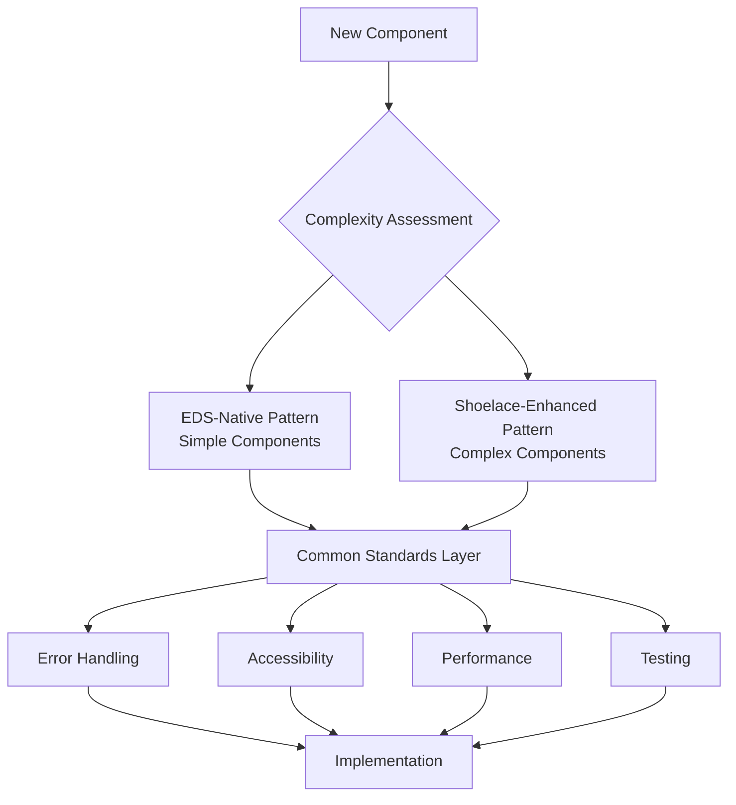

# EDS Block Architecture Standards Guide

## Executive Summary

This document establishes two complementary architectural patterns for EDS block development, ensuring consistency while providing flexibility based on component complexity. Both patterns share common standards for error handling, accessibility, and performance.

### AI-Assisted Development Philosophy

This architecture embraces **local-first development that enables meaningful AI assistance**. Traditional EDS development workflows create barriers for AI assistance by fragmenting work across multiple systems (Google Docs, SharePoint, code repositories). Our approach implements a **local-first, proxy-fallback development server** that:

- **Unifies Environment**: AI sees code, content, and data in one place
- **Enables Real-time Feedback**: Save a file and refresh - changes appear instantly  
- **Provides Complete Context**: Work on code and content together without system switching
- **Supports Intelligent Assistance**: AI can analyze, test, and suggest improvements with full visibility

The development server checks if requested files exist locally first. If they do, it serves that file. If not, it fetches from your production server and passes it through. This simple but powerful pattern enables individual block development without juggling multiple systems while still accessing real EDS resources.

## Architecture Overview



## Pattern Selection Criteria

### EDS-Native Pattern (Simple Components)

**Use When:**

- Simple or no state management required
- Custom styling needs
- Performance is critical
- Minimal dependencies preferred
- No build process required

**File Structure:**

```bash
/blocks/{component-name}/
├── {component-name}.js
├── {component-name}.css
├── test.html
├── README.md
└── example.md
```

**Examples:** floating-alert, banners, simple cards, content blocks, text components

### Shoelace-Enhanced Pattern (Complex Components)

**Use When:**

- Component has 5+ interactive elements
- Complex state management required
- Rich UI components needed
- Advanced glassmorphism effects and immersive modals required
- Multi-component assembly and coordination needed
- Consistent Shoelace design system appearance critical
- Advanced interactions required
- External dependencies need bundling
- FOUC elimination and performance optimization critical

**File Structure:**

```bash
/build/{component-name}/           # Source files for development
├── {component-name}.js           # Source implementation
├── {component-name}.css          # Source styles
├── {component-name}-stub.css     # Stub CSS file for deployment
├── index.html                    # Development test file
├── package.json                  # Dependencies and build scripts
├── vite.config.js               # Build configuration
├── deploy.js                     # Deployment script
├── DEV-README.md                 # Development documentation
├── USER-README.md                # User documentation for deployment
└── dist/                         # Build output directory
    └── {component-name}.js       # Bundled implementation

/blocks/{component-name}/          # Built files for EDS deployment
├── {component-name}.js           # Bundled implementation (copied from dist/)
├── {component-name}.css          # Stub CSS file (styles bundled in JS)
├── test.html                     # EDS test file
├── README.md                     # Usage documentation (copied from USER-README.md)
└── example.md                    # Content author examples
```

**Build Process:**

- Development happens in `/build/{component-name}/`
- `npm run build` bundles dependencies using Vite into `dist/` directory
- `npm run deploy` runs the complete build and deployment process:
  - Builds the self-contained component with Vite
  - Bundles all dependencies into a single JavaScript file
  - Copies built component from `dist/` to `../../blocks/{component-name}/`
  - Copies stub CSS file (styles are bundled in JS)
  - Copies user documentation from `USER-README.md` to `README.md`
- Uses `deploy.js` script for automated file copying and deployment

**Examples:** shoelace-card (with advanced glassmorphism and immersive modals), data tables, complex forms, dashboards, interactive modals

### Multi-Component Assembly Architecture

The Shoelace-Enhanced pattern demonstrates sophisticated **multi-component assembly** where multiple Shoelace components are coordinated to create rich user interfaces:

```javascript
// Core component assembly for rich UI experiences
const components = ['sl-card', 'sl-button', 'sl-badge', 'sl-icon-button', 'sl-spinner'];

// Components are imported at module level for bundling
import '@shoelace-style/shoelace/dist/components/card/card.js';
import '@shoelace-style/shoelace/dist/components/button/button.js';
import '@shoelace-style/shoelace/dist/components/badge/badge.js';
import '@shoelace-style/shoelace/dist/components/icon-button/icon-button.js';
import '@shoelace-style/shoelace/dist/components/spinner/spinner.js';
```

#### Component Coordination Patterns

**1. Hierarchical Component Structure**
```javascript
// Primary container: sl-card provides the foundational structure
function createCardContainer(cardData) {
  const card = document.createElement('sl-card');
  card.className = 'shoelace-enhanced-card';
  
  // Secondary components: sl-badge for categorization
  const categoryBadge = document.createElement('sl-badge');
  categoryBadge.variant = 'primary';
  categoryBadge.textContent = cardData.category || 'Featured';
  
  // Interactive elements: sl-button for primary actions
  const actionButton = document.createElement('sl-button');
  actionButton.variant = 'primary';
  actionButton.size = 'medium';
  actionButton.textContent = cardData.buttonText || 'Learn More';
  
  // Utility components: sl-icon-button for secondary actions
  const favoriteButton = document.createElement('sl-icon-button');
  favoriteButton.name = 'heart';
  favoriteButton.label = 'Add to favorites';
  
  return { card, categoryBadge, actionButton, favoriteButton };
}
```

**2. State Management Across Components**
```javascript
// Coordinated state management for multiple components
class ShoelaceCardState {
  constructor() {
    this.isLoading = false;
    this.isFavorited = false;
    this.isModalOpen = false;
    this.components = new Map();
  }
  
  // Loading state coordination
  setLoadingState(isLoading) {
    this.isLoading = isLoading;
    
    // Update spinner visibility
    const spinner = this.components.get('spinner');
    if (spinner) {
      spinner.style.display = isLoading ? 'block' : 'none';
    }
    
    // Update button states
    const buttons = this.components.get('buttons') || [];
    buttons.forEach(button => {
      button.loading = isLoading;
      button.disabled = isLoading;
    });
  }
}
```

### Build & Deploy Commands

```bash
# Development server with hot reload
npm run dev

# Build component into dist/ directory
npm run build

# Complete build and deployment to blocks/ directory
npm run deploy

# Build, deploy, and show testing instructions
npm run test
```

- **npm run dev**: Starts development server with hot reload and proxy support
- **npm run build**: Bundles component with all dependencies into `dist/` directory
- **npm run deploy**: Runs build + copies files to `../../blocks/{component-name}/`
- **npm run test**: Runs deploy + provides testing instructions

## Common Standards (Both Patterns)

### 1. File Structure

```bash
/blocks/{component-name}/
├── {component-name}.js          # Core functionality
├── {component-name}.css         # Component styles
├── test.html                    # Standardized test file
├── README.md                    # Documentation
├── example.md                   # Content author examples
└── {component-name}.test.js     # Unit tests (optional)
```

### 2. JavaScript Architecture Standards

#### Configuration Constants Pattern

```javascript
const COMPONENT_CONFIG = {
  // Performance settings
  ANIMATION_DURATION: 300,
  DEBOUNCE_DELAY: 250,
  
  // Error handling
  MAX_RETRY_ATTEMPTS: 3,
  TIMEOUT_DURATION: 5000,
  
  // Accessibility
  FOCUS_TRAP_ENABLED: true,
  ARIA_LIVE_REGION: 'polite',
  
  // User messages
  LOADING_MESSAGE: 'Loading content...',
  ERROR_MESSAGE: 'Unable to load content. Please try again.',
  SUCCESS_MESSAGE: 'Content loaded successfully',
  
  // Feature flags
  ENABLE_ANALYTICS: true,
  ENABLE_DEBUG_LOGGING: false
};
```

#### Standard Decorate Function Structure

```javascript
export default async function decorate(block) {
  try {
    // 1. Early validation and setup
    if (!block || !block.children.length) {
      throw new Error('Invalid block structure');
    }
    
    // 2. Configuration and state initialization
    const config = { ...COMPONENT_CONFIG };
    
    // 3. Content extraction (pattern-specific)
    const content = extractContent(block);
    
    // 4. DOM element creation
    const container = createComponentStructure(content, config);
    
    // 5. Event handlers setup
    setupEventHandlers(container, config);
    
    // 6. Accessibility implementation
    setupAccessibility(container);
    
    // 7. Replace block content
    block.innerHTML = '';
    block.appendChild(container);
    
    // 8. Return cleanup function (optional)
    return () => cleanup(container);
    
  } catch (error) {
    handleComponentError(error, block);
  }
}
```

### 3. Error Handling Standards

#### Standard Error Handling Pattern

```javascript
function handleComponentError(error, block, config = {}) {
  // Log error for debugging
  console.error(`Component Error [${block.className}]:`, error);
  
  // Show user-friendly error state
  const errorContainer = document.createElement('div');
  errorContainer.className = 'component-error';
  errorContainer.setAttribute('role', 'alert');
  errorContainer.innerHTML = `
    <div class="error-content">
      <p>${config.ERROR_MESSAGE || 'Unable to load content. Please try again.'}</p>
      <button class="retry-button" onclick="location.reload()">Retry</button>
    </div>
  `;
  
  block.innerHTML = '';
  block.appendChild(errorContainer);
}

// Network request error handling
async function fetchWithRetry(url, options = {}, maxRetries = 3) {
  for (let attempt = 1; attempt <= maxRetries; attempt++) {
    try {
      const response = await fetch(url, {
        ...options,
        signal: AbortSignal.timeout(COMPONENT_CONFIG.TIMEOUT_DURATION)
      });
      
      if (!response.ok) {
        throw new Error(`HTTP ${response.status}: ${response.statusText}`);
      }
      
      return response;
    } catch (error) {
      if (attempt === maxRetries) throw error;
      await new Promise(resolve => setTimeout(resolve, 1000 * attempt));
    }
  }
}
```

### 4. Accessibility Standards

#### Required Accessibility Implementation

```javascript
function setupAccessibility(container) {
  // 1. Semantic HTML structure
  ensureSemanticStructure(container);
  
  // 2. ARIA attributes
  setupAriaAttributes(container);
  
  // 3. Keyboard navigation
  setupKeyboardNavigation(container);
  
  // 4. Focus management
  setupFocusManagement(container);
  
  // 5. Screen reader support
  setupScreenReaderSupport(container);
}

function setupKeyboardNavigation(container) {
  const focusableElements = container.querySelectorAll(
    'button, [href], input, select, textarea, [tabindex]:not([tabindex="-1"])'
  );
  
  container.addEventListener('keydown', (event) => {
    switch (event.key) {
      case 'Escape':
        handleEscapeKey(event, container);
        break;
      case 'Tab':
        handleTabNavigation(event, focusableElements);
        break;
      case 'Enter':
      case ' ':
        handleActivation(event);
        break;
    }
  });
}

function setupAriaAttributes(container) {
  // Set appropriate ARIA roles
  if (!container.getAttribute('role')) {
    container.setAttribute('role', 'region');
  }
  
  // Add aria-label if needed
  if (!container.getAttribute('aria-label') && !container.getAttribute('aria-labelledby')) {
    const heading = container.querySelector('h1, h2, h3, h4, h5, h6');
    if (heading) {
      heading.id = heading.id || `heading-${Date.now()}`;
      container.setAttribute('aria-labelledby', heading.id);
    }
  }
  
  // Set up live regions for dynamic content
  const liveRegion = container.querySelector('[data-live-region]');
  if (liveRegion) {
    liveRegion.setAttribute('aria-live', 'polite');
    liveRegion.setAttribute('aria-atomic', 'true');
  }
}
```

### 5. Performance Standards

#### FOUC Elimination and Advanced Performance Optimization

**Flash of Unstyled Content (FOUC) Challenge**: Modern web components often suffer from progressive content building where users see text appearing first, followed by slowly loading images. This creates a jarring, unprofessional experience.

**Image Preloading Solution**: Our implementation addresses FOUC through comprehensive **image preloading strategy** that ensures all visual content is ready before any cards are displayed:

```javascript
// Utility function to preload a single image
async function preloadImage(src, timeout = 5000) {
  return new Promise((resolve, reject) => {
    const img = new Image();
    const timer = setTimeout(() => {
      reject(new Error(`Image load timeout: ${src}`));
    }, timeout);
    
    img.onload = () => {
      clearTimeout(timer);
      resolve(img);
    };
    
    img.onerror = () => {
      clearTimeout(timer);
      reject(new Error(`Image load failed: ${src}`));
    };
    
    img.src = src;
  });
}

// Preload all card images in parallel
async function preloadAllImages(cardData, timeout = 5000) {
  const imageUrls = cardData
    .map(card => card.image)
    .filter(Boolean);
    
  if (imageUrls.length === 0) {
    return [];
  }
  
  console.log(`[shoelace-card] Preloading ${imageUrls.length} images...`);
  
  const preloadPromises = imageUrls.map(url => 
    preloadImage(url, timeout).catch(error => {
      console.warn(`[shoelace-card] Failed to preload image: ${url}`, error);
      return null; // Return null for failed images
    })
  );
  
  const results = await Promise.all(preloadPromises);
  const successCount = results.filter(Boolean).length;
  console.log(`[shoelace-card] Preloaded ${successCount}/${imageUrls.length} images successfully`);
  
  return results;
}
```

#### Atomic Content Rendering

Enhanced card generation ensures all content appears simultaneously:

```javascript
// Enhanced generate cards with image preloading
async function generateCards(block, cardData) {
  if (!cardData || cardData.length === 0) {
    block.innerHTML = '<p class="shoelace-card-empty">No cards available.</p>';
    return;
  }
  
  // Show loading state
  block.classList.add('loading');
  
  try {
    // Preload all images first
    console.log('[shoelace-card] Preloading images...');
    await preloadAllImages(cardData);
    console.log('[shoelace-card] All images preloaded');
    
    // Create container and all cards
    const container = createCardContainer();
    const fragment = document.createDocumentFragment();
    
    // Build all cards with preloaded images
    cardData.forEach((data, index) => {
      const card = createShoelaceCard(data, index + 1);
      fragment.appendChild(card);
    });
    
    container.appendChild(fragment);
    
    // Atomic replacement
    block.innerHTML = '';
    block.appendChild(container);
    block.classList.remove('loading');
    
    // Trigger fade-in animation
    requestAnimationFrame(() => {
      container.classList.add('loaded');
    });
    
    attachCardEventListeners(block);
    
  } catch (error) {
    console.error('[shoelace-card] Image preloading failed:', error);
    // Fallback to progressive loading
    generateCardsProgressive(block, cardData);
  }
}
```

#### Enhanced CSS Loading States

```css
/* Enhanced loading state for the entire block */
.shoelace-card-block.loading {
  opacity: 0.7;
  pointer-events: none;
  position: relative;
  min-height: 200px;
}

.shoelace-card-block.loading::after {
  content: '';
  position: absolute;
  top: 50%;
  left: 50%;
  width: 2rem;
  height: 2rem;
  margin: -1rem 0 0 -1rem;
  border: 2px solid var(--sl-color-neutral-300);
  border-top-color: var(--sl-color-primary-600);
  border-radius: 50%;
  animation: spin 1s linear infinite;
  z-index: 10;
}

/* Container starts hidden, fades in when loaded */
.shoelace-card-container {
  opacity: 0;
  transform: translateY(10px);
  transition: opacity 0.4s ease-out, transform 0.4s ease-out;
}

.shoelace-card-container.loaded {
  opacity: 1;
  transform: translateY(0);
}

/* Individual cards with staggered animation */
.shoelace-card-item {
  opacity: 0;
  transform: translateY(20px);
  transition: opacity 0.3s ease-out, transform 0.3s ease-out;
}

.shoelace-card-container.loaded .shoelace-card-item {
  opacity: 1;
  transform: translateY(0);
}

/* Staggered delay for each card */
.shoelace-card-container.loaded .shoelace-card-item:nth-child(1) { transition-delay: 0.1s; }
.shoelace-card-container.loaded .shoelace-card-item:nth-child(2) { transition-delay: 0.2s; }
.shoelace-card-container.loaded .shoelace-card-item:nth-child(3) { transition-delay: 0.3s; }
.shoelace-card-container.loaded .shoelace-card-item:nth-child(4) { transition-delay: 0.4s; }
.shoelace-card-container.loaded .shoelace-card-item:nth-child(5) { transition-delay: 0.5s; }
.shoelace-card-container.loaded .shoelace-card-item:nth-child(n+6) { transition-delay: 0.6s; }
```

#### Performance Benefits

**✅ Eliminated FOUC**: No progressive text/image building - all content appears simultaneously  
**✅ Smooth Loading**: Professional loading states with animated spinner  
**✅ Fast Perceived Performance**: All content appears as complete units  
**✅ Reliable Fallbacks**: Graceful handling of failed/slow images with placeholder graphics  
**✅ Network Resilient**: 5-second timeout handling for slow connections  
**✅ Memory Efficient**: Uses DocumentFragment for optimal DOM manipulation  
**✅ Accessibility Maintained**: Proper loading states and alt text throughout

## Pattern-Specific Implementation

### EDS-Native Pattern Implementation

#### HTML Structure

```html
<div class="component-name block" data-block-name="component-name" data-block-status="initialized">
  <div>
    <div>
      <!-- EDS-standard nested content structure -->
    </div>
  </div>
</div>
```

#### Content Extraction Pattern

```javascript
function extractContent(block) {
  // Navigate through EDS wrapper divs to find actual content
  let contentSource = block;
  
  const firstDiv = block.querySelector('div');
  if (firstDiv) {
    const secondDiv = firstDiv.querySelector('div');
    if (secondDiv && (secondDiv.children.length > 0 || secondDiv.textContent.trim())) {
      contentSource = secondDiv;
    } else if (firstDiv.children.length > 0 || firstDiv.textContent.trim()) {
      contentSource = firstDiv;
    }
  }
  
  return contentSource;
}
```

#### Test File Template (EDS-Native)

```html
<!DOCTYPE html>
<html lang="en">
<head>
    <meta charset="UTF-8">
    <meta name="viewport" content="width=device-width, initial-scale=1.0">
    <title>[Component] Test - EDS Structure</title>
    <link rel="stylesheet" href="[component].css">
    <style>
        body {
            font-family: Arial, sans-serif;
            padding: 2rem;
            background: #f5f5f5;
        }
        .test-content {
            max-width: 800px;
            margin: 0 auto;
            background: white;
            padding: 2rem;
            border-radius: 8px;
            box-shadow: 0 2px 10px rgba(0,0,0,0.1);
        }
    </style>
</head>
<body>
    <div class="test-content">
        <h1>[Component] Test Page</h1>
        
        <div class="[component] block" data-block-name="[component]" data-block-status="initialized">
            <div>
                <div>
                    <!-- Test content here -->
                </div>
            </div>
        </div>
    </div>

    <script type="module">
        import decorate from './[component].js';
        
        document.addEventListener('DOMContentLoaded', () => {
            const blocks = document.querySelectorAll('.[component].block');
            blocks.forEach(decorate);
        });
    </script>
</body>
</html>
```

### Shoelace-Enhanced Pattern Implementation

#### Shoelace HTML Structure

```html
<div class="component-name block">
  <div>
    <!-- Content structure with Shoelace components -->
  </div>
</div>
```

#### Shoelace Integration Pattern

```javascript
// Import Shoelace components for bundling
import '@shoelace-style/shoelace/dist/components/card/card.js';
import '@shoelace-style/shoelace/dist/components/button/button.js';
import '@shoelace-style/shoelace/dist/components/badge/badge.js';
import '@shoelace-style/shoelace/dist/components/icon-button/icon-button.js';
import '@shoelace-style/shoelace/dist/components/spinner/spinner.js';

// Import styles for bundling
import shoelaceStyles from '@shoelace-style/shoelace/dist/themes/light.css?inline';
import componentStyles from './shoelace-card.css?inline';

// Configuration with debug mode detection
const SHOELACE_CARD_CONFIG = {
  QUERY_INDEX_PATH: '/slides/query-index.json',
  BADGE_COLOR: 'primary',
  DEFAULT_BUTTON_TEXT: 'Learn More'
};

// Debug mode detection and logging
const DEBUG_MODE = window.location.hostname === 'localhost' && 
                   window.location.port === '3000';

function debugLog(message, data = null) {
  if (DEBUG_MODE) {
    console.log(`[MODAL-DEBUG] ${message}`, data || '');
  }
}

// Auto-inject styles when component loads
function injectStyles() {
  if (!document.querySelector('#shoelace-card-styles')) {
    const style = document.createElement('style');
    style.id = 'shoelace-card-styles';
    style.textContent = shoelaceStyles + '\n' + componentStyles;
    document.head.appendChild(style);
  }
}

export default async function decorate(block) {
  try {
    // Inject styles first
    injectStyles();
    
    // Wait for Shoelace components to be ready
    await waitForShoelaceComponents();
    
    // Get query path and fetch data
    const queryPath = getQueryPath(block);
    const cardData = await fetchCardData(queryPath);
    
    // Clear block and add container class
    block.innerHTML = '';
    block.classList.add('shoelace-card-block');
    
    // Generate cards with preloading
    await generateCards(block, cardData);
    
  } catch (error) {
    console.warn('[shoelace-card] Enhancement failed, showing fallback:', error);
    showFallbackContent(block);
  }
}
```

#### Advanced Modal System with Integrated Title Header

The modal implementation features sophisticated glassmorphism effects with an innovative **integrated title header design**:

```javascript
// Enhanced content processing with integrated title header
async function loadModalContent(modalContent, contentPath) {
  try {
    // Fetch content with enhanced error handling
    const htmlContent = await fetchPlainHtml(contentPath);
    
    if (htmlContent) {
      // Create content container
      const contentDiv = document.createElement('div');
      contentDiv.className = 'shoelace-card-modal-text';
      contentDiv.innerHTML = htmlContent;
      
      // Extract title from content and create header with ESC button
      const titleElement = contentDiv.querySelector('h1');
      const titleText = titleElement ? titleElement.textContent : 'Content';
      
      // Remove original title from content
      if (titleElement) {
        titleElement.remove();
      }
      
      // Create title header with ESC button
      const titleHeader = document.createElement('div');
      titleHeader.className = 'shoelace-card-modal-header';
      titleHeader.style.cssText = `
        display: flex !important;
        justify-content: space-between !important;
        align-items: center !important;
        padding: 1rem 1rem 0.5rem 1rem !important;
        margin-bottom: 1rem !important;
        border-bottom: 1px solid rgba(255, 255, 255, 0.2) !important;
      `;
      
      // Create title element
      const title = document.createElement('h1');
      title.textContent = titleText;
      title.style.cssText = `
        color: white !important;
        font-size: 2rem !important;
        font-weight: 700 !important;
        margin: 0 !important;
        text-shadow: 0 2px 4px rgba(0, 0, 0, 0.8) !important;
        background: linear-gradient(135deg, #ffffff 0%, #e0e0e0 100%) !important;
        -webkit-background-clip: text !important;
        -webkit-text-fill-color: transparent !important;
        background-clip: text !important;
        flex: 1 !important;
      `;
      
      // Create ESC button for header
      const headerCloseButton = document.createElement('button');
      headerCloseButton.className = 'shoelace-card-modal-close';
      headerCloseButton.innerHTML = 'ESC';
      headerCloseButton.setAttribute('aria-label', 'Press ESC or click to close modal');
      headerCloseButton.style.cssText = `
        background: rgba(255, 255, 255, 0.2) !important;
        backdrop-filter: blur(10px) !important;
        border-radius: 0.5rem !important;
        border: 1px solid rgba(255, 255, 255, 0.3) !important;
        color: white !important;
        font-size: 0.875rem !important;
        font-weight: 600 !important;
        width: 3rem !important;
        height: 2rem !important;
        cursor: pointer !important;
        transition: all 0.2s ease !important;
        margin-left: 1rem !important;
      `;
      
      // Assemble header
      titleHeader.appendChild(title);
      titleHeader.appendChild(headerCloseButton);
      
      // Clear all content and add new structure
      modalContent.innerHTML = '';
      modalContent.appendChild(titleHeader);
      modalContent.appendChild(contentDiv);
    }
  } catch (error) {
    console.error('[shoelace-card] Content loading failed:', error);
    modalContent.innerHTML = createErrorContent(contentPath, error);
  }
}
```

#### Test File Template (Shoelace-Enhanced)

```html
<!DOCTYPE html>
<html lang="en">
<head>
    <meta charset="UTF-8">
    <meta name="viewport" content="width=device-width, initial-scale=1.0">
    <title>[Component] Test - Shoelace Enhanced</title>
    <link rel="stylesheet" href="[component].css">
    <style>
        body {
            font-family: -apple-system, BlinkMacSystemFont, 'Segoe UI', Roboto, sans-serif;
            margin: 0;
            padding: 2rem;
            background: linear-gradient(135deg, #667eea 0%, #764ba2 100%);
            min-height: 100vh;
        }
        
        .container {
            max-width: 1200px;
            margin: 0 auto;
        }
        
        h1 {
            text-align: center;
            color: white;
            margin-bottom: 2rem;
            text-shadow: 0 2px 4px rgba(0, 0, 0, 0.3);
        }
        
        .test-section {
            background: rgba(255, 255, 255, 0.1);
            backdrop-filter: blur(10px);
            border-radius: 1rem;
            padding: 2rem;
            margin-bottom: 2rem;
            border: 1px solid rgba(255, 255, 255, 0.2);
        }
        
        .test-section h2 {
            color: white;
            margin-top: 0;
            text-shadow: 0 1px 2px rgba(0, 0, 0, 0.3);
        }
        
        .debug-info {
            background: rgba(0, 0, 0, 0.2);
            border-radius: 0.5rem;
            padding: 1rem;
            margin: 1rem 0;
            font-family: 'Monaco', 'Menlo', monospace;
            font-size: 0.875rem;
            color: rgba(255, 255, 255, 0.8);
        }
    </style>
</head>
<body>
    <div class="container">
        <h1>🎴 [Component] Component - Development Test</h1>
        
        <div class="test-section">
            <h2>Default Configuration</h2>
            <p>Testing with default query path: <code>/slides/query-index.json</code></p>
            <div class="debug-info">
                <strong>Expected behavior

:</strong> Component loads with Shoelace styling and functionality</div>
            
            <div class="[component] block">
                <div>
                    <!-- Default test content -->
                </div>
            </div>
        </div>
        
        <div class="test-section">
            <h2>Custom Query Path</h2>
            <p>Testing with custom query path</p>
            <div class="debug-info">
                <strong>Expected behavior:</strong> Component loads data from custom path
            </div>
            
            <div class="[component] block">
                <div>
                    <div>/custom/path/data.json</div>
                </div>
            </div>
        </div>
        
        <div class="test-section">
            <h2>Error Handling</h2>
            <p>Testing with invalid query path</p>
            <div class="debug-info">
                <strong>Expected behavior:</strong> Component shows error state gracefully
            </div>
            
            <div class="[component] block">
                <div>
                    <div>/invalid/path/data.json</div>
                </div>
            </div>
        </div>
    </div>

    <script type="module">
        import decorate from './[component].js';
        
        document.addEventListener('DOMContentLoaded', () => {
            const blocks = document.querySelectorAll('.[component].block');
            blocks.forEach(decorate);
        });
    </script>
</body>
</html>
```

## CSS Standards

### 1. CSS Architecture

#### CSS Custom Properties (Variables)

```css
:root {
  /* Color system */
  --component-primary: #007bff;
  --component-secondary: #6c757d;
  --component-success: #28a745;
  --component-danger: #dc3545;
  --component-warning: #ffc107;
  --component-info: #17a2b8;
  
  /* Typography */
  --component-font-family: -apple-system, BlinkMacSystemFont, 'Segoe UI', Roboto, sans-serif;
  --component-font-size-base: 1rem;
  --component-line-height-base: 1.5;
  
  /* Spacing */
  --component-spacing-xs: 0.25rem;
  --component-spacing-sm: 0.5rem;
  --component-spacing-md: 1rem;
  --component-spacing-lg: 1.5rem;
  --component-spacing-xl: 3rem;
  
  /* Borders */
  --component-border-radius: 0.375rem;
  --component-border-width: 1px;
  --component-border-color: #dee2e6;
  
  /* Shadows */
  --component-shadow-sm: 0 1px 2px rgba(0, 0, 0, 0.05);
  --component-shadow-md: 0 4px 6px rgba(0, 0, 0, 0.1);
  --component-shadow-lg: 0 10px 15px rgba(0, 0, 0, 0.1);
  
  /* Transitions */
  --component-transition-fast: 0.15s ease-in-out;
  --component-transition-base: 0.3s ease-in-out;
  --component-transition-slow: 0.5s ease-in-out;
}
```

#### Component-Specific CSS Structure

```css
/* Component container */
.component-name {
  /* Base styles */
  font-family: var(--component-font-family);
  font-size: var(--component-font-size-base);
  line-height: var(--component-line-height-base);
}

/* Component states */
.component-name.loading {
  opacity: 0.7;
  pointer-events: none;
}

.component-name.error {
  border: 2px solid var(--component-danger);
  background-color: rgba(220, 53, 69, 0.1);
}

/* Component elements */
.component-name__header {
  padding: var(--component-spacing-md);
  border-bottom: var(--component-border-width) solid var(--component-border-color);
}

.component-name__content {
  padding: var(--component-spacing-md);
}

.component-name__footer {
  padding: var(--component-spacing-md);
  border-top: var(--component-border-width) solid var(--component-border-color);
}

/* Responsive design */
@media (max-width: 768px) {
  .component-name {
    font-size: 0.875rem;
  }
  
  .component-name__header,
  .component-name__content,
  .component-name__footer {
    padding: var(--component-spacing-sm);
  }
}

/* Dark mode support */
@media (prefers-color-scheme: dark) {
  .component-name {
    --component-border-color: #495057;
    background-color: #212529;
    color: #f8f9fa;
  }
}

/* Reduced motion support */
@media (prefers-reduced-motion: reduce) {
  .component-name * {
    animation-duration: 0.01ms !important;
    animation-iteration-count: 1 !important;
    transition-duration: 0.01ms !important;
  }
}
```

### 2. Performance CSS Standards

#### Critical CSS Patterns

```css
/* Above-the-fold critical styles */
.component-name {
  /* Prevent layout shift */
  min-height: 200px;
  
  /* Optimize rendering */
  contain: layout style paint;
  
  /* GPU acceleration for animations */
  transform: translateZ(0);
  will-change: transform, opacity;
}

/* Loading states to prevent FOUC */
.component-name.loading {
  background: linear-gradient(90deg, #f0f0f0 25%, #e0e0e0 50%, #f0f0f0 75%);
  background-size: 200% 100%;
  animation: loading-shimmer 1.5s infinite;
}

@keyframes loading-shimmer {
  0% { background-position: -200% 0; }
  100% { background-position: 200% 0; }
}

/* Efficient animations */
.component-name__item {
  transition: transform var(--component-transition-fast),
              opacity var(--component-transition-fast);
}

.component-name__item:hover {
  transform: translateY(-2px);
}
```

## Testing Standards

### 1. Manual Testing Checklist

#### Functionality Testing

- [ ] Component loads without errors
- [ ] All interactive elements respond correctly
- [ ] Data fetching works with valid and invalid URLs
- [ ] Error states display appropriately
- [ ] Loading states show during async operations

#### Accessibility Testing

- [ ] Keyboard navigation works for all interactive elements
- [ ] Screen reader announces content changes
- [ ] Focus indicators are visible
- [ ] Color contrast meets WCAG AA standards
- [ ] ARIA attributes are properly implemented

#### Performance Testing

- [ ] Component loads within 2 seconds on 3G connection
- [ ] No layout shift during loading
- [ ] Images are optimized and properly sized
- [ ] CSS and JavaScript are minified
- [ ] No console errors or warnings

#### Responsive Testing

- [ ] Component works on mobile devices (320px+)
- [ ] Component works on tablets (768px+)
- [ ] Component works on desktop (1024px+)
- [ ] Touch interactions work on mobile
- [ ] Text remains readable at all sizes

### 2. Automated Testing (Optional)

#### Unit Test Template

```javascript
// component-name.test.js
import { expect } from '@esm-bundle/chai';
import decorate from './component-name.js';

describe('Component Name', () => {
  let container;
  
  beforeEach(() => {
    container = document.createElement('div');
    container.className = 'component-name block';
    container.innerHTML = '<div><div>Test content</div></div>';
    document.body.appendChild(container);
  });
  
  afterEach(() => {
    document.body.removeChild(container);
  });
  
  it('should decorate the block without errors', async () => {
    await decorate(container);
    expect(container.children.length).to.be.greaterThan(0);
  });
  
  it('should handle empty content gracefully', async () => {
    container.innerHTML = '';
    await decorate(container);
    expect(container.classList.contains('error')).to.be.false;
  });
  
  it('should be accessible', async () => {
    await decorate(container);
    const focusableElements = container.querySelectorAll(
      'button, [href], input, select, textarea, [tabindex]:not([tabindex="-1"])'
    );
    expect(focusableElements.length).to.be.greaterThan(0);
  });
});
```

## Documentation Standards

### 1. README.md Template

```markdown
# Component Name

Brief description of what this component does and when to use it.

## Usage

### Basic Implementation

```html
<div class="component-name block">
  <div>
    <div>
      <!-- Content structure -->
    </div>
  </div>
</div>
```

### Configuration Options

| Option | Type | Default | Description |
|--------|------|---------|-------------|
| option1 | string | 'default' | Description of option1 |
| option2 | boolean | true | Description of option2 |

### Examples

#### Example 1: Basic Usage
[Provide example]

#### Example 2: Advanced Configuration
[Provide example]

## Accessibility

This component follows WCAG 2.1 AA guidelines:

- ✅ Keyboard navigation support
- ✅ Screen reader compatibility
- ✅ High contrast mode support
- ✅ Focus management
- ✅ ARIA attributes

## Browser Support

- ✅ Chrome 90+
- ✅ Firefox 88+
- ✅ Safari 14+
- ✅ Edge 90+

## Performance

- ✅ Lazy loading support
- ✅ Optimized for Core Web Vitals
- ✅ Minimal bundle size
- ✅ Efficient rendering

## Development

### Local Testing

1. Open `test.html` in your browser
2. Verify functionality across different screen sizes
3. Test keyboard navigation
4. Check console for errors

### Customization

[Provide guidance on customizing the component]

## Troubleshooting

### Common Issues

**Issue**: Component doesn't load
**Solution**: Check console for JavaScript errors

**Issue**: Styling looks incorrect
**Solution**: Ensure CSS file is properly linked

## Changelog

### v1.0.0
- Initial release
```

### 2. example.md Template

```markdown
# Component Name Examples

This document provides content authors with examples of how to use the Component Name block.

## Basic Example

```
Component Name
Content goes here
```

## Advanced Example

```
Component Name
Advanced content
With multiple lines
And special formatting
```

## Content Guidelines

- Keep content concise and focused
- Use clear, descriptive language
- Follow accessibility best practices
- Test content with screen readers

## Best Practices

1. **Content Structure**: Organize content logically
2. **Image Alt Text**: Always provide descriptive alt text
3. **Link Text**: Use descriptive link text, avoid "click here"
4. **Headings**: Use proper heading hierarchy

## Common Patterns

### Pattern 1: Simple Content
[Example]

### Pattern 2: Rich Content
[Example]

### Pattern 3: Interactive Content
[Example]
```

## Implementation Timeline

### Phase 1: Planning (1-2 days)
- [ ] Analyze requirements and complexity
- [ ] Choose appropriate pattern (EDS-Native vs Shoelace-Enhanced)
- [ ] Create technical specification
- [ ] Set up development environment

### Phase 2: Core Development (3-5 days)
- [ ] Implement basic functionality
- [ ] Add error handling
- [ ] Implement accessibility features
- [ ] Create initial CSS styles
- [ ] Set up test file

### Phase 3: Enhancement (2-3 days)
- [ ] Add advanced features
- [ ] Optimize performance
- [ ] Implement responsive design
- [ ] Add loading states
- [ ] Polish animations and transitions

### Phase 4: Testing & Documentation (2-3 days)
- [ ] Manual testing across devices
- [ ] Accessibility testing
- [ ] Performance testing
- [ ] Write documentation
- [ ] Create usage examples

### Phase 5: Deployment (1 day)
- [ ] Final code review
- [ ] Deploy to staging
- [ ] User acceptance testing
- [ ] Deploy to production
- [ ] Monitor for issues

## Quality Assurance Checklist

### Code Quality
- [ ] Code follows project conventions
- [ ] No console errors or warnings
- [ ] Proper error handling implemented
- [ ] Code is well-commented
- [ ] No hardcoded values (use configuration)

### Performance
- [ ] Component loads in under 2 seconds
- [ ] No layout shift during loading
- [ ] Efficient DOM manipulation
- [ ] Optimized images and assets
- [ ] Minimal bundle size

### Accessibility
- [ ] WCAG 2.1 AA compliance
- [ ] Keyboard navigation works
- [ ] Screen reader compatibility
- [ ] Proper ARIA attributes
- [ ] Color contrast meets standards

### Browser Compatibility
- [ ] Works in Chrome 90+
- [ ] Works in Firefox 88+
- [ ] Works in Safari 14+
- [ ] Works in Edge 90+
- [ ] Mobile browsers supported

### Documentation
- [ ] README.md is complete and accurate
- [ ] example.md provides clear usage examples
- [ ] Code is well-documented
- [ ] API documentation is current
- [ ] Troubleshooting guide is helpful

## Conclusion

This architecture standards guide provides a comprehensive framework for developing consistent, accessible, and performant EDS blocks. By following these patterns and standards, teams can:

- **Reduce Development Time**: Standardized patterns and templates accelerate development
- **Ensure Quality**: Built-in accessibility, performance, and error handling standards
- **Maintain Consistency**: Unified approach across all components
- **Enable AI Assistance**: Local-first development environment supports intelligent assistance
- **Scale Effectively**: Clear patterns support team growth and knowledge transfer

The dual-pattern approach (EDS-Native and Shoelace-Enhanced) provides flexibility while maintaining consistency, allowing teams to choose the right tool for each component's complexity and requirements.

### Key Takeaways

1. **Choose the Right Pattern**: Use EDS-Native for simple components, Shoelace-Enhanced for complex ones
2. **Follow Common Standards**: All components share error handling, accessibility, and performance standards
3. **Test Thoroughly**: Use the provided checklists and templates for comprehensive testing
4. **Document Everything**: Clear documentation enables team collaboration and maintenance
5. **Optimize for AI**: Local-first development enables meaningful AI assistance throughout the process

By implementing these standards, development teams can create robust, accessible, and maintainable EDS blocks that provide excellent user experiences across all devices and use cases.
