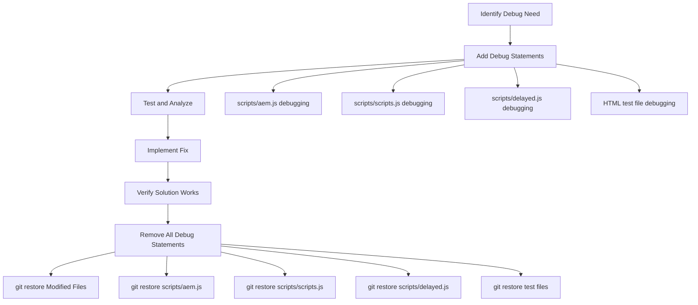

# Block Debugging Guide for AI Assistants

This debug guide is a comprehensive debugging manual that addresses all aspects of EDS block development, testing, and troubleshooting while maintaining universal applicability across all EDS projects. The addition of the generic instrumentation prompt makes advanced performance analysis accessible to any developer working with EDS.

This guide provides step-by-step instructions for AI assistants to debug and test EDS (Edge Delivery Services) blocks using the local development server designed to improve AI assistant workflows.

## Overview

The project includes a local development server (`server.js`) that significantly improves AI assistant effectiveness by enabling testing blocks in isolation while maintaining EDS compatibility. This guide explains how to create test files and debug blocks efficiently.

## Prerequisites

- Node.js installed
- Project server running via `npm run debug`
- Understanding of EDS block structure

## Quick Start

1. **Start the development server:**

   ```bash
   npm run debug
   ```

   Server runs at: `http://localhost:3000`

2. **Create a test file in your block directory:**

   ```bash
   blocks/your-block-name/test.html
   ```

3. **Access your test:**

   ```bash
   http://localhost:3000/blocks/your-block-name/test.html
   ```

## EDS Block Structure

EDS blocks follow a specific structure that must be replicated exactly in test files:

```bash
blocks/block-name/
├── block-name.js          # Block JavaScript (ES module)
├── block-name.css         # Block styles
├── README.md              # Documentation
└── test.html              # Test file (MUST replicate EDS structure)
```

**CRITICAL**: Test files must use the exact same block structure as EDS. The purpose of test files is to replicate the EDS environment locally - there is no alternative structure.

## File Replacement Testing Strategy

### **EDS Dynamic Block Loading Constraint**

**CRITICAL**: EDS uses dynamic imports with constructed paths that cannot be modified:
```javascript
// In scripts/aem.js - loadBlock function
const mod = await import(`/blocks/${blockName}/${blockName}.js`);
```

This means EDS **always** calls the block by its exact name (`your-component.js`), making direct instrumentation impossible without file replacement.

### **File Replacement Testing Workflow**

When testing instrumented or enhanced block versions, you must temporarily replace the original block file:

#### **Method 1: Manual Backup/Restore**
```bash
# 1. Create backup of original
cp blocks/your-component/your-component.js blocks/your-component/your-component-backup.js

# 2. Replace with instrumented/test version
cp blocks/your-component/your-component-instrumented.js blocks/your-component/your-component.js

# 3. Run tests (EDS automatically loads the replacement version)
# http://localhost:3000/blocks/your-component/test.html

# 4. Restore original file
cp blocks/your-component/your-component-backup.js blocks/your-component/your-component.js

# 5. Clean up backup
rm blocks/your-component/your-component-backup.js
```

#### **Method 2: Git-Based Workflow (Recommended)**
```bash
# 1. Ensure clean working directory
git status

# 2. Replace with instrumented/test version
cp blocks/your-component/your-component-instrumented.js blocks/your-component/your-component.js

# 3. Run tests and collect data
# (Execute testing procedures)

# 4. Restore original using git
git restore blocks/your-component/your-component.js

# 5. Verify restoration
git status  # Should show no changes
```

#### **Automated Testing Script Template**
```bash
#!/bin/bash
# test-instrumented-block.sh

BLOCK_NAME="$1"
BLOCK_PATH="blocks/$BLOCK_NAME"
ORIGINAL_FILE="${BLOCK_PATH}/${BLOCK_NAME}.js"
INSTRUMENTED_FILE="${BLOCK_PATH}/${BLOCK_NAME}-instrumented.js"
BACKUP_FILE="${BLOCK_PATH}/${BLOCK_NAME}-backup.js"

# Validation
if [ ! -f "$INSTRUMENTED_FILE" ]; then
    echo "❌ Instrumented file not found: $INSTRUMENTED_FILE"
    exit 1
fi

echo "🔧 Testing instrumented $BLOCK_NAME block..."

# 1. Backup original
cp "$ORIGINAL_FILE" "$BACKUP_FILE"
echo "✅ Original file backed up"

# 2. Replace with instrumented version
cp "$INSTRUMENTED_FILE" "$ORIGINAL_FILE"
echo "✅ Instrumented version deployed"

# 3. Wait for user testing
echo "🌐 Open: http://localhost:3000/blocks/$BLOCK_NAME/test.html"
echo "📊 Run tests, then press Enter to restore..."
read -r

# 4. Restore original
cp "$BACKUP_FILE" "$ORIGINAL_FILE"
rm "$BACKUP_FILE"
echo "✅ Original file restored and backup cleaned up"
```

### **Why File Replacement is Required**

1. **EDS Dynamic Loading**: `import(\`/blocks/\${blockName}/\${blockName}.js\`)` cannot be modified
2. **Exact Name Matching**: EDS constructs paths using block name, requires exact filename
3. **No Import Redirection**: Cannot redirect imports without modifying core EDS files
4. **Testing Isolation**: File replacement allows testing enhanced code in real EDS environment

## Block JavaScript Implementation Debugging

### **Enhanced `decorate()` Function Patterns**

All EDS blocks should implement comprehensive debugging patterns in their `decorate()` functions:

#### **Standard Error Handling Pattern**
```javascript
// Standard error handling pattern for all blocks
export default async function decorate(block) {
  const blockName = block.dataset.blockName || 'unknown';
  
  try {
    console.group(`[${blockName.toUpperCase()}] Block decoration starting`);
    console.time(`[${blockName.toUpperCase()}] Decoration time`);
    
    // Ensure EDS visibility
    if (!document.body.classList.contains('appear')) {
      console.warn(`[${blockName.toUpperCase()}] Adding appear class for visibility`);
      document.body.classList.add('appear');
    }
    
    // Component logic here
    await enhanceBlock(block);
    
    console.log(`[${blockName.toUpperCase()}] Decoration completed successfully`);
    
  } catch (error) {
    console.error(`[${blockName.toUpperCase()}] Decoration failed:`, error);
    
    // Fallback content
    block.innerHTML = `<p>Component temporarily unavailable</p>`;
    
  } finally {
    console.timeEnd(`[${blockName.toUpperCase()}] Decoration time`);
    console.groupEnd();
  }
}
```

#### **Performance Monitoring Integration**
```javascript
// Add to component decorate() function for performance monitoring
export default function decorate(block) {
  const startTime = performance.now();
  console.time('[PERF] Block decoration');
  
  try {
    // Component logic here
    
    const endTime = performance.now();
    console.timeEnd('[PERF] Block decoration');
    console.log(`[PERF] ${block.className} decorated in ${endTime - startTime}ms`);
  } catch (error) {
    console.error(`[PERF] ${block.className} decoration failed:`, error);
  }
}
```

#### **EDS Attribute Preservation**
```javascript
// Problem: Shadow DOM isolation prevents EDS styling
export default function decorate(block) {
  // Preserve EDS attributes before DOM manipulation
  const blockStatus = block.getAttribute('data-block-status');
  const blockName = block.getAttribute('data-block-name');
  
  // Clear and rebuild DOM
  block.innerHTML = '';
  
  // Restore EDS attributes for proper styling
  if (blockStatus) block.setAttribute('data-block-status', blockStatus);
  if (blockName) block.setAttribute('data-block-name', blockName);
}
```

#### **Race Condition Prevention**
```javascript
// Detect and handle race conditions
let decorationInProgress = false;

export default async function decorate(block) {
  if (decorationInProgress) {
    console.warn('[RACE-CONDITION] Decoration already in progress');
    return;
  }
  
  decorationInProgress = true;
  
  try {
    await performDecoration(block);
  } finally {
    decorationInProgress = false;
  }
}
```

## Creating test.html Files

### Basic Template

```html
<!DOCTYPE html>
<html lang="en">
<head>
    <meta charset="UTF-8">
    <meta name="viewport" content="width=device-width, initial-scale=1.0">
    <title>Block Name Test</title>
    <!-- Link to block CSS -->
    <link rel="stylesheet" href="block-name.css">
    <style>
        /* Optional: Add test-specific styles */
        body {
            font-family: Arial, sans-serif;
            padding: 2rem;
            background: #f5f5f5;
        }
        .test-container {
            max-width: 1200px;
            margin: 0 auto;
            background: white;
            padding: 2rem;
            border-radius: 8px;
            box-shadow: 0 2px 10px rgba(0,0,0,0.1);
        }
    </style>
</head>
<body>
    <div class="test-container">
        <h1>Block Name Test</h1>
        
        <!-- EDS Block Structure (Exact Replication) -->
        <div class="block-name block" data-block-name="block-name" data-block-status="initialized">
            <div>
                <div>
                    <p>Your test content here</p>
                </div>
            </div>
        </div>
        
        <!-- Test Controls (Optional) -->
        <div class="test-controls">
            <button onclick="location.reload()">Reload Test</button>
        </div>
    </div>

    <!-- Block Initialization Script -->
    <script type="module">
        import decorate from './block-name.js';
        
        document.addEventListener('DOMContentLoaded', () => {
            const block = document.querySelector('.block-name.block');
            if (block) {
                decorate(block);
            }
        });
    </script>
</body>
</html>
```

### EDS Block Structure Requirements

**CRITICAL:** Block structure must exactly replicate EDS processing:

- Block container: `.block-name.block` with `data-block-name="block-name"` and `data-block-status="initialized"`
- Content wrapper: Nested `<div><div>content</div></div>` structure
- Content elements: Use semantic HTML (`<p>`, `<h2>`, `<a>`, etc.)
- JavaScript selector: Target `.block-name.block` (not `.block-name-block`)

### Content Structure

EDS blocks expect specific HTML structure. Common patterns:

#### Simple Content Block

```html
<div class="my-block block" data-block-name="my-block" data-block-status="initialized">
    <div>
        <div>
            <p>Single piece of content</p>
        </div>
    </div>
</div>
```

#### Multi-Column Block

```html
<div class="my-block block" data-block-name="my-block" data-block-status="initialized">
    <div>
        <div>
            <p>Column 1 content</p>
        </div>
        <div>
            <p>Column 2 content</p>
        </div>
        <div>
            <p>Column 3 content</p>
        </div>
    </div>
</div>
```

#### Table-Based Block

```html
<div class="my-block block" data-block-name="my-block" data-block-status="initialized">
    <div>
        <div>
            <p>Header 1</p>
        </div>
        <div>
            <p>Header 2</p>
        </div>
    </div>
    <div>
        <div>
            <p>Row 1, Col 1</p>
        </div>
        <div>
            <p>Row 1, Col 2</p>
        </div>
    </div>
    <div>
        <div>
            <p>Row 2, Col 1</p>
        </div>
        <div>
            <p>Row 2, Col 2</p>
        </div>
    </div>
</div>
```

## Testing Workflow for AI Assistants

### Step 1: Analyze the Block

Before creating tests, examine:

- Block JavaScript (`block-name.js`)
- Block CSS (`block-name.css`)
- README.md for usage instructions
- Example files if available

### Step 2: Create Test File

1. **Create `test.html` in the block directory**
2. **Use the basic template above**
3. **Customize the content structure** based on block requirements
4. **Add test-specific content** that exercises block functionality

### Step 3: Start Development Server

```bash
npm run debug
```

Monitor terminal output for:

- Server startup confirmation
- File serving logs
- Error messages

### Step 4: Access and Test

1. **Navigate to:** `http://localhost:3000/blocks/block-name/test.html`
2. **Open browser developer tools**
3. **Check for:**
   - JavaScript errors in console
   - Network requests for assets
   - CSS loading issues
   - Block functionality

### Step 5: Debug Issues

Common debugging steps:

#### JavaScript Errors

- Check console for error messages
- Verify ES module imports
- Ensure block function is exported correctly
- Check for missing dependencies

#### CSS Issues

- Verify CSS file loads (Network tab)
- Check for CSS syntax errors
- Ensure proper class naming
- Test responsive behavior

#### Block Not Initializing

- Verify block container has correct class name
- Check if `decorate` function is called
- Ensure DOM is ready before initialization
- Verify block structure matches expectations

### Step 6: Performance Analysis

Monitor and optimize block performance using these debugging techniques:

#### **Function Execution Timing**
```javascript
// Add to component decorate() function for performance monitoring
export default function decorate(block) {
  const startTime = performance.now();
  console.time('[PERF] Block decoration');
  
  try {
    // Component logic here
    
    const endTime = performance.now();
    console.timeEnd('[PERF] Block decoration');
    console.log(`[PERF] ${block.className} decorated in ${endTime - startTime}ms`);
  } catch (error) {
    console.error(`[PERF] ${block.className} decoration failed:`, error);
  }
}
```

#### **Memory Usage Monitoring**
```javascript
// Memory monitoring pattern for debugging memory leaks
function monitorMemoryUsage(blockName) {
  if (performance.memory) {
    const memory = performance.memory;
    console.log(`[MEMORY] ${blockName}:`, {
      used: `${(memory.usedJSHeapSize / 1024 / 1024).toFixed(2)}MB`,
      total: `${(memory.totalJSHeapSize / 1024 / 1024).toFixed(2)}MB`,
      limit: `${(memory.jsHeapSizeLimit / 1024 / 1024).toFixed(2)}MB`
    });
  }
}
```

#### **Performance Benchmarking Guidelines**
Based on testing, typical performance metrics:

- **Block Loading**: 15-20ms (including CSS/JS loading)
- **Block Decoration**: 1-3ms for simple blocks, 5-15ms for complex blocks
- **Memory Overhead**: 150KB-500KB per instrumented block
- **DOM Mutations**: 5-10 mutations per block decoration

### Step 7: Error Resolution

Implement systematic error handling and recovery:

#### **Error Pattern Analysis**
```javascript
// Comprehensive error logging
function logError(context, error, additionalInfo = {}) {
  const errorReport = {
    context,
    message: error.message,
    stack: error.stack,
    timestamp: new Date().toISOString(),
    userAgent: navigator.userAgent,
    url: window.location.href,
    ...additionalInfo
  };
  
  console.error('[ERROR-REPORT]', errorReport);
  
  // Optional: Send to monitoring service
  // sendErrorReport(errorReport);
}
```

#### **Graceful Degradation Pattern**
```javascript
export default async function decorate(block) {
  try {
    // Primary functionality
    await enhanceBlock(block);
  } catch (error) {
    console.error('[ERROR-RECOVERY] Enhancement failed, using fallback:', error);
    
    // Fallback functionality
    block.innerHTML = '<p>Content temporarily unavailable</p>';
    
    // Ensure visibility
    if (!document.body.classList.contains('appear')) {
      document.body.classList.add('appear');
    }
  }
}
```

## Performance Debugging and Instrumentation

### **Creating Instrumentation for Any EDS Project**

#### **AI Assistant Prompt for Generic Instrumentation**

Use this prompt to request comprehensive instrumentation for any EDS project:

```
Please create comprehensive instrumentation for this EDS project's JavaScript files. I need detailed performance metrics, function call traces, execution timing data, variable scope analysis, memory usage patterns, and program flow information during execution.

Requirements:
1. **Core Instrumentation Framework**: Create a reusable instrumentation.js file that can wrap any function with performance monitoring
2. **Instrumented Versions**: Create instrumented versions of all major JavaScript files (scripts/aem.js, scripts/scripts.js, scripts/delayed.js, and any blocks)
3. **Performance Metrics**: Capture function execution times, memory usage, DOM mutations, async operations
4. **Structured Output**: Generate telemetry data in a structured format suitable for analysis
5. **Minimal Impact**: Ensure instrumentation has minimal impact on execution performance
6. **File Replacement Strategy**: Create instrumented versions with "-instrumented" suffix for testing
7. **Browser Integration**: Include browser console integration for real-time monitoring

The instrumentation should:
- Wrap all major functions with timing and memory monitoring
- Track DOM mutations and changes
- Monitor async operations and Promise chains
- Capture error patterns and recovery attempts
- Provide detailed execution flow analysis
- Generate comprehensive performance reports
- Support file replacement testing workflow

Please create instrumented versions of:
- scripts/aem.js → scripts/aem-instrumented.js
- scripts/scripts.js → scripts/scripts-instrumented.js  
- scripts/delayed.js → scripts/delayed-instrumented.js
- blocks/[component]/[component].js → blocks/[component]/[component]-instrumented.js

Include test files that demonstrate the instrumentation working with browser console integration.
```

#### **Expected Instrumentation Output**

The AI assistant should create:

1. **Core Framework** (`scripts/instrumentation.js`):
   - Function wrapping utilities
   - Performance monitoring tools
   - Memory tracking capabilities
   - DOM mutation observers
   - Error handling and logging

2. **Instrumented Core Files**:
   - `scripts/aem-instrumented.js` - All AEM core functions wrapped
   - `scripts/scripts-instrumented.js` - Main application flow instrumented
   - `scripts/delayed-instrumented.js` - Delayed functionality instrumented

3. **Instrumented Block Files**:
   - `blocks/[component]/[component]-instrumented.js` - Individual block instrumentation

4. **Test Infrastructure**:
   - Test HTML files with browser console integration
   - Global instrumentation access functions
   - Performance report generation tools

#### **Using the Instrumentation**

Once created, use the file replacement strategy to test:

```bash
# 1. Backup original block
cp blocks/your-component/your-component.js blocks/your-component/your-component-backup.js

# 2. Replace with instrumented version
cp blocks/your-component/your-component-instrumented.js blocks/your-component/your-component.js

# 3. Run tests and collect performance data
# Open: http://localhost:3000/blocks/your-component/test.html
# Use browser console: window.getInstrumentationReport()

# 4. Restore original
git restore blocks/your-component/your-component.js
```

### **Function Execution Timing Analysis**

When debugging performance issues, use instrumentation to capture detailed execution metrics:

```javascript
// Enhanced performance monitoring with detailed metrics
export default function decorate(block) {
  const blockName = block.dataset.blockName || 'unknown';
  const startTime = performance.now();
  const initialMemory = performance.memory?.usedJSHeapSize || 0;
  
  console.group(`[PERF-DEBUG] ${blockName.toUpperCase()}`);
  console.time(`[PERF] ${blockName} decoration`);
  
  try {
    // Component logic here
    
    const endTime = performance.now();
    const finalMemory = performance.memory?.usedJSHeapSize || 0;
    const memoryIncrease = finalMemory - initialMemory;
    
    console.timeEnd(`[PERF] ${blockName} decoration`);
    console.log(`[PERF] Execution time: ${(endTime - startTime).toFixed(2)}ms`);
    console.log(`[PERF] Memory increase: ${(memoryIncrease / 1024).toFixed(2)}KB`);
    
  } catch (error) {
    console.error(`[PERF] ${blockName} decoration failed:`, error);
  } finally {
    console.groupEnd();
  }
}
```

### **Memory Leak Detection**

Monitor memory usage patterns to identify leaks:

```javascript
// Memory leak detection pattern
function detectMemoryLeaks(blockName) {
  const initialMemory = performance.memory?.usedJSHeapSize || 0;
  
  return {
    check: () => {
      const currentMemory = performance.memory?.usedJSHeapSize || 0;
      const increase = currentMemory - initialMemory;
      
      if (increase > 1024 * 1024) { // 1MB threshold
        console.warn(`[MEMORY-LEAK] ${blockName} increased memory by ${(increase / 1024 / 1024).toFixed(2)}MB`);
      }
      
      return { initial: initialMemory, current: currentMemory, increase };
    }
  };
}

// Usage in component
export default function decorate(block) {
  const memoryTracker = detectMemoryLeaks(block.className);
  
  // Component logic here
  
  // Check memory after decoration
  setTimeout(() => memoryTracker.check(), 1000);
}
```

## Error Pattern Analysis and Resolution

### **Common Error Patterns**

#### **Module Loading Failures**
```javascript
// Error Pattern:
Error: failed to load module for header
  at loadBlock (scripts/aem.js:589)
  at async loadSection (scripts/aem.js:683)

// Root Cause: Missing block JavaScript file or ES module syntax errors
// Resolution Strategy:
1. Verify block file exists: blocks/header/header.js
2. Check ES module syntax: export default function decorate(block) {}
3. Test module in isolation: import('./header.js').then(console.log)
4. Implement graceful fallback for missing blocks
```

#### **Resource Loading Errors**
```javascript
// Error Pattern:
Failed to load resource: the server responded with a status of 404 (Not Found)
Resource: /fonts/roboto-medium.woff2

// Root Cause: Missing font files or incorrect proxy configuration
// Resolution Strategy:
1. Check if resource exists locally
2. Verify proxy URL configuration in server.js
3. Implement font fallbacks in CSS
4. Use web fonts with proper fallback stack
```

#### **Shadow DOM Visibility Issues**
```javascript
// Error Pattern:
✅ Component loads successfully
✅ Data fetches correctly  
❌ Content completely invisible

// Root Cause: Shadow DOM isolation prevents EDS styling
// Resolution Strategy:
1. Preserve EDS attributes: data-block-status, data-block-name
2. Ensure body.appear class is present
3. Add component-level visibility fallbacks
4. Test both served and rendered HTML states
```

### **Error Recovery Templates**

```javascript
// Standard error handling template for all blocks
export default async function decorate(block) {
  const blockName = block.dataset.blockName || 'unknown';
  
  try {
    console.group(`[${blockName.toUpperCase()}] Block decoration starting`);
    console.time(`[${blockName.toUpperCase()}] Decoration time`);
    
    // Ensure EDS visibility
    if (!document.body.classList.contains('appear')) {
      console.warn(`[${blockName.toUpperCase()}] Adding appear class for visibility`);
      document.body.classList.add('appear');
    }
    
    // Component logic here
    await enhanceBlock(block);
    
    console.log(`[${blockName.toUpperCase()}] Decoration completed successfully`);
    
  } catch (error) {
    console.error(`[${blockName.toUpperCase()}] Decoration failed:`, error);
    
    // Fallback content
    block.innerHTML = `<p>Component temporarily unavailable</p>`;
    
  } finally {
    console.timeEnd(`[${blockName.toUpperCase()}] Decoration time`);
    console.groupEnd();
  }
}
```

## Advanced Debugging Techniques

### **DOM Mutation and Timing Debugging**

#### **Tracking DOM Changes**

Monitor DOM mutations during block processing:

```javascript
// DOM mutation observer for debugging
function debugDOMMutations(targetElement, blockName) {
  const observer = new MutationObserver((mutations) => {
    mutations.forEach((mutation) => {
      console.log(`[DOM-DEBUG] ${blockName}:`, {
        type: mutation.type,
        target: mutation.target.tagName,
        addedNodes: mutation.addedNodes.length,
        removedNodes: mutation.removedNodes.length,
        attributeName: mutation.attributeName,
        oldValue: mutation.oldValue
      });
    });
  });
  
  observer.observe(targetElement, {
    childList: true,
    subtree: true,
    attributes: true,
    attributeOldValue: true
  });
  
  return observer;
}
```

#### **Common DOM Timing Issues**

**EDS Processing Race Conditions**:
```javascript
// Problem: Component modifies DOM before EDS processing completes
export default function decorate(block) {
  // ✅ CORRECT: Wait for EDS processing
  if (block.dataset.blockStatus !== 'initialized') {
    console.warn('[DOM-DEBUG] Block not fully initialized, waiting...');
    setTimeout(() => decorate(block), 10);
    return;
  }
  
  // Safe to modify DOM after EDS initialization
  block.innerHTML = '<div>New content</div>';
}
```

**Shadow DOM vs EDS Conflicts**:
```javascript
// Problem: Shadow DOM isolation prevents EDS styling
export default function decorate(block) {
  // Preserve EDS attributes before DOM manipulation
  const blockStatus = block.getAttribute('data-block-status');
  const blockName = block.getAttribute('data-block-name');
  
  // Clear and rebuild DOM
  block.innerHTML = '';
  
  // Restore EDS attributes for proper styling
  if (blockStatus) block.setAttribute('data-block-status', blockStatus);
  if (blockName) block.setAttribute('data-block-name', blockName);
}
```

### **Asynchronous Operation Debugging**

#### **Tracking Async Operations**

Monitor Promise-based operations during block loading:

```javascript
// Async operation tracking pattern
export default async function decorate(block) {
  const asyncOps = [];
  
  try {
    // Track CSS loading
    const cssPromise = loadCSS('./block.css')
      .then(() => console.log('[ASYNC] CSS loaded'))
      .catch(error => console.error('[ASYNC] CSS failed:', error));
    asyncOps.push(cssPromise);
    
    // Track data fetching
    const dataPromise = fetch('/api/data')
      .then(response => response.json())
      .then(data => console.log('[ASYNC] Data loaded:', data.length, 'items'))
      .catch(error => console.error('[ASYNC] Data failed:', error));
    asyncOps.push(dataPromise);
    
    // Wait for all async operations
    await Promise.allSettled(asyncOps);
    console.log('[ASYNC] All operations completed');
    
  } catch (error) {
    console.error('[ASYNC] Block decoration failed:', error);
  }
}
```

#### **Promise Chain Debugging**
```javascript
// Debug Promise chains with detailed logging
fetch('/api/data')
  .then(response => {
    console.log('[ASYNC-DEBUG] Response status:', response.status);
    if (!response.ok) throw new Error(`HTTP ${response.status}`);
    return response.json();
  })
  .then(data => {
    console.log('[ASYNC-DEBUG] Data parsed:', typeof data, Object.keys(data));
    return processData(data);
  })
  .then(result => {
    console.log('[ASYNC-DEBUG] Processing complete:', result);
  })
  .catch(error => {
    console.error('[ASYNC-DEBUG] Chain failed:', error);
  });
```

### **Memory Usage Optimization**

#### **Efficient DOM Manipulation**
```javascript
// ❌ INEFFICIENT: Multiple DOM queries
function decorateInefficient(block) {
  block.querySelector('.item').style.color = 'red';
  block.querySelector('.item').style.fontSize = '16px';
  block.querySelector('.item').addEventListener('click', handler);
}

// ✅ EFFICIENT: Single query, batch operations
function decorateEfficient(block) {
  const item = block.querySelector('.item');
  if (item) {
    Object.assign(item.style, { color: 'red', fontSize: '16px' });
    item.addEventListener('click', handler);
  }
}
```

#### **Resource Loading Optimization**
```javascript
// Preload critical resources
function preloadResources(urls) {
  urls.forEach(url => {
    const link = document.createElement('link');
    link.rel = 'preload';
    link.href = url;
    link.as = url.endsWith('.css') ? 'style' : 'script';
    document.head.appendChild(link);
  });
}
```

## Browser Console Debug Tools

### **Console Integration Patterns**

Implement comprehensive console debugging for components:

```javascript
// Debug helper functions
window.debugEDS = {
  // Get all blocks on page
  getBlocks: () => document.querySelectorAll('[data-block-name]'),
  
  // Get block status
  getBlockStatus: (blockName) => {
    const blocks = document.querySelectorAll(`[data-block-name="${blockName}"]`);
    return Array.from(blocks).map(block => ({
      element: block,
      status: block.dataset.blockStatus,
      name: block.dataset.blockName,
      classes: block.className
    }));
  },
  
  // Force block reinitialization
  reinitBlock: async (blockName) => {
    const blocks = document.querySelectorAll(`[data-block-name="${blockName}"]`);
    for (const block of blocks) {
      const module = await import(`/blocks/${blockName}/${blockName}.js`);
      if (module.default) await module.default(block);
    }
  },
  
  // Memory usage report
  getMemoryUsage: () => {
    if (performance.memory) {
      const memory = performance.memory;
      return {
        used: `${(memory.usedJSHeapSize / 1024 / 1024).toFixed(2)}MB`,
        total: `${(memory.totalJSHeapSize / 1024 / 1024).toFixed(2)}MB`,
        percentage: `${((memory.usedJSHeapSize / memory.totalJSHeapSize) * 100).toFixed(1)}%`
      };
    }
    return 'Memory API not available';
  }
};

// Make available globally
console.log('🔧 EDS Debug Tools Available:');
console.log('- window.debugEDS.getBlocks()');
console.log('- window.debugEDS.getBlockStatus("block-name")');
console.log('- window.debugEDS.reinitBlock("block-name")');
console.log('- window.debugEDS.getMemoryUsage()');
```

### **Console Command Examples**

```javascript
// Debug commands for browser console

// 1. Check all blocks on page
debugEDS.getBlocks()

// 2. Get specific block status
debugEDS.getBlockStatus('your-component')

// 3. Check memory usage
debugEDS.getMemoryUsage()

// 4. Reinitialize problematic block
await debugEDS.reinitBlock('your-component')

// 5. Monitor DOM mutations
const observer = new MutationObserver(console.log);
observer.observe(document.body, { childList: true, subtree: true });

// 6. Performance timing
console.time('Block Loading');
await debugEDS.reinitBlock('your-component');
console.timeEnd('Block Loading');

// 7. Get instrumentation report (if instrumented versions are active)
window.getInstrumentationReport()

// 8. Export instrumentation data for analysis
window.exportInstrumentationData()
```

### **Requesting Instrumentation Creation**

When you need comprehensive performance analysis, use this approach:

#### **Step 1: Request AI Assistant to Create Instrumentation**
Copy and paste this prompt to any AI assistant:

```
Please create comprehensive instrumentation for this EDS project's JavaScript files. I need detailed performance metrics, function call traces, execution timing data, variable scope analysis, memory usage patterns, and program flow information during execution.

Requirements:
1. **Core Instrumentation Framework**: Create a reusable instrumentation.js file that can wrap any function with performance monitoring
2. **Instrumented Versions**: Create instrumented versions of all major JavaScript files (scripts/aem.js, scripts/scripts.js, scripts/delayed.js, and any blocks)
3. **Performance Metrics**: Capture function execution times, memory usage, DOM mutations, async operations
4. **Structured Output**: Generate telemetry data in a structured format suitable for analysis
5. **Minimal Impact**: Ensure instrumentation has minimal impact on execution performance
6. **File Replacement Strategy**: Create instrumented versions with "-instrumented" suffix for testing
7. **Browser Integration**: Include browser console integration for real-time monitoring

Please create instrumented versions of:
- scripts/aem.js → scripts/aem-instrumented.js
- scripts/scripts.js → scripts/scripts-instrumented.js  
- scripts/delayed.js → scripts/delayed-instrumented.js
- blocks/[component]/[component].js → blocks/[component]/[component]-instrumented.js

Include test files that demonstrate the instrumentation working with browser console integration.
```

#### **Step 2: Implement File Replacement Testing**
```bash
# Use the file replacement strategy to test instrumented versions
cp blocks/your-component/your-component-instrumented.js blocks/your-component/your-component.js
# Run tests, then restore: git restore blocks/your-component/your-component.js
```

#### **Step 3: Analyze Performance Data**
```javascript
// In browser console after loading instrumented version
const report = window.getInstrumentationReport();
console.table(report.functionMetrics);
console.log('Total execution time:', report.totalTime + 'ms');
console.log('Memory usage:', report.memoryUsage);
```

### **Browser DevTools Integration**

#### **Network Tab Analysis**
- Monitor resource loading order and timing
- Identify failed requests (404s, CORS errors)
- Check response headers and content types
- Analyze transfer sizes and compression

#### **Performance Tab Usage**
- Record page load performance
- Identify long-running tasks
- Analyze memory usage patterns
- Detect layout thrashing

#### **Console Tab Debugging**
- Use console.group() for organized logging
- Implement console.time() for performance measurement
- Use console.table() for structured data display
- Set up console.assert() for validation checks

## Advanced Testing Scenarios

### Testing with Multiple Instances

```html
<div class="my-block block" data-block-name="my-block" data-block-status="initialized">
    <div>
        <div>
            <p>Instance 1 content</p>
        </div>
    </div>
</div>

<div class="my-block block" data-block-name="my-block" data-block-status="initialized">
    <div>
        <div>
            <p>Instance 2 content</p>
        </div>
    </div>
</div>

<script type="module">
    import decorate from './my-block.js';
    
    document.addEventListener('DOMContentLoaded', () => {
        const blocks = document.querySelectorAll('.my-block.block');
        blocks.forEach(block => decorate(block));
    });
</script>
```

### Testing with Dynamic Content

```html
<div class="test-controls">
    <button onclick="addContent()">Add Content</button>
    <button onclick="removeContent()">Remove Content</button>
</div>

<div class="my-block block" data-block-name="my-block" data-block-status="initialized" id="test-block">
    <div>
        <div>
            <p>Initial content</p>
        </div>
    </div>
</div>

<script type="module">
    import decorate from './my-block.js';
    
    let contentCount = 1;
    
    window.addContent = function() {
        const block = document.getElementById('test-block');
        const newRow = document.createElement('div');
        newRow.innerHTML = `<div>Dynamic content ${++contentCount}</div>`;
        block.appendChild(newRow);
        
        // Re-decorate if needed
        decorate(block);
    };
    
    window.removeContent = function() {
        const block = document.getElementById('test-block');
        const rows = block.children;
        if (rows.length > 1) {
            rows[rows.length - 1].remove();
        }
    };
    
    document.addEventListener('DOMContentLoaded', () => {
        const block = document.getElementById('test-block');
        decorate(block);
    });
</script>
```

### Testing with External Dependencies

```html
<!-- Include external libraries if block requires them -->
<script src="https://cdn.jsdelivr.net/npm/library@version/dist/library.min.js"></script>

<div class="my-block block" data-block-name="my-block" data-block-status="initialized">
    <div><div>Content requiring external library</div></div>
</div>
```

## Server Request Debugging

### **Analyzing Server Logs**

Monitor server terminal output for detailed request information:

```bash
# Successful local file serving
Request: GET /blocks/your-component/your-component.js
✅ Serving local file: /project-root/blocks/your-component/your-component.js

# Proxy request pattern
Request: GET /media_image.png
🔄 Local file not found, attempting proxy for: /media_image.png
🔄 Proxying request to: https://your-domain.com/media_image.png
✅ Proxy Success: 200 OK (50,054 bytes, image/webp)

# Failed proxy request
❌ Proxy Failed: 404 Not Found
Failed URL: https://your-domain.com/fonts/roboto-medium.woff2
```

### **Common Server Issues and Solutions**

#### **Resource Loading Failures**
```bash
# Symptom: 404 errors for fonts or images
❌ Error proxying request for /fonts/roboto-medium.woff2: Proxy request failed: 404 Not Found

# Debug Steps:
1. Check if resource exists locally
2. Verify proxy URL configuration
3. Test direct access to proxy URL
4. Implement fallback resources
```

#### **Module Loading Errors**
```bash
# Symptom: Block JavaScript fails to load
failed to load module for header JSHandle@error
failed to load module for footer JSHandle@error

# Debug Steps:
1. Verify ES module syntax in block JavaScript
2. Check for circular dependencies
3. Ensure proper export statements
4. Test module in isolation
```

### **Network Request Analysis**

Use browser DevTools Network tab to analyze:

- **Request Timeline**: Order of resource loading
- **Response Headers**: CORS, caching, content-type
- **Transfer Sizes**: Identify large resources
- **Failed Requests**: 404s, timeouts, CORS errors

#### **Network Debug Checklist**
- [ ] All local resources load successfully (200 status)
- [ ] Proxy requests have appropriate fallbacks
- [ ] CORS headers present for cross-origin requests
- [ ] Resource sizes are reasonable (<1MB for images)
- [ ] No circular dependency errors in modules

### **Network Request Debug Template**

```javascript
// Network request debugging wrapper
async function debugFetch(url, options = {}) {
  console.log(`[NETWORK] Requesting: ${url}`);
  const startTime = performance.now();
  
  try {
    const response = await fetch(url, options);
    const endTime = performance.now();
    
    console.log(`[NETWORK] Response: ${response.status} ${response.statusText} (${(endTime - startTime).toFixed(2)}ms)`);
    
    if (!response.ok) {
      throw new Error(`HTTP ${response.status}: ${response.statusText}`);
    }
    
    return response;
    
  } catch (error) {
    console.error(`[NETWORK] Request failed: ${url}`, error);
    throw error;
  }
}
```

## Server Behavior

### Local File Priority

- Server serves local files first
- Falls back to proxy (`https://your-domain.com`) for missing files
- Enables testing with real remote assets

### MIME Type Support

- `.html` → `text/html`
- `.js` → `application/javascript`
- `.css` → `text/css`
- `.json` → `application/json`
- Images, fonts, and other assets supported

### CORS Headers

- Permissive CORS for development
- No caching for immediate updates

### **Server Configuration Debug Settings**

```javascript
// Add to server.js for enhanced debugging
const DEBUG_MODE = process.env.DEBUG === 'true';

if (DEBUG_MODE) {
  console.log('🔧 Debug mode enabled');
  console.log('📊 Enhanced logging active');
  console.log('🔍 Request timing enabled');
}
```

## Complete Block Debugging Workflow

### **Phase 1: Initial Assessment**
- [ ] **Check Server Status**: Verify `npm run debug` is running
- [ ] **Verify File Structure**: Ensure block files exist and are properly named
- [ ] **Test Basic Loading**: Access `http://localhost:3000/blocks/block-name/test.html`
- [ ] **Check Browser Console**: Look for immediate errors
- [ ] **Validate Block Structure**: Confirm EDS naming conventions

### **Phase 2: Network Analysis**
- [ ] **Open DevTools Network Tab**: Monitor resource loading
- [ ] **Reload Page**: Watch request sequence and timing
- [ ] **Identify Failed Requests**: Note 404s, timeouts, CORS errors
- [ ] **Check Server Logs**: Monitor terminal output for detailed request info
- [ ] **Verify Proxy Behavior**: Confirm fallback requests work correctly

### **Phase 3: DOM and Timing Analysis**
- [ ] **Add DOM Mutation Observer**: Track DOM changes during loading
- [ ] **Monitor EDS Processing**: Check for `data-block-status` changes
- [ ] **Verify Block Decoration**: Ensure `decorate()` function executes
- [ ] **Check Timing Conflicts**: Look for race conditions
- [ ] **Validate EDS Attributes**: Confirm proper attribute preservation

### **Phase 4: Performance Analysis**
- [ ] **Add Performance Timing**: Measure function execution times
- [ ] **Monitor Memory Usage**: Track memory allocation and cleanup
- [ ] **Analyze Async Operations**: Verify Promise resolution
- [ ] **Check Resource Loading**: Measure network request timing
- [ ] **Validate Optimization**: Ensure efficient DOM manipulation

### **Phase 5: Error Resolution**
- [ ] **Implement Error Handling**: Add try/catch blocks with logging
- [ ] **Add Fallback Content**: Ensure graceful degradation
- [ ] **Test Error Scenarios**: Simulate network failures, missing resources
- [ ] **Verify Recovery**: Ensure system continues functioning after errors
- [ ] **Document Solutions**: Record fixes for future reference

## Enhanced Debugging Checklist

### **Pre-Development Setup**
- [ ] **File Replacement Strategy**: Understand instrumented file testing workflow
- [ ] **Debug Tools Available**: Browser console, DevTools, server logs
- [ ] **Performance Baseline**: Know expected timing and memory benchmarks
- [ ] **Error Patterns**: Familiar with common failure modes and solutions

### **Before Testing**
- [ ] Block files exist (`.js`, `.css`)
- [ ] Server is running (`npm run debug`)
- [ ] Test file created in correct location
- [ ] Block structure follows EDS conventions
- [ ] **Instrumented versions prepared** (if performance testing)
- [ ] **Git working directory clean** (for file replacement workflow)

### **During Testing**
- [ ] Check browser console for errors
- [ ] Verify network requests succeed
- [ ] Test responsive behavior
- [ ] Validate accessibility features
- [ ] Test all interactive elements
- [ ] **Monitor performance metrics** (timing, memory)
- [ ] **Track DOM mutations** (if debugging timing issues)
- [ ] **Verify EDS integration** (attributes, styling, lifecycle)

### **Performance Testing Checklist**
- [ ] **Function Execution Timing**: <20ms for block decoration
- [ ] **Memory Usage**: <500KB increase per block
- [ ] **DOM Mutations**: <15 mutations per decoration cycle
- [ ] **Async Operations**: <5 concurrent operations
- [ ] **Resource Loading**: All critical resources <1MB
- [ ] **Error Recovery**: Graceful degradation implemented

### **File Replacement Testing Checklist**
- [ ] **Backup Created**: Original file safely backed up
- [ ] **Instrumented Version**: Enhanced version ready for deployment
- [ ] **Testing Complete**: All scenarios tested thoroughly
- [ ] **Original Restored**: File replacement properly reversed
- [ ] **Git Status Clean**: No unintended changes committed

### Common Issues

#### Block Not Appearing

1. Check CSS class names match EDS convention
2. Verify CSS file loads correctly
3. Ensure block container exists in DOM
4. Check for JavaScript errors preventing rendering

#### JavaScript Module Errors

1. Verify ES module syntax
2. Check import/export statements
3. Ensure all dependencies are available
4. Validate function calls and variable references

#### Styling Issues

1. Check CSS file path in `<link>` tag
2. Verify CSS selectors match HTML structure
3. Test for CSS conflicts with global styles
4. Check responsive breakpoints

#### Server Issues

1. Restart server if files aren't updating
2. Check terminal for error messages
3. Verify file paths are correct
4. Clear browser cache if needed

## Example: Complete Test File

Here's a complete example for a hypothetical "card" block:

```html
<!DOCTYPE html>
<html lang="en">
<head>
    <meta charset="UTF-8">
    <meta name="viewport" content="width=device-width, initial-scale=1.0">
    <title>Card Block Test</title>
    <link rel="stylesheet" href="card.css">
    <style>
        body {
            font-family: Arial, sans-serif;
            padding: 2rem;
            background: #f5f5f5;
        }
        .test-container {
            max-width: 1200px;
            margin: 0 auto;
            background: white;
            padding: 2rem;
            border-radius: 8px;
            box-shadow: 0 2px 10px rgba(0,0,0,0.1);
        }
        .test-section {
            margin: 2rem 0;
            padding: 1rem;
            border: 1px solid #ddd;
            border-radius: 4px;
        }
    </style>
</head>
<body>
    <div class="test-container">
        <h1>Card Block Test</h1>
        
        <div class="test-section">
            <h2>Single Card</h2>
            <div class="card block" data-block-name="card" data-block-status="initialized">
                <div>
                    <div>
                        <h3>Card Title</h3>
                        <p>Card description text goes here.</p>
                        <p><a href="#test">Learn More</a></p>
                    </div>
                </div>
            </div>
        </div>
        
        <div class="test-section">
            <h2>Multiple Cards</h2>
            <div class="card block" data-block-name="card" data-block-status="initialized">
                <div>
                    <div>
                        <h3>Card 1 Title</h3>
                        <p>First card description.</p>
                        <p><a href="#test1">Link 1</a></p>
                    </div>
                </div>
                <div>
                    <div>
                        <h3>Card 2 Title</h3>
                        <p>Second card description.</p>
                        <p><a href="#test2">Link 2</a></p>
                    </div>
                </div>
                <div>
                    <div>
                        <h3>Card 3 Title</h3>
                        <p>Third card description.</p>
                        <p><a href="#test3">Link 3</a></p>
                    </div>
                </div>
            </div>
        </div>
        
        <div class="test-controls">
            <button onclick="location.reload()">Reload Test</button>
            <button onclick="toggleTheme()">Toggle Theme</button>
        </div>
    </div>

    <script type="module">
        import decorate from './card.js';
        
        document.addEventListener('DOMContentLoaded', () => {
            const blocks = document.querySelectorAll('.card.block');
            blocks.forEach(block => decorate(block));
        });
        
        window.toggleTheme = function() {
            document.body.style.background = 
                document.body.style.background === 'rgb(51, 51, 51)' ? '#f5f5f5' : '#333';
        };
    </script>
</body>
</html>
```

## Best Practices for AI Assistants

1. **Always create test files** when debugging blocks
2. **Follow EDS naming conventions** exactly
3. **Test multiple scenarios** (single/multiple instances, different content)
4. **Check browser console** for errors
5. **Verify responsive behavior** using browser dev tools
6. **Test accessibility** with keyboard navigation
7. **Document test cases** in comments
8. **Use meaningful test content** that exercises block features

## Troubleshooting Server Issues

### Server Won't Start

```bash
# Check if port is in use
lsof -i :3000

# Kill existing process
pkill -f "node server.js"

# Restart server
npm run debug
```

### Files Not Loading

- Verify file paths relative to project root
- Check file permissions
- Monitor server logs for detailed errors
- Clear browser cache

### Proxy Not Working

- Check internet connection
- Verify proxy URL in server configuration
- Review network logs in browser dev tools

## Understanding EDS HTML States: Dual Layout System

### Critical Architectural Distinction for Debugging

EDS operates with a **dual layout system** where HTML undergoes transformation from served to rendered state through [`scripts/aem.js`](scripts/aem.js) and [`scripts/scripts.js`](scripts/scripts.js) processing. This transformation is fundamental to how EDS blocks function.

#### **Served HTML State** (`test2.html`)
- **Raw content** as delivered from CMS/authoring systems
- **Minimal structure** before EDS processing
- **Example**: `<div class="your-component"></div>`
- **Processing**: Awaits transformation by EDS scripts
- **Use case**: Represents what EDS receives from content management

#### **Rendered HTML State** (`test.html`) 
- **Processed content** after EDS scripts transformation
- **Full block structure** with proper attributes and nesting
- **Example**: `<div class="your-component block" data-block-name="your-component" data-block-status="initialized">`
- **Processing**: Final DOM state after EDS processing complete
- **Use case**: Represents final DOM state after EDS processing

#### **HTML Transformation Process**

**CRITICAL**: The served HTML (like `test2.html`) is **perfect as delivered by EDS**. The transformation process automatically converts minimal served HTML into full rendered HTML structure.

The transformation from served to rendered HTML occurs through:

1. **EDS Automatic Structure Creation**:
   - EDS automatically wraps content in proper `div.section > div > div` structure
   - Minimal served HTML: `<div class="your-component"></div>`
   - Gets automatically wrapped to match `div.section > div > div` selector pattern

2. **[`scripts/aem.js`](scripts/aem.js) Processing**:
   - [`decorateBlocks()`](scripts/aem.js:626) - Finds blocks via `div.section > div > div` selector (after auto-wrapping)
   - [`decorateBlock()`](scripts/aem.js:608) - Adds `.block` class and `data-block-*` attributes
   - [`loadBlock()`](scripts/aem.js:687) - Dynamically imports and executes block JavaScript

3. **[`scripts/scripts.js`](scripts/scripts.js) Processing**:
   - [`loadEager()`](scripts/scripts.js:77) - Processes main content and adds `body.appear` class
   - [`decorateMain()`](scripts/scripts.js:77) - Orchestrates block decoration
   - [`loadSection()`](scripts/scripts.js:81) - Handles section-level processing

4. **Component Execution**:
   - Block's `decorate()` function is called with the transformed element
   - Component creates final rendered content</search>

#### **Why This Dual Layout System Matters for Debugging**

The distinction is critical because:
- **EDS processing** transforms minimal HTML into full block structure
- **Block decoration timing** determines when component `decorate()` functions execute
- **Shadow DOM timing** can interfere with EDS's DOM manipulation during transformation
- **Style injection** may occur before or after DOM transformation
- **Race conditions** exist between EDS transformation and custom element registration

#### **Debugging Strategy for Dual Layout System**

**For Served HTML Issues** (`test2.html`):
- Debug EDS block discovery: Does `decorateBlocks()` find the element?
- Debug block decoration: Does `decorateBlock()` add required attributes?
- Debug block loading: Does `loadBlock()` successfully import component?

**For Rendered HTML Issues** (`test.html`):
- Debug component execution: Does the `decorate()` function execute?
- Debug DOM manipulation: Are component changes applied correctly?
- Debug styling: Are styles properly applied to transformed DOM?

#### **Testing Both Layout States**

Create test files for both scenarios:
```bash
blocks/your-block/
├── test.html      # Rendered HTML (EDS-processed structure)
├── test2.html     # Served HTML (raw/minimal structure)
└── your-block.js  # Component logic
```

#### **Common Dual Layout Debugging Patterns**

**Served HTML Debug Pattern**:
```javascript
// In scripts/aem.js - decorateBlocks function
function decorateBlocks(main) {
  const blocks = main.querySelectorAll('div.section > div > div');
  console.log('[DEBUG-EDS] decorateBlocks found:', blocks.length, 'blocks');
  blocks.forEach(decorateBlock);
}
```

**Rendered HTML Debug Pattern**:
```javascript
// In component decorate() function
export default function decorate(block) {
  console.log('[DEBUG-COMPONENT] decorate() called for:', block.className);
  console.log('[DEBUG-COMPONENT] Block attributes:', block.dataset);
  // Component logic here
}
```

## Real-World Debug Case Study: Shadow DOM Component Issue

This case study demonstrates a critical debugging scenario involving Shadow DOM vs EDS processing race conditions:

### 🔍 **Confirmed Issue: Shadow DOM Visibility Problem**

#### **Symptoms Observed:**
- **✅ Component loads successfully** (console logs show successful processing)
- **✅ Data fetches correctly** (external resources loaded via proxy)
- **❌ Content completely invisible** (blank white screen despite successful processing)
- **🔍 DOM timing conflicts** (MutationObserver errors during initialization)

#### **Root Cause Analysis:**
**Shadow DOM vs EDS Processing Race Condition** where:

1. **EDS Processing**: [`scripts/aem.js:decorateBlock()`](scripts/aem.js:608-620) adds `data-block-status="initialized"` to block
2. **Component Processing**: Component's `decorate()` function clears `innerHTML` 
3. **Shadow DOM Creation**: Component creates Shadow DOM content inside cleared block
4. **Style Isolation**: CSS targeting `[data-block-status="initialized"]` cannot penetrate Shadow DOM boundaries
5. **Result**: Content exists but is invisible due to style isolation

#### **Debugging Evidence:**
```
Console Logs (test2.html):
✅ [your-component] Loading external resources...
✅ [your-component] Resources loaded successfully  
✅ [your-component] Component initialization complete
❌ Visual Result: Completely blank screen
🔍 [DEBUG-TIMING] MutationObserver timing errors
```

#### **Testing Methodology:**
- **Served HTML State**: `test2.html` - minimal `<div class="your-component"></div>`
- **Rendered HTML State**: `test.html` - full EDS processed structure
- **Debug Instrumentation**: Comprehensive timing analysis with debug scripts
- **Browser Testing**: Visual confirmation via `http://localhost:3000/blocks/your-component/test2.html`

#### **Fix Implementation:**
**Problem**: `decorate()` function cleared `innerHTML` without preserving EDS attributes

**Solution Applied**: Preserve and restore EDS attributes after innerHTML clearing
```javascript
// Preserve EDS attributes before clearing innerHTML
const blockStatus = block.getAttribute('data-block-status');
const blockName = block.getAttribute('data-block-name');

// Clear block and add container class
block.innerHTML = '';
block.classList.add('your-component-block');

// Restore EDS attributes to maintain visibility controls
if (blockStatus) {
  block.setAttribute('data-block-status', blockStatus);
  console.warn('[your-component] Preserved data-block-status:', blockStatus);
}
if (blockName) {
  block.setAttribute('data-block-name', blockName);
  console.warn('[your-component] Preserved data-block-name:', blockName);
}
```

**Deployment Process**: 
1. Modified component JavaScript file
2. Built and deployed using project build process
3. Updated blocks directory with fixed version

### ✅ **Successful Testing Results**
- **Component**: Self-contained bundle with all dependencies
- **Data Loading**: Successfully fetches external resources via proxy
- **Interactive Features**: All component functionality working correctly
- **Error Handling**: Graceful degradation when resources fail
- **Debug Tools**: Built-in debug helpers and comprehensive logging

### Testing Command Used
```bash
# Start EDS development server
npm run debug

# Access test page
http://localhost:3000/blocks/your-component/test.html
```

### Key Success Factors
1. **Proper EDS Structure**: Used exact block structure with `.your-component.block` class
2. **Self-Contained Testing**: Component includes all dependencies in single file
3. **Proxy Integration**: Server successfully proxied missing assets from external domain
4. **Real Data Testing**: Used live data from external endpoints for authentic testing
5. **Interactive Testing**: Successfully tested all component functionality and user interactions

## ⚠️ **CRITICAL: EDS Core Scripts Constraint**

### **DO NOT MODIFY EDS CORE SCRIPTS**

The following files belong to Adobe Edge Delivery Services and **MUST NOT** be modified:

- **[`scripts/scripts.js`](scripts/scripts.js)** - EDS main processing script
- **[`scripts/aem.js`](scripts/aem.js)** - EDS core functionality (Adobe licensed)
- **[`scripts/delayed.js`](scripts/delayed.js)** - EDS delayed loading functionality

### **EDS Body Visibility System**

**How EDS Controls Body Visibility:**
1. **Default State**: [`styles/styles.css`](styles/styles.css) sets `body { display: none; }`
2. **Visibility Trigger**: [`scripts/scripts.js:80`](scripts/scripts.js:80) adds `document.body.classList.add('appear')`
3. **Visible State**: CSS rule `body.appear { display: block; }` makes content visible

**When EDS Adds `appear` Class:**
- **Condition**: When `main` element exists (line 78: `if (main)`)
- **Timing**: During `loadEager()` function execution
- **Location**: [`scripts/scripts.js:80`](scripts/scripts.js:80)

### **Debugging EDS Body Visibility Issues**

**Root Cause Analysis:**
If `body.appear` class is missing, investigate:

1. **EDS Scripts Loading**: Are [`scripts/scripts.js`](scripts/scripts.js) and [`scripts/aem.js`](scripts/aem.js) loading?
2. **Main Element**: Does the HTML contain a `<main>` element?
3. **Script Errors**: Are JavaScript errors preventing EDS completion?
4. **Timing Issues**: Are custom components interfering with EDS lifecycle?

**Fix Locations (EDS Scripts Excluded):**
- ✅ **Component Level**: Add fallback in component's `decorate()` function
- ✅ **Test Files**: Add manual `appear` class in test HTML
- ✅ **Debug Scripts**: Add visibility fix in debugging tools
- ❌ **EDS Scripts**: Cannot modify Adobe's core scripts

### **Component-Level Body Visibility Fix Pattern**

```javascript
// Safe pattern for component decorate() functions
export default async function decorate(block) {
  try {
    // Ensure body visibility for component rendering
    if (!document.body.classList.contains('appear')) {
      console.warn('[component-name] EDS appear class missing, adding for visibility');
      document.body.classList.add('appear');
    }
    
    // ... rest of component logic
  } catch (error) {
    console.error('[component-name] Enhancement failed:', error);
  }
}
```

This pattern ensures components work regardless of EDS script timing or failures while respecting the constraint against modifying EDS core files.

### **🔧 DEBUGGING EXCEPTION: Temporary Debug Statements in EDS Core Scripts**

**IMPORTANT**: While EDS core scripts cannot be permanently modified, **temporary debugging statements** are allowed for troubleshooting purposes.

#### **Allowed Debug Modifications**

You **MAY** add temporary debugging statements to these EDS core files:
- **[`scripts/aem.js`](scripts/aem.js)** - EDS core functionality and block processing
- **[`scripts/scripts.js`](scripts/scripts.js)** - EDS main processing script and lifecycle
- **[`scripts/delayed.js`](scripts/delayed.js)** - EDS delayed loading functionality
- **Served HTML test files** - Any HTML files served by the development server

When debugging is complete, use git restore to get the originals back, after user confirmation

#### **Debug Statement Requirements**

**✅ ALLOWED Debug Statements:**
```javascript
// DOM inspection and state logging
console.log('[DEBUG-EDS] Block processing state:', blockStatus);
console.log('[DEBUG-EDS] Element count:', elements.length);
console.log('[DEBUG-EDS] Current DOM structure:', element.innerHTML);

// Execution flow tracking
console.group('[DEBUG-EDS] Function: decorateBlocks()');
console.log('[DEBUG-EDS] Processing block:', blockName);
console.groupEnd();

// Variable value inspection
console.log('[DEBUG-EDS] Configuration:', config);
console.log('[DEBUG-EDS] Data loaded:', data);

// Timing and lifecycle tracking
console.time('[DEBUG-EDS] Block decoration time');
console.timeEnd('[DEBUG-EDS] Block decoration time');
```

**❌ FORBIDDEN Modifications:**
```javascript
// DO NOT modify logic or behavior
if (condition) {
  // Adding new conditional logic - FORBIDDEN
}

// DO NOT change function parameters or return values
function decorateBlock(block) {
  // Changing function signature - FORBIDDEN
  return modifiedResult; // Changing return value - FORBIDDEN
}

// DO NOT add new functionality
block.addEventListener('click', handler); // Adding new behavior - FORBIDDEN
```

#### **Debug Statement Guidelines**

1. **Non-Behavioral Only**: Debug statements must NOT alter functionality, logic, or behavior
2. **Visibility Only**: Only provide visibility into execution flow, variable values, and state
3. **Temporary**: Must be removed after debugging session is complete
4. **Prefixed**: Use `[DEBUG-EDS]` prefix for easy identification and removal
5. **Grouped**: Use `console.group()` for organized output

#### **Debug Session Workflow**



#### **Cleanup Process**

After successful debugging and fix implementation:

```bash
# Remove all temporary debug statements
git restore scripts/aem.js
git restore scripts/scripts.js
git restore scripts/delayed.js
git restore blocks/*/test*.html

# Verify clean state
git status
```

#### **Example Debug Session: EDS Block Processing**

**Problem**: Block not initializing properly

**Debug Strategy**: Add logging to EDS block processing pipeline

```javascript
// In scripts/aem.js - decorateBlock function
export function decorateBlock(block) {
  console.log('[DEBUG-EDS] decorateBlock called for:', block.className);
  console.log('[DEBUG-EDS] Block dataset:', block.dataset);
  
  const shortBlockName = block.classList[0];
  console.log('[DEBUG-EDS] Short block name:', shortBlockName);
  
  if (shortBlockName) {
    console.log('[DEBUG-EDS] Setting data-block-name:', shortBlockName);
    block.dataset.blockName = shortBlockName;
    
    console.log('[DEBUG-EDS] Setting data-block-status to initialized');
    block.dataset.blockStatus = 'initialized';
    
    console.log('[DEBUG-EDS] Final block state:', {
      className: block.className,
      dataset: block.dataset,
      children: block.children.length
    });
  }
}
```

**Analysis**: Debug output reveals whether EDS attributes are being set correctly

**Cleanup**: `git restore scripts/aem.js` after fix is implemented

#### **Common Debug Scenarios**

**🔍 Block Processing Issues**
```javascript
// In scripts/aem.js
console.log('[DEBUG-EDS] decorateBlocks processing:', blocks.length, 'blocks');
blocks.forEach(block => {
  console.log('[DEBUG-EDS] Processing block:', block.className, block.dataset);
});
```

**⏱️ Timing and Lifecycle Issues**
```javascript
// In scripts/scripts.js
console.log('[DEBUG-EDS] loadEager starting');
console.time('[DEBUG-EDS] loadEager execution');
await loadEager(doc);
console.timeEnd('[DEBUG-EDS] loadEager execution');
console.log('[DEBUG-EDS] Body appear class added');
```

**📦 Resource Loading Issues**
```javascript
// In scripts/delayed.js
console.log('[DEBUG-EDS] Delayed scripts loading');
console.log('[DEBUG-EDS] Available blocks for lazy loading:', blocks);
```

This debugging capability provides powerful visibility into EDS internal processing while maintaining the constraint that core functionality cannot be permanently altered.

This demonstrates how the local development server enables comprehensive testing of complex EDS components with external dependencies and real data sources.

## 🚀 Deployment and EDS Integration

### Deploy Command Usage

After successful development and testing, use the deploy command to build and deploy components:

```bash
# Navigate to component build directory
cd build/your-component

# Deploy finished built stubs and README to blocks folder
npm run deploy
```

The deploy command:
- **Builds self-contained component** with all dependencies bundled
- **Copies to blocks/ directory** (`../../blocks/your-component/`)
- **Creates stub CSS** (styles bundled in JavaScript for performance)
- **Copies user documentation** as README.md for content authors
- **Prepares production-ready files** for EDS deployment

### EDS Project Integration

To actually use the built system in your EDS project, copy the `blocks/` contents to your own repository:

```bash
# Copy built components to your EDS project
cp -r blocks/your-component /path/to/your/eds-project/blocks/

# Navigate to your EDS project
cd /path/to/your/eds-project

# Add to git and commit
git add blocks/your-component/
git commit -m "Add component with advanced features"

# Push to your repository
git push origin main
```

### Complete Workflow

1. **Development**: Work in `build/your-component/` with `npm run dev`
2. **Testing**: Use `npm run debug` for EDS compatibility testing
3. **Build & Deploy**: Run `npm run deploy` to create production files
4. **Copy to EDS**: Copy `blocks/your-component/` to your EDS repository
5. **Git Integration**: Commit and push to your EDS project repository

The deploy command handles the technical build process, but final integration requires manual copying to your specific EDS repository to maintain proper version control and deployment workflows.

---

This guide provides comprehensive instructions for AI assistants to effectively debug and test EDS blocks using the local development server designed to improve AI assistant workflows. The server's local-first approach with proxy fallback enables AI assistants to work more efficiently by providing immediate feedback, clear error reporting, and consistent testing patterns. Follow these established patterns for reliable, efficient EDS development that leverages the server's AI assistant-focused design.
