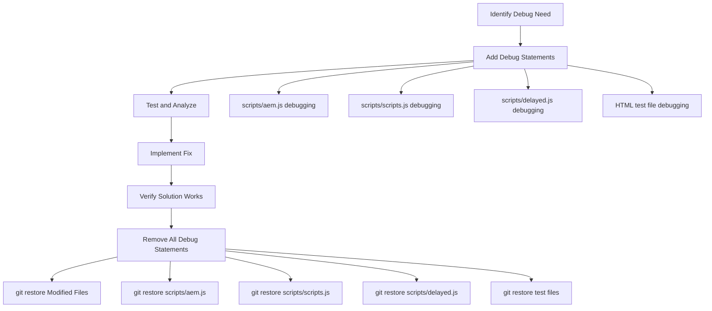

# Block Debugging Guide for AI Assistants

This guide provides step-by-step instructions for AI assistants to debug and test EDS (Edge Delivery Services) blocks using the local development server designed to improve AI assistant workflows.

## Overview

The project includes a local development server (`server.js`) that significantly improves AI assistant effectiveness by enabling testing blocks in isolation while maintaining EDS compatibility. This guide explains how to create test files and debug blocks efficiently.

## Prerequisites

- Node.js installed
- Project server running via `npm run debug`
- Understanding of EDS block structure

## Quick Start

1. **Start the development server:**

   ```bash
   npm run debug
   ```

   Server runs at: `http://localhost:3000`

2. **Create a test file in your block directory:**

   ```bash
   blocks/your-block-name/test.html
   ```

3. **Access your test:**

   ```bash
   http://localhost:3000/blocks/your-block-name/test.html
   ```

## EDS Block Structure

EDS blocks follow a specific structure that must be replicated exactly in test files:

```bash
blocks/block-name/
├── block-name.js          # Block JavaScript (ES module)
├── block-name.css         # Block styles
├── README.md              # Documentation
└── test.html              # Test file (MUST replicate EDS structure)
```

**CRITICAL**: Test files must use the exact same block structure as EDS. The purpose of test files is to replicate the EDS environment locally - there is no alternative structure.

## Creating test.html Files

### Basic Template

```html
<!DOCTYPE html>
<html lang="en">
<head>
    <meta charset="UTF-8">
    <meta name="viewport" content="width=device-width, initial-scale=1.0">
    <title>Block Name Test</title>
    <!-- Link to block CSS -->
    <link rel="stylesheet" href="block-name.css">
    <style>
        /* Optional: Add test-specific styles */
        body {
            font-family: Arial, sans-serif;
            padding: 2rem;
            background: #f5f5f5;
        }
        .test-container {
            max-width: 1200px;
            margin: 0 auto;
            background: white;
            padding: 2rem;
            border-radius: 8px;
            box-shadow: 0 2px 10px rgba(0,0,0,0.1);
        }
    </style>
</head>
<body>
    <div class="test-container">
        <h1>Block Name Test</h1>
        
        <!-- EDS Block Structure (Exact Replication) -->
        <div class="block-name block" data-block-name="block-name" data-block-status="initialized">
            <div>
                <div>
                    <p>Your test content here</p>
                </div>
            </div>
        </div>
        
        <!-- Test Controls (Optional) -->
        <div class="test-controls">
            <button onclick="location.reload()">Reload Test</button>
        </div>
    </div>

    <!-- Block Initialization Script -->
    <script type="module">
        import decorate from './block-name.js';
        
        document.addEventListener('DOMContentLoaded', () => {
            const block = document.querySelector('.block-name.block');
            if (block) {
                decorate(block);
            }
        });
    </script>
</body>
</html>
```

### EDS Block Structure Requirements

**CRITICAL:** Block structure must exactly replicate EDS processing:

- Block container: `.block-name.block` with `data-block-name="block-name"` and `data-block-status="initialized"`
- Content wrapper: Nested `<div><div>content</div></div>` structure
- Content elements: Use semantic HTML (`<p>`, `<h2>`, `<a>`, etc.)
- JavaScript selector: Target `.block-name.block` (not `.block-name-block`)

### Content Structure

EDS blocks expect specific HTML structure. Common patterns:

#### Simple Content Block

```html
<div class="my-block block" data-block-name="my-block" data-block-status="initialized">
    <div>
        <div>
            <p>Single piece of content</p>
        </div>
    </div>
</div>
```

#### Multi-Column Block

```html
<div class="my-block block" data-block-name="my-block" data-block-status="initialized">
    <div>
        <div>
            <p>Column 1 content</p>
        </div>
        <div>
            <p>Column 2 content</p>
        </div>
        <div>
            <p>Column 3 content</p>
        </div>
    </div>
</div>
```

#### Table-Based Block

```html
<div class="my-block block" data-block-name="my-block" data-block-status="initialized">
    <div>
        <div>
            <p>Header 1</p>
        </div>
        <div>
            <p>Header 2</p>
        </div>
    </div>
    <div>
        <div>
            <p>Row 1, Col 1</p>
        </div>
        <div>
            <p>Row 1, Col 2</p>
        </div>
    </div>
    <div>
        <div>
            <p>Row 2, Col 1</p>
        </div>
        <div>
            <p>Row 2, Col 2</p>
        </div>
    </div>
</div>
```

## Testing Workflow for AI Assistants

### Step 1: Analyze the Block

Before creating tests, examine:

- Block JavaScript (`block-name.js`)
- Block CSS (`block-name.css`)
- README.md for usage instructions
- Example files if available

### Step 2: Create Test File

1. **Create `test.html` in the block directory**
2. **Use the basic template above**
3. **Customize the content structure** based on block requirements
4. **Add test-specific content** that exercises block functionality

### Step 3: Start Development Server

```bash
npm run debug
```

Monitor terminal output for:

- Server startup confirmation
- File serving logs
- Error messages

### Step 4: Access and Test

1. **Navigate to:** `http://localhost:3000/blocks/block-name/test.html`
2. **Open browser developer tools**
3. **Check for:**
   - JavaScript errors in console
   - Network requests for assets
   - CSS loading issues
   - Block functionality

### Step 5: Debug Issues

Common debugging steps:

#### JavaScript Errors

- Check console for error messages
- Verify ES module imports
- Ensure block function is exported correctly
- Check for missing dependencies

#### CSS Issues

- Verify CSS file loads (Network tab)
- Check for CSS syntax errors
- Ensure proper class naming
- Test responsive behavior

#### Block Not Initializing

- Verify block container has correct class name
- Check if `decorate` function is called
- Ensure DOM is ready before initialization
- Verify block structure matches expectations

## Advanced Testing Scenarios

### Testing with Multiple Instances

```html
<div class="my-block block" data-block-name="my-block" data-block-status="initialized">
    <div>
        <div>
            <p>Instance 1 content</p>
        </div>
    </div>
</div>

<div class="my-block block" data-block-name="my-block" data-block-status="initialized">
    <div>
        <div>
            <p>Instance 2 content</p>
        </div>
    </div>
</div>

<script type="module">
    import decorate from './my-block.js';
    
    document.addEventListener('DOMContentLoaded', () => {
        const blocks = document.querySelectorAll('.my-block.block');
        blocks.forEach(block => decorate(block));
    });
</script>
```

### Testing with Dynamic Content

```html
<div class="test-controls">
    <button onclick="addContent()">Add Content</button>
    <button onclick="removeContent()">Remove Content</button>
</div>

<div class="my-block block" data-block-name="my-block" data-block-status="initialized" id="test-block">
    <div>
        <div>
            <p>Initial content</p>
        </div>
    </div>
</div>

<script type="module">
    import decorate from './my-block.js';
    
    let contentCount = 1;
    
    window.addContent = function() {
        const block = document.getElementById('test-block');
        const newRow = document.createElement('div');
        newRow.innerHTML = `<div>Dynamic content ${++contentCount}</div>`;
        block.appendChild(newRow);
        
        // Re-decorate if needed
        decorate(block);
    };
    
    window.removeContent = function() {
        const block = document.getElementById('test-block');
        const rows = block.children;
        if (rows.length > 1) {
            rows[rows.length - 1].remove();
        }
    };
    
    document.addEventListener('DOMContentLoaded', () => {
        const block = document.getElementById('test-block');
        decorate(block);
    });
</script>
```

### Testing with External Dependencies

```html
<!-- Include external libraries if block requires them -->
<script src="https://cdn.jsdelivr.net/npm/library@version/dist/library.min.js"></script>

<div class="my-block block" data-block-name="my-block" data-block-status="initialized">
    <div><div>Content requiring external library</div></div>
</div>
```

## Server Behavior

### Local File Priority

- Server serves local files first
- Falls back to proxy (`https://allabout.network`) for missing files
- Enables testing with real remote assets

### MIME Type Support

- `.html` → `text/html`
- `.js` → `application/javascript`
- `.css` → `text/css`
- `.json` → `application/json`
- Images, fonts, and other assets supported

### CORS Headers

- Permissive CORS for development
- No caching for immediate updates

## Debugging Checklist

### Before Testing

- [ ] Block files exist (`.js`, `.css`)
- [ ] Server is running (`npm run debug`)
- [ ] Test file created in correct location
- [ ] Block structure follows EDS conventions

### During Testing

- [ ] Check browser console for errors
- [ ] Verify network requests succeed
- [ ] Test responsive behavior
- [ ] Validate accessibility features
- [ ] Test all interactive elements

### Common Issues

#### Block Not Appearing

1. Check CSS class names match EDS convention
2. Verify CSS file loads correctly
3. Ensure block container exists in DOM
4. Check for JavaScript errors preventing rendering

#### JavaScript Module Errors

1. Verify ES module syntax
2. Check import/export statements
3. Ensure all dependencies are available
4. Validate function calls and variable references

#### Styling Issues

1. Check CSS file path in `<link>` tag
2. Verify CSS selectors match HTML structure
3. Test for CSS conflicts with global styles
4. Check responsive breakpoints

#### Server Issues

1. Restart server if files aren't updating
2. Check terminal for error messages
3. Verify file paths are correct
4. Clear browser cache if needed

## Example: Complete Test File

Here's a complete example for a hypothetical "card" block:

```html
<!DOCTYPE html>
<html lang="en">
<head>
    <meta charset="UTF-8">
    <meta name="viewport" content="width=device-width, initial-scale=1.0">
    <title>Card Block Test</title>
    <link rel="stylesheet" href="card.css">
    <style>
        body {
            font-family: Arial, sans-serif;
            padding: 2rem;
            background: #f5f5f5;
        }
        .test-container {
            max-width: 1200px;
            margin: 0 auto;
            background: white;
            padding: 2rem;
            border-radius: 8px;
            box-shadow: 0 2px 10px rgba(0,0,0,0.1);
        }
        .test-section {
            margin: 2rem 0;
            padding: 1rem;
            border: 1px solid #ddd;
            border-radius: 4px;
        }
    </style>
</head>
<body>
    <div class="test-container">
        <h1>Card Block Test</h1>
        
        <div class="test-section">
            <h2>Single Card</h2>
            <div class="card block" data-block-name="card" data-block-status="initialized">
                <div>
                    <div>
                        <h3>Card Title</h3>
                        <p>Card description text goes here.</p>
                        <p><a href="#test">Learn More</a></p>
                    </div>
                </div>
            </div>
        </div>
        
        <div class="test-section">
            <h2>Multiple Cards</h2>
            <div class="card block" data-block-name="card" data-block-status="initialized">
                <div>
                    <div>
                        <h3>Card 1 Title</h3>
                        <p>First card description.</p>
                        <p><a href="#test1">Link 1</a></p>
                    </div>
                </div>
                <div>
                    <div>
                        <h3>Card 2 Title</h3>
                        <p>Second card description.</p>
                        <p><a href="#test2">Link 2</a></p>
                    </div>
                </div>
                <div>
                    <div>
                        <h3>Card 3 Title</h3>
                        <p>Third card description.</p>
                        <p><a href="#test3">Link 3</a></p>
                    </div>
                </div>
            </div>
        </div>
        
        <div class="test-controls">
            <button onclick="location.reload()">Reload Test</button>
            <button onclick="toggleTheme()">Toggle Theme</button>
        </div>
    </div>

    <script type="module">
        import decorate from './card.js';
        
        document.addEventListener('DOMContentLoaded', () => {
            const blocks = document.querySelectorAll('.card.block');
            blocks.forEach(block => decorate(block));
        });
        
        window.toggleTheme = function() {
            document.body.style.background = 
                document.body.style.background === 'rgb(51, 51, 51)' ? '#f5f5f5' : '#333';
        };
    </script>
</body>
</html>
```

## Best Practices for AI Assistants

1. **Always create test files** when debugging blocks
2. **Follow EDS naming conventions** exactly
3. **Test multiple scenarios** (single/multiple instances, different content)
4. **Check browser console** for errors
5. **Verify responsive behavior** using browser dev tools
6. **Test accessibility** with keyboard navigation
7. **Document test cases** in comments
8. **Use meaningful test content** that exercises block features

## Troubleshooting Server Issues

### Server Won't Start

```bash
# Check if port is in use
lsof -i :3000

# Kill existing process
pkill -f "node server.js"

# Restart server
npm run debug
```

### Files Not Loading

- Verify file paths relative to project root
- Check file permissions
- Monitor server logs for detailed errors
- Clear browser cache

### Proxy Not Working

- Check internet connection
- Verify proxy URL in server configuration
- Review network logs in browser dev tools

## Understanding EDS HTML States: Dual Layout System

### Critical Architectural Distinction for Debugging

EDS operates with a **dual layout system** where HTML undergoes transformation from served to rendered state through [`scripts/aem.js`](scripts/aem.js) and [`scripts/scripts.js`](scripts/scripts.js) processing. This transformation is fundamental to how EDS blocks function.

#### **Served HTML State** (`test2.html`)
- **Raw content** as delivered from CMS/authoring systems
- **Minimal structure** before EDS processing
- **Example**: `<div class="shoelace-card"></div>`
- **Processing**: Awaits transformation by EDS scripts
- **Use case**: Represents what EDS receives from content management

#### **Rendered HTML State** (`test.html`) 
- **Processed content** after EDS scripts transformation
- **Full block structure** with proper attributes and nesting
- **Example**: `<div class="shoelace-card block" data-block-name="shoelace-card" data-block-status="initialized">`
- **Processing**: Final DOM state after EDS processing complete
- **Use case**: Represents final DOM state after EDS processing

#### **HTML Transformation Process**

**CRITICAL**: The served HTML (like [`test2.html`](blocks/shoelace-card/test2.html)) is **perfect as delivered by EDS**. The transformation process automatically converts minimal served HTML into full rendered HTML structure.

The transformation from served to rendered HTML occurs through:

1. **EDS Automatic Structure Creation**:
   - EDS automatically wraps content in proper `div.section > div > div` structure
   - Minimal served HTML: `<div class="shoelace-card"></div>`
   - Gets automatically wrapped to match `div.section > div > div` selector pattern

2. **[`scripts/aem.js`](scripts/aem.js) Processing**:
   - [`decorateBlocks()`](scripts/aem.js:626) - Finds blocks via `div.section > div > div` selector (after auto-wrapping)
   - [`decorateBlock()`](scripts/aem.js:608) - Adds `.block` class and `data-block-*` attributes
   - [`loadBlock()`](scripts/aem.js:687) - Dynamically imports and executes block JavaScript

3. **[`scripts/scripts.js`](scripts/scripts.js) Processing**:
   - [`loadEager()`](scripts/scripts.js:77) - Processes main content and adds `body.appear` class
   - [`decorateMain()`](scripts/scripts.js:77) - Orchestrates block decoration
   - [`loadSection()`](scripts/scripts.js:81) - Handles section-level processing

4. **Component Execution**:
   - Block's `decorate()` function is called with the transformed element
   - Component creates final rendered content</search>

#### **Why This Dual Layout System Matters for Debugging**

The distinction is critical because:
- **EDS processing** transforms minimal HTML into full block structure
- **Block decoration timing** determines when component `decorate()` functions execute
- **Shadow DOM timing** can interfere with EDS's DOM manipulation during transformation
- **Style injection** may occur before or after DOM transformation
- **Race conditions** exist between EDS transformation and custom element registration

#### **Debugging Strategy for Dual Layout System**

**For Served HTML Issues** (`test2.html`):
- Debug EDS block discovery: Does `decorateBlocks()` find the element?
- Debug block decoration: Does `decorateBlock()` add required attributes?
- Debug block loading: Does `loadBlock()` successfully import component?

**For Rendered HTML Issues** (`test.html`):
- Debug component execution: Does the `decorate()` function execute?
- Debug DOM manipulation: Are component changes applied correctly?
- Debug styling: Are styles properly applied to transformed DOM?

#### **Testing Both Layout States**

Create test files for both scenarios:
```bash
blocks/your-block/
├── test.html      # Rendered HTML (EDS-processed structure)
├── test2.html     # Served HTML (raw/minimal structure)
└── your-block.js  # Component logic
```

#### **Common Dual Layout Debugging Patterns**

**Served HTML Debug Pattern**:
```javascript
// In scripts/aem.js - decorateBlocks function
function decorateBlocks(main) {
  const blocks = main.querySelectorAll('div.section > div > div');
  console.log('[DEBUG-EDS] decorateBlocks found:', blocks.length, 'blocks');
  blocks.forEach(decorateBlock);
}
```

**Rendered HTML Debug Pattern**:
```javascript
// In component decorate() function
export default function decorate(block) {
  console.log('[DEBUG-COMPONENT] decorate() called for:', block.className);
  console.log('[DEBUG-COMPONENT] Block attributes:', block.dataset);
  // Component logic here
}
```

## Real-World Debug Case Study: Shoelace Card Shadow DOM Issue

The shoelace-card component demonstrates a critical debugging scenario involving Shadow DOM vs EDS processing race conditions:

### 🔍 **Confirmed Issue: Shadow DOM Visibility Problem**

#### **Symptoms Observed:**
- **✅ Component loads successfully** (console logs show successful processing)
- **✅ Data fetches correctly** (5/5 images preloaded from `/slides/query-index.json`)
- **❌ Content completely invisible** (blank white screen despite successful processing)
- **🔍 DOM timing conflicts** (MutationObserver errors during initialization)

#### **Root Cause Analysis:**
**Shadow DOM vs EDS Processing Race Condition** where:

1. **EDS Processing**: [`scripts/aem.js:decorateBlock()`](scripts/aem.js:608-620) adds `data-block-status="initialized"` to block
2. **Component Processing**: [`build/shoelace-card/shoelace-card.js:decorate()`](build/shoelace-card/shoelace-card.js:1036) clears `innerHTML` 
3. **Shadow DOM Creation**: Component creates Shadow DOM content inside cleared block
4. **Style Isolation**: CSS targeting `[data-block-status="initialized"]` cannot penetrate Shadow DOM boundaries
5. **Result**: Content exists but is invisible due to style isolation

#### **Debugging Evidence:**
```
Console Logs (test2.html):
✅ [shoelace-card] Preloading 5 images...
✅ [shoelace-card] Preloaded 5/5 images successfully  
✅ [shoelace-card] All images preloaded
❌ Visual Result: Completely blank screen
🔍 [DEBUG-TIMING] MutationObserver timing errors
```

#### **Testing Methodology:**
- **Served HTML State**: [`test2.html`](blocks/shoelace-card/test2.html) - minimal `<div class="shoelace-card"></div>`
- **Rendered HTML State**: [`test.html`](blocks/shoelace-card/test.html) - full EDS processed structure
- **Debug Instrumentation**: Comprehensive timing analysis with [`debug-shoelace-timing.js`](debug-shoelace-timing.js)
- **Browser Testing**: Visual confirmation via `http://localhost:3000/blocks/shoelace-card/test2.html`

#### **Fix Implementation:**
**Problem**: [`decorate()`](build/shoelace-card/shoelace-card.js:1040) cleared `innerHTML` without preserving EDS attributes

**Solution Applied**: Preserve and restore EDS attributes after innerHTML clearing
```javascript
// Preserve EDS attributes before clearing innerHTML
const blockStatus = block.getAttribute('data-block-status');
const blockName = block.getAttribute('data-block-name');

// Clear block and add container class
block.innerHTML = '';
block.classList.add('shoelace-card-block');

// Restore EDS attributes to maintain visibility controls
if (blockStatus) {
  block.setAttribute('data-block-status', blockStatus);
  console.warn('[shoelace-card] Preserved data-block-status:', blockStatus);
}
if (blockName) {
  block.setAttribute('data-block-name', blockName);
  console.warn('[shoelace-card] Preserved data-block-name:', blockName);
}
```

**Deployment Process**: 
1. Modified [`build/shoelace-card/shoelace-card.js`](build/shoelace-card/shoelace-card.js)
2. Built and deployed: `cd build/shoelace-card && npm run deploy`
3. Updated [`blocks/shoelace-card/shoelace-card.js`](blocks/shoelace-card/shoelace-card.js) with fix

### ✅ **Previous Successful Testing Results** (for comparison)
- **Component**: Self-contained bundle with all Shoelace dependencies
- **Data Loading**: Successfully fetches from `/slides/query-index.json` via proxy
- **Interactive Features**: Immersive full-screen modals with glassmorphism effects
- **Error Handling**: Graceful 404 handling while maintaining functionality
- **Debug Tools**: Built-in debug helpers and comprehensive logging

### Testing Command Used
```bash
# Start EDS development server
npm run debug

# Access test page
http://localhost:3000/blocks/shoelace-card/test.html
```

### Key Success Factors
1. **Proper EDS Structure**: Used exact block structure with `.shoelace-card.block` class
2. **Self-Contained Testing**: Component includes all dependencies in single file
3. **Proxy Integration**: Server successfully proxied missing assets from allabout.network
4. **Real Data Testing**: Used live data from query endpoints for authentic testing
5. **Interactive Testing**: Successfully tested modal functionality and user interactions

## ⚠️ **CRITICAL: EDS Core Scripts Constraint**

### **DO NOT MODIFY EDS CORE SCRIPTS**

The following files belong to Adobe Edge Delivery Services and **MUST NOT** be modified:

- **[`scripts/scripts.js`](scripts/scripts.js)** - EDS main processing script
- **[`scripts/aem.js`](scripts/aem.js)** - EDS core functionality (Adobe licensed)
- **[`scripts/delayed.js`](scripts/delayed.js)** - EDS delayed loading functionality

### **EDS Body Visibility System**

**How EDS Controls Body Visibility:**
1. **Default State**: [`styles/styles.css`](styles/styles.css) sets `body { display: none; }`
2. **Visibility Trigger**: [`scripts/scripts.js:80`](scripts/scripts.js:80) adds `document.body.classList.add('appear')`
3. **Visible State**: CSS rule `body.appear { display: block; }` makes content visible

**When EDS Adds `appear` Class:**
- **Condition**: When `main` element exists (line 78: `if (main)`)
- **Timing**: During `loadEager()` function execution
- **Location**: [`scripts/scripts.js:80`](scripts/scripts.js:80)

### **Debugging EDS Body Visibility Issues**

**Root Cause Analysis:**
If `body.appear` class is missing, investigate:

1. **EDS Scripts Loading**: Are [`scripts/scripts.js`](scripts/scripts.js) and [`scripts/aem.js`](scripts/aem.js) loading?
2. **Main Element**: Does the HTML contain a `<main>` element?
3. **Script Errors**: Are JavaScript errors preventing EDS completion?
4. **Timing Issues**: Are custom components interfering with EDS lifecycle?

**Fix Locations (EDS Scripts Excluded):**
- ✅ **Component Level**: Add fallback in component's `decorate()` function
- ✅ **Test Files**: Add manual `appear` class in test HTML
- ✅ **Debug Scripts**: Add visibility fix in debugging tools
- ❌ **EDS Scripts**: Cannot modify Adobe's core scripts

### **Component-Level Body Visibility Fix Pattern**

```javascript
// Safe pattern for component decorate() functions
export default async function decorate(block) {
  try {
    // Ensure body visibility for component rendering
    if (!document.body.classList.contains('appear')) {
      console.warn('[component-name] EDS appear class missing, adding for visibility');
      document.body.classList.add('appear');
    }
    
    // ... rest of component logic
  } catch (error) {
    console.error('[component-name] Enhancement failed:', error);
  }
}
```

This pattern ensures components work regardless of EDS script timing or failures while respecting the constraint against modifying EDS core files.

### **🔧 DEBUGGING EXCEPTION: Temporary Debug Statements in EDS Core Scripts**

**IMPORTANT**: While EDS core scripts cannot be permanently modified, **temporary debugging statements** are allowed for troubleshooting purposes.

#### **Allowed Debug Modifications**

You **MAY** add temporary debugging statements to these EDS core files:
- **[`scripts/aem.js`](scripts/aem.js)** - EDS core functionality and block processing
- **[`scripts/scripts.js`](scripts/scripts.js)** - EDS main processing script and lifecycle
- **[`scripts/delayed.js`](scripts/delayed.js)** - EDS delayed loading functionality
- **Served HTML test files** - Any HTML files served by the development server

#### **Debug Statement Requirements**

**✅ ALLOWED Debug Statements:**
```javascript
// DOM inspection and state logging
console.log('[DEBUG-EDS] Block processing state:', blockStatus);
console.log('[DEBUG-EDS] Element count:', elements.length);
console.log('[DEBUG-EDS] Current DOM structure:', element.innerHTML);

// Execution flow tracking
console.group('[DEBUG-EDS] Function: decorateBlocks()');
console.log('[DEBUG-EDS] Processing block:', blockName);
console.groupEnd();

// Variable value inspection
console.log('[DEBUG-EDS] Configuration:', config);
console.log('[DEBUG-EDS] Data loaded:', data);

// Timing and lifecycle tracking
console.time('[DEBUG-EDS] Block decoration time');
console.timeEnd('[DEBUG-EDS] Block decoration time');
```

**❌ FORBIDDEN Modifications:**
```javascript
// DO NOT modify logic or behavior
if (condition) {
  // Adding new conditional logic - FORBIDDEN
}

// DO NOT change function parameters or return values
function decorateBlock(block) {
  // Changing function signature - FORBIDDEN
  return modifiedResult; // Changing return value - FORBIDDEN
}

// DO NOT add new functionality
block.addEventListener('click', handler); // Adding new behavior - FORBIDDEN
```

#### **Debug Statement Guidelines**

1. **Non-Behavioral Only**: Debug statements must NOT alter functionality, logic, or behavior
2. **Visibility Only**: Only provide visibility into execution flow, variable values, and state
3. **Temporary**: Must be removed after debugging session is complete
4. **Prefixed**: Use `[DEBUG-EDS]` prefix for easy identification and removal
5. **Grouped**: Use `console.group()` for organized output

#### **Debug Session Workflow**



#### **Cleanup Process**

After successful debugging and fix implementation:

```bash
# Remove all temporary debug statements
git restore scripts/aem.js
git restore scripts/scripts.js
git restore scripts/delayed.js
git restore blocks/*/test*.html

# Verify clean state
git status
```

#### **Example Debug Session: EDS Block Processing**

**Problem**: Block not initializing properly

**Debug Strategy**: Add logging to EDS block processing pipeline

```javascript
// In scripts/aem.js - decorateBlock function
export function decorateBlock(block) {
  console.log('[DEBUG-EDS] decorateBlock called for:', block.className);
  console.log('[DEBUG-EDS] Block dataset:', block.dataset);
  
  const shortBlockName = block.classList[0];
  console.log('[DEBUG-EDS] Short block name:', shortBlockName);
  
  if (shortBlockName) {
    console.log('[DEBUG-EDS] Setting data-block-name:', shortBlockName);
    block.dataset.blockName = shortBlockName;
    
    console.log('[DEBUG-EDS] Setting data-block-status to initialized');
    block.dataset.blockStatus = 'initialized';
    
    console.log('[DEBUG-EDS] Final block state:', {
      className: block.className,
      dataset: block.dataset,
      children: block.children.length
    });
  }
}
```

**Analysis**: Debug output reveals whether EDS attributes are being set correctly

**Cleanup**: `git restore scripts/aem.js` after fix is implemented

#### **Common Debug Scenarios**

**🔍 Block Processing Issues**
```javascript
// In scripts/aem.js
console.log('[DEBUG-EDS] decorateBlocks processing:', blocks.length, 'blocks');
blocks.forEach(block => {
  console.log('[DEBUG-EDS] Processing block:', block.className, block.dataset);
});
```

**⏱️ Timing and Lifecycle Issues**
```javascript
// In scripts/scripts.js
console.log('[DEBUG-EDS] loadEager starting');
console.time('[DEBUG-EDS] loadEager execution');
await loadEager(doc);
console.timeEnd('[DEBUG-EDS] loadEager execution');
console.log('[DEBUG-EDS] Body appear class added');
```

**📦 Resource Loading Issues**
```javascript
// In scripts/delayed.js
console.log('[DEBUG-EDS] Delayed scripts loading');
console.log('[DEBUG-EDS] Available blocks for lazy loading:', blocks);
```

This debugging capability provides powerful visibility into EDS internal processing while maintaining the constraint that core functionality cannot be permanently altered.

This demonstrates how the local development server enables comprehensive testing of complex EDS components with external dependencies and real data sources.

## 🚀 Deployment and EDS Integration

### Deploy Command Usage

After successful development and testing, use the deploy command to build and deploy components:

```bash
# Navigate to component build directory
cd build/shoelace-card

# Deploy finished built stubs and README to blocks folder
npm run deploy
```

The deploy command:
- **Builds self-contained component** with all dependencies bundled
- **Copies to blocks/ directory** (`../../blocks/shoelace-card/`)
- **Creates stub CSS** (styles bundled in JavaScript for performance)
- **Copies user documentation** as README.md for content authors
- **Prepares production-ready files** for EDS deployment

### EDS Project Integration

To actually use the built system in your EDS project, copy the `blocks/` contents to your own repository:

```bash
# Copy built components to your EDS project
cp -r blocks/shoelace-card /path/to/your/eds-project/blocks/

# Navigate to your EDS project
cd /path/to/your/eds-project

# Add to git and commit
git add blocks/shoelace-card/
git commit -m "Add Shoelace Card component with advanced features"

# Push to your repository
git push origin main
```

### Complete Workflow

1. **Development**: Work in `build/shoelace-card/` with `npm run dev`
2. **Testing**: Use `npm run debug` for EDS compatibility testing
3. **Build & Deploy**: Run `npm run deploy` to create production files
4. **Copy to EDS**: Copy `blocks/shoelace-card/` to your EDS repository
5. **Git Integration**: Commit and push to your EDS project repository

The deploy command handles the technical build process, but final integration requires manual copying to your specific EDS repository to maintain proper version control and deployment workflows.

---

This guide provides comprehensive instructions for AI assistants to effectively debug and test EDS blocks using the local development server designed to improve AI assistant workflows. The server's local-first approach with proxy fallback enables AI assistants to work more efficiently by providing immediate feedback, clear error reporting, and consistent testing patterns. Follow these established patterns for reliable, efficient EDS development that leverages the server's AI assistant-focused design.
