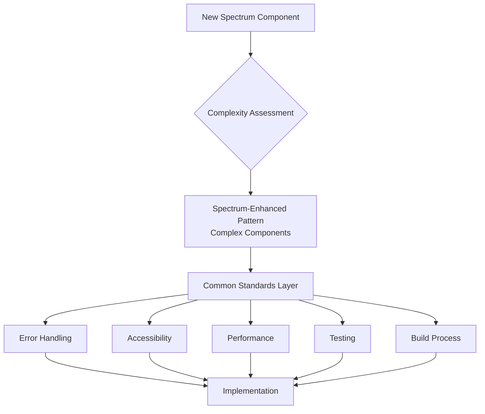

# EDS and Spectrum Architecture Standards Guide

## Executive Summary

This document, created for an AI assistant,  establishes architectural patterns and standards for Spectrum-enhanced block development, focusing on rich UI components, consistent design system integration, and complex state management. These standards ensure components leverage Adobe's Spectrum design system while maintaining compatibility with EDS deployment requirements.

## Architecture Overview



## Spectrum-Enhanced Pattern

### Use When

- External dependencies need bundling
- Complex state management required
- Rich UI components needed
- Consistent design system appearance critical
- Advanced interactions required

### File Structure

```bash
/build/{component-name}/           # Source files for development
├── {component-name}.js           # Source implementation
├── {component-name}.css          # Source styles
├── index.html                    # Development test file
├── package.json                  # Dependencies and build scripts
├── vite.config.js               # Build configuration
└── README.md                     # Development documentation

/blocks/{component-name}/          # Built files for EDS deployment
├── {component-name}.js           # Bundled implementation
├── {component-name}.css          # Processed styles
├── test.html                     # EDS test file
├── README.md                     # Usage documentation
└── example.md                    # Content author examples
```

### Build Process

- Development happens in `/build/{component-name}/`
- `npm run build` bundles dependencies using Vite, from this folder
- Built files are copied to `/blocks/{component-name}/` for EDS deployment
- Use `scripts/build-component.js` for automated building

### Examples

spectrum-card, data tables, complex forms, dashboards, interactive modals

## JavaScript Architecture Standards

### Configuration Constants Pattern

```javascript
const COMPONENT_CONFIG = {
  // Performance settings
  ANIMATION_DURATION: 300,
  DEBOUNCE_DELAY: 250,
  
  // Error handling
  MAX_RETRY_ATTEMPTS: 3,
  TIMEOUT_DURATION: 5000,
  
  // Accessibility
  FOCUS_TRAP_ENABLED: true,
  ARIA_LIVE_REGION: 'polite',
  
  // User messages
  LOADING_MESSAGE: 'Loading content...',
  ERROR_MESSAGE: 'Unable to load content. Please try again.',
  SUCCESS_MESSAGE: 'Content loaded successfully',
  
  // Spectrum-specific settings
  SPECTRUM_THEME: 'light',
  SPECTRUM_SCALE: 'medium',
  SPECTRUM_SYSTEM: 'spectrum',
  
  // Feature flags
  ENABLE_ANALYTICS: true,
  ENABLE_DEBUG_LOGGING: false
};
```

### Standard Decorate Function Structure

```javascript
// Import required Spectrum components at the top
import '@spectrum-web-components/theme/theme-light.js';
import '@spectrum-web-components/theme/scale-medium.js';
import '@spectrum-web-components/theme/sp-theme.js';

export default async function decorate(block) {
  try {
    // 1. Early validation and setup
    if (!block || !block.children.length) {
      throw new Error('Invalid block structure');
    }
    
    // 2. Ensure Spectrum theme is available
    await customElements.whenDefined('sp-theme');
    
    // 3. Configuration and state initialization
    const config = { ...COMPONENT_CONFIG };
    
    // 4. Content extraction
    const content = extractContent(block);
    
    // 5. DOM element creation with Spectrum components
    const container = createSpectrumStructure(content, config);
    
    // 6. Event handlers setup
    setupEventHandlers(container, config);
    
    // 7. Accessibility implementation
    setupAccessibility(container);
    
    // 8. Apply Spectrum styling and behavior
    setupSpectrumComponents(container);
    
    // 9. Replace block content
    block.innerHTML = '';
    block.appendChild(container);
    
    // 10. Return cleanup function (optional)
    return () => cleanup(container);
    
  } catch (error) {
    handleComponentError(error, block);
  }
}
```

## Error Handling Standards

### Standard Error Handling Pattern

```javascript
function handleComponentError(error, block, config = {}) {
  // Log error for debugging
  console.error(`Spectrum Component Error [${block.className}]:`, error);
  
  // Show user-friendly error state with Spectrum styling
  const errorContainer = document.createElement('sp-theme');
  errorContainer.setAttribute('color', 'light');
  errorContainer.setAttribute('scale', 'medium');
  errorContainer.innerHTML = `
    <div class="spectrum-component-error">
      <sp-illustrated-message heading="Something went wrong">
        <svg slot="illustration" viewBox="0 0 150 103" width="150" height="103">
          <!-- Error illustration SVG -->
        </svg>
        <p>${config.ERROR_MESSAGE || 'Unable to load content. Please try again.'}</p>
        <sp-button variant="primary" onclick="location.reload()">Retry</sp-button>
      </sp-illustrated-message>
    </div>
  `;
  
  block.innerHTML = '';
  block.appendChild(errorContainer);
}

// Network request error handling with Spectrum loading states
async function fetchWithRetry(url, options = {}, maxRetries = 3) {
  for (let attempt = 1; attempt <= maxRetries; attempt++) {
    try {
      const response = await fetch(url, {
        ...options,
        signal: AbortSignal.timeout(COMPONENT_CONFIG.TIMEOUT_DURATION)
      });
      
      if (!response.ok) {
        throw new Error(`HTTP ${response.status}: ${response.statusText}`);
      }
      
      return response;
    } catch (error) {
      if (attempt === maxRetries) throw error;
      await new Promise(resolve => setTimeout(resolve, 1000 * attempt));
    }
  }
}
```

## Accessibility Standards

### Required Accessibility Implementation

```javascript
function setupAccessibility(container) {
  // 1. Semantic HTML structure with Spectrum components
  ensureSemanticStructure(container);
  
  // 2. ARIA attributes (many handled by Spectrum components)
  setupAriaAttributes(container);
  
  // 3. Keyboard navigation (enhanced by Spectrum)
  setupKeyboardNavigation(container);
  
  // 4. Focus management with Spectrum focus system
  setupSpectrumFocusManagement(container);
  
  // 5. Screen reader support
  setupScreenReaderSupport(container);
}

function setupSpectrumFocusManagement(container) {
  // Spectrum components handle most focus management automatically
  // Add custom focus handling for non-Spectrum elements
  const customFocusableElements = container.querySelectorAll(
    '[data-custom-focusable]'
  );
  
  customFocusableElements.forEach(element => {
    element.addEventListener('focus', handleCustomFocus);
    element.addEventListener('blur', handleCustomBlur);
  });
}

function setupKeyboardNavigation(container) {
  // Spectrum components provide built-in keyboard navigation
  // Add custom keyboard handling for complex interactions
  container.addEventListener('keydown', (event) => {
    switch (event.key) {
      case 'Escape':
        handleEscapeKey(event, container);
        break;
      case 'F6':
        handleSectionNavigation(event, container);
        break;
      default:
        // Let Spectrum components handle standard navigation
        break;
    }
  });
}
```

## Performance Standards

### Loading States with Spectrum Components

```javascript
function showSpectrumLoadingState(container, message = 'Loading...') {
  const loader = document.createElement('div');
  loader.className = 'spectrum-component-loader';
  loader.innerHTML = `
    <sp-progress-circle indeterminate size="m" aria-label="${message}"></sp-progress-circle>
    <sp-body class="loader-text">${message}</sp-body>
  `;
  
  container.appendChild(loader);
  return loader;
}

function hideLoadingState(loader) {
  if (loader && loader.parentNode) {
    loader.parentNode.removeChild(loader);
  }
}

// Optimized Spectrum component initialization
async function initializeSpectrumComponents(container) {
  // Wait for all Spectrum components to be defined
  const spectrumElements = container.querySelectorAll('[class*="sp-"]');
  const componentPromises = Array.from(spectrumElements).map(element => {
    const tagName = element.tagName.toLowerCase();
    return customElements.whenDefined(tagName);
  });
  
  await Promise.all(componentPromises);
  
  // Apply any custom initialization
  spectrumElements.forEach(element => {
    if (element.initialize && typeof element.initialize === 'function') {
      element.initialize();
    }
  });
}
```

## Spectrum Integration Implementation

### HTML Structure

```html
<sp-theme color="light" scale="medium" system="spectrum">
  <div class="component-name block">
    <div>
      <!-- Spectrum-enhanced content structure -->
    </div>
  </div>
</sp-theme>
```

### Spectrum Component Integration Pattern

```javascript
function createSpectrumStructure(content, config) {
  // Create Spectrum theme wrapper
  const themeWrapper = document.createElement('sp-theme');
  themeWrapper.setAttribute('color', config.SPECTRUM_THEME);
  themeWrapper.setAttribute('scale', config.SPECTRUM_SCALE);
  themeWrapper.setAttribute('system', config.SPECTRUM_SYSTEM);
  
  // Create component container
  const container = document.createElement('div');
  container.className = 'spectrum-component-container';
  
  // Build component structure with Spectrum elements
  const componentContent = buildSpectrumContent(content, config);
  container.appendChild(componentContent);
  
  themeWrapper.appendChild(container);
  return themeWrapper;
}

function buildSpectrumContent(content, config) {
  // Example: Create a card with Spectrum components
  const card = document.createElement('sp-card');
  card.setAttribute('variant', 'standard');
  
  // Add header if present
  if (content.title) {
    const header = document.createElement('div');
    header.slot = 'heading';
    header.innerHTML = `<sp-heading size="M">${content.title}</sp-heading>`;
    card.appendChild(header);
  }
  
  // Add content
  if (content.body) {
    const body = document.createElement('div');
    body.innerHTML = `<sp-body>${content.body}</sp-body>`;
    card.appendChild(body);
  }
  
  // Add actions if present
  if (content.actions && content.actions.length > 0) {
    const actions = document.createElement('div');
    actions.slot = 'actions';
    
    content.actions.forEach(action => {
      const button = document.createElement('sp-button');
      button.setAttribute('variant', action.variant || 'secondary');
      button.textContent = action.text;
      button.addEventListener('click', action.handler);
      actions.appendChild(button);
    });
    
    card.appendChild(actions);
  }
  
  return card;
}
```

### Test File Template

```html
<!DOCTYPE html>
<html lang="en">
<head>
    <meta charset="UTF-8">
    <meta name="viewport" content="width=device-width, initial-scale=1.0">
    <title>[Component] Test - Spectrum Enhanced</title>
    <script type="module">
        import '@spectrum-web-components/theme/theme-light.js';
        import '@spectrum-web-components/theme/scale-medium.js';
        import '@spectrum-web-components/theme/sp-theme.js';
        // Import other required Spectrum components
    </script>
    <style>
        body {
            background: var(--spectrum-gray-100);
            font-family: var(--spectrum-sans-font-family-stack);
            margin: 0;
            padding: 0;
        }
        .test-container {
            max-width: 1200px;
            margin: 0 auto;
            padding: var(--spectrum-spacing-400);
        }
    </style>
</head>
<body>
    <sp-theme color="light" scale="medium" system="spectrum">
        <div class="test-container">
            <sp-heading size="XL">[Component] Test Page</sp-heading>
            
            <div class="[component] block">
                <div>
                    <!-- Test content here -->
                </div>
            </div>
        </div>
    </sp-theme>

    <script type="module">
        import decorate from './[component].js';
        
        document.addEventListener('DOMContentLoaded', () => {
            const blocks = document.querySelectorAll('.[component].block');
            blocks.forEach(decorate);
        });
    </script>
</body>
</html>
```

## CSS Standards

### Spectrum Design Tokens

```css
:root {
  /* Use Spectrum design tokens */
  --component-color-primary: var(--spectrum-blue-600);
  --component-color-secondary: var(--spectrum-blue-500);
  --component-color-background: var(--spectrum-gray-50);
  --component-color-text: var(--spectrum-gray-900);
  --component-color-border: var(--spectrum-gray-300);
  --component-color-error: var(--spectrum-red-600);
  --component-color-success: var(--spectrum-green-600);
  
  /* Spectrum spacing tokens */
  --component-spacing-xs: var(--spectrum-spacing-75);
  --component-spacing-s: var(--spectrum-spacing-100);
  --component-spacing-m: var(--spectrum-spacing-200);
  --component-spacing-l: var(--spectrum-spacing-300);
  --component-spacing-xl: var(--spectrum-spacing-400);
  
  /* Spectrum typography tokens */
  --component-font-family: var(--spectrum-sans-font-family-stack);
  --component-font-weight-normal: var(--spectrum-body-font-weight);
  --component-font-weight-bold: var(--spectrum-heading-font-weight);
  --component-line-height: var(--spectrum-line-height-100);
  
  /* Spectrum UI tokens */
  --component-border-radius: var(--spectrum-corner-radius-100);
  --component-shadow: var(--spectrum-drop-shadow-color-50);
  --component-transition: var(--spectrum-animation-duration-100) var(--spectrum-animation-ease-in-out);
}
```

### Responsive Design with Spectrum

```css
/* Use Spectrum breakpoints */
.spectrum-component-container {
  padding: var(--spectrum-spacing-200);
}

/* Tablet - Spectrum medium breakpoint */
@media (min-width: 768px) {
  .spectrum-component-container {
    padding: var(--spectrum-spacing-300);
  }
}

/* Desktop - Spectrum large breakpoint */
@media (min-width: 1024px) {
  .spectrum-component-container {
    padding: var(--spectrum-spacing-400);
  }
}

/* Large Desktop - Spectrum extra large breakpoint */
@media (min-width: 1280px) {
  .spectrum-component-container {
    max-width: 1200px;
    margin: 0 auto;
  }
}
```

## Build Configuration

### Package.json Template

```json
{
  "name": "spectrum-component-name",
  "version": "1.0.0",
  "type": "module",
  "scripts": {
    "dev": "vite",
    "build": "vite build",
    "preview": "vite preview"
  },
  "dependencies": {
    "@spectrum-web-components/theme": "^0.42.4",
    "@spectrum-web-components/button": "^0.42.4",
    "@spectrum-web-components/card": "^0.42.4"
  },
  "devDependencies": {
    "vite": "^5.0.0"
  }
}
```

### Vite Configuration

```javascript
import { defineConfig } from 'vite';

export default defineConfig({
  build: {
    lib: {
      entry: 'component-name.js',
      name: 'ComponentName',
      fileName: 'component-name',
      formats: ['es']
    },
    rollupOptions: {
      external: [],
      output: {
        assetFileNames: 'component-name.css'
      }
    },
    outDir: '../blocks/component-name',
    emptyOutDir: false
  },
  define: {
    'process.env.NODE_ENV': '"production"'
  }
});
```

## Validation Checklists

### Pre-Development Checklist

- [ ] Spectrum-Enhanced pattern confirmed as appropriate choice
- [ ] Required Spectrum components identified
- [ ] Build process requirements understood
- [ ] Accessibility requirements defined

### Development Checklist

#### JavaScript Implementation

- [ ] Required Spectrum components imported
- [ ] Configuration constants defined with Spectrum settings
- [ ] Standard decorate function signature used
- [ ] customElements.whenDefined() used for timing
- [ ] Error handling implemented with Spectrum error states
- [ ] Loading states use Spectrum progress components
- [ ] Cleanup function provided for complex components

#### Spectrum Integration

- [ ] sp-theme wrapper properly configured
- [ ] Spectrum design tokens utilized in CSS
- [ ] Component integration tested with theme switching
- [ ] Spectrum accessibility features leveraged
- [ ] Custom elements properly initialized
- [ ] Event handling works with Spectrum components

#### Build Configuration checklist

- [ ] Package.json configured with required dependencies
- [ ] Vite configuration optimized for component bundling
- [ ] Build output generates correct file structure
- [ ] Source maps available for debugging
- [ ] Bundle size optimized and analyzed

### Testing Checklist

- [ ] Development test file works in /build/ directory
- [ ] Built component works in /blocks/ directory
- [ ] All Spectrum components render correctly
- [ ] Theme switching works properly
- [ ] Interactive elements respond correctly
- [ ] Error states display with Spectrum styling
- [ ] Loading states use appropriate Spectrum components
- [ ] Cross-browser compatibility verified

### Documentation Checklist

- [ ] Development README.md in /build/ directory
- [ ] Usage README.md in /blocks/ directory
- [ ] example.md created for content authors
- [ ] Spectrum component dependencies documented
- [ ] Build process instructions provided
- [ ] Theme customization options documented

## Best Practices

### Spectrum Component Usage

- Always wrap components in `sp-theme`
- Use Spectrum design tokens instead of custom CSS values
- Leverage built-in Spectrum accessibility features
- Test with different theme configurations
- Follow Spectrum component composition patterns

### Performance Optimization

- Import only required Spectrum components
- Use dynamic imports for large component sets
- Implement proper cleanup for complex components
- Monitor bundle size impact
- Use Spectrum's built-in lazy loading where available

### State Management

- Use Spectrum component state where possible
- Implement proper event handling with Spectrum events
- Maintain state consistency across theme changes
- Handle component lifecycle properly

## Conclusion

Spectrum-Enhanced architecture provides rich, consistent UI components while maintaining compatibility with EDS deployment requirements. By following these standards, developers can create sophisticated components that leverage Adobe's design system while ensuring accessibility, performance, and maintainability.

The build process ensures that complex Spectrum components can be developed efficiently while still being deployable as standard EDS blocks.
