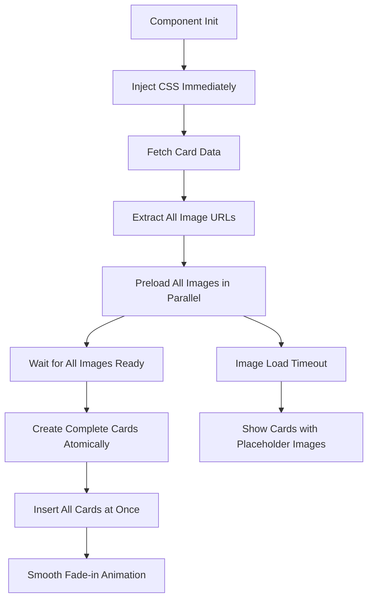

# FOUC Elimination Plan: Image Preloading Focus

## Problem Analysis

The Flash of Unstyled Content (FOUC) in the shoelace-card component manifests as:
- Text content appears immediately
- Images load slowly and progressively
- Cards "build up" visually, creating jarring user experience
- Layout shifts as images load and render

## Solution Strategy: Image Preloading Priority

### Core Approach
Focus on **image preloading** as the primary solution to prevent slow image loading that causes the progressive build-up effect.



## Implementation Plan

### Phase 1: Image Preloading Infrastructure

#### 1.1 Create Image Preloader Utility
```javascript
// Utility function to preload a single image
async function preloadImage(src, timeout = 5000) {
  return new Promise((resolve, reject) => {
    const img = new Image();
    const timer = setTimeout(() => {
      reject(new Error(`Image load timeout: ${src}`));
    }, timeout);
    
    img.onload = () => {
      clearTimeout(timer);
      resolve(img);
    };
    
    img.onerror = () => {
      clearTimeout(timer);
      reject(new Error(`Image load failed: ${src}`));
    };
    
    img.src = src;
  });
}
```

#### 1.2 Batch Image Preloader
```javascript
// Preload all card images in parallel
async function preloadAllImages(cardData, timeout = 5000) {
  const imageUrls = cardData
    .map(card => card.image)
    .filter(Boolean);
    
  const preloadPromises = imageUrls.map(url => 
    preloadImage(url, timeout).catch(error => {
      console.warn(`Failed to preload image: ${url}`, error);
      return null; // Return null for failed images
    })
  );
  
  return Promise.all(preloadPromises);
}
```

### Phase 2: Modified Component Loading Flow

#### 2.1 Enhanced generateCards Function
```javascript
async function generateCards(block, cardData) {
  if (!cardData || cardData.length === 0) {
    block.innerHTML = '<p class="shoelace-card-empty">No cards available.</p>';
    return;
  }
  
  // Show loading state
  block.classList.add('loading');
  
  try {
    // Preload all images first
    console.log('[shoelace-card] Preloading images...');
    await preloadAllImages(cardData);
    console.log('[shoelace-card] All images preloaded');
    
    // Create container and all cards
    const container = createCardContainer();
    const fragment = document.createDocumentFragment();
    
    // Build all cards with preloaded images
    cardData.forEach((data, index) => {
      const card = createShoelaceCard(data, index + 1);
      fragment.appendChild(card);
    });
    
    container.appendChild(fragment);
    
    // Atomic replacement
    block.innerHTML = '';
    block.appendChild(container);
    block.classList.remove('loading');
    
    // Trigger fade-in animation
    requestAnimationFrame(() => {
      container.classList.add('loaded');
    });
    
    attachCardEventListeners(block);
    
  } catch (error) {
    console.error('[shoelace-card] Image preloading failed:', error);
    // Fallback to progressive loading
    generateCardsProgressive(block, cardData);
  }
}
```

### Phase 3: CSS Enhancements

#### 3.1 Loading States
```css
/* Loading state for the entire block */
.shoelace-card-block.loading {
  opacity: 0.7;
  pointer-events: none;
  position: relative;
}

.shoelace-card-block.loading::after {
  content: '';
  position: absolute;
  top: 50%;
  left: 50%;
  width: 2rem;
  height: 2rem;
  margin: -1rem 0 0 -1rem;
  border: 2px solid var(--sl-color-neutral-300);
  border-top-color: var(--sl-color-primary-600);
  border-radius: 50%;
  animation: spin 1s linear infinite;
  z-index: 10;
}
```

#### 3.2 Smooth Transitions
```css
/* Container starts hidden, fades in when loaded */
.shoelace-card-container {
  opacity: 0;
  transform: translateY(10px);
  transition: opacity 0.4s ease-out, transform 0.4s ease-out;
}

.shoelace-card-container.loaded {
  opacity: 1;
  transform: translateY(0);
}

/* Individual cards with staggered animation */
.shoelace-card-item {
  opacity: 0;
  transform: translateY(20px);
  transition: opacity 0.3s ease-out, transform 0.3s ease-out;
}

.shoelace-card-container.loaded .shoelace-card-item {
  opacity: 1;
  transform: translateY(0);
}

/* Staggered delay for each card */
.shoelace-card-container.loaded .shoelace-card-item:nth-child(1) { transition-delay: 0.1s; }
.shoelace-card-container.loaded .shoelace-card-item:nth-child(2) { transition-delay: 0.2s; }
.shoelace-card-container.loaded .shoelace-card-item:nth-child(3) { transition-delay: 0.3s; }
.shoelace-card-container.loaded .shoelace-card-item:nth-child(4) { transition-delay: 0.4s; }
.shoelace-card-container.loaded .shoelace-card-item:nth-child(5) { transition-delay: 0.5s; }
```

### Phase 4: Error Handling & Fallbacks

#### 4.1 Progressive Fallback
```javascript
// Fallback function for when preloading fails
function generateCardsProgressive(block, cardData) {
  console.log('[shoelace-card] Using progressive loading fallback');
  
  const container = createCardContainer();
  
  cardData.forEach((data, index) => {
    const card = createShoelaceCard(data, index + 1);
    container.appendChild(card);
  });
  
  block.innerHTML = '';
  block.appendChild(container);
  block.classList.remove('loading');
  
  attachCardEventListeners(block);
}
```

#### 4.2 Image Error Handling
```javascript
// Enhanced image creation with error handling
function createCardImage(imageSrc, title) {
  if (!imageSrc) return null;
  
  const img = document.createElement('img');
  img.slot = 'image';
  img.src = imageSrc;
  img.alt = title || 'Card image';
  img.loading = 'lazy'; // Keep as fallback
  
  // Add error handling
  img.onerror = () => {
    img.src = 'data:image/svg+xml;base64,PHN2ZyB3aWR0aD0iNDAwIiBoZWlnaHQ9IjIwMCIgeG1sbnM9Imh0dHA6Ly93d3cudzMub3JnLzIwMDAvc3ZnIj48cmVjdCB3aWR0aD0iMTAwJSIgaGVpZ2h0PSIxMDAlIiBmaWxsPSIjZGRkIi8+PHRleHQgeD0iNTAlIiB5PSI1MCUiIGZvbnQtZmFtaWx5PSJBcmlhbCIgZm9udC1zaXplPSIxNCIgZmlsbD0iIzk5OSIgdGV4dC1hbmNob3I9Im1pZGRsZSIgZHk9Ii4zZW0iPkltYWdlIE5vdCBGb3VuZDwvdGV4dD48L3N2Zz4=';
    img.alt = 'Image not found';
  };
  
  return img;
}
```

## Performance Optimizations

### 1. Parallel Loading
- All images load simultaneously using `Promise.all()`
- No sequential loading delays
- Maximum network utilization

### 2. Timeout Management
- 5-second timeout for image loading
- Graceful fallback to progressive loading
- Prevents indefinite loading states

### 3. Memory Efficiency
- Use `DocumentFragment` for DOM assembly
- Single DOM insertion operation
- Minimal layout thrashing

### 4. Network Optimization
- Respect existing `loading="lazy"` as fallback
- Implement reasonable timeouts
- Graceful degradation for slow networks

## Expected Results

✅ **Eliminated FOUC**: No progressive text/image building
✅ **Smooth Loading**: Professional loading states with spinner
✅ **Fast Perceived Performance**: All content appears simultaneously
✅ **Reliable Fallbacks**: Graceful handling of failed/slow images
✅ **Maintained Accessibility**: Proper loading states and alt text
✅ **Network Resilient**: Timeout handling for slow connections

## Implementation Priority

1. **High Priority**: Image preloading infrastructure
2. **High Priority**: Modified generateCards with preloading
3. **Medium Priority**: CSS loading states and transitions
4. **Medium Priority**: Error handling and fallbacks
5. **Low Priority**: Performance optimizations and polish

This focused approach addresses the core FOUC issue by ensuring all images are ready before any content is displayed, eliminating the progressive build-up effect.
