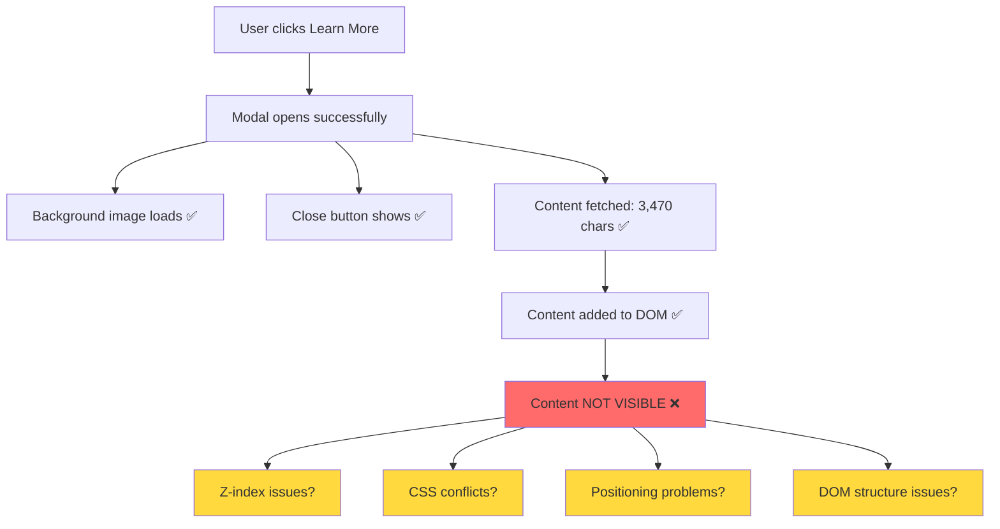
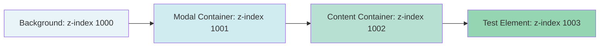
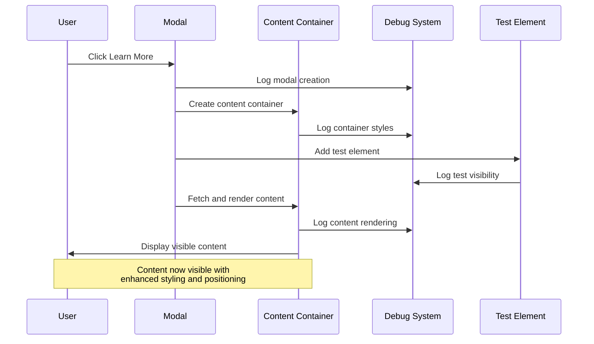
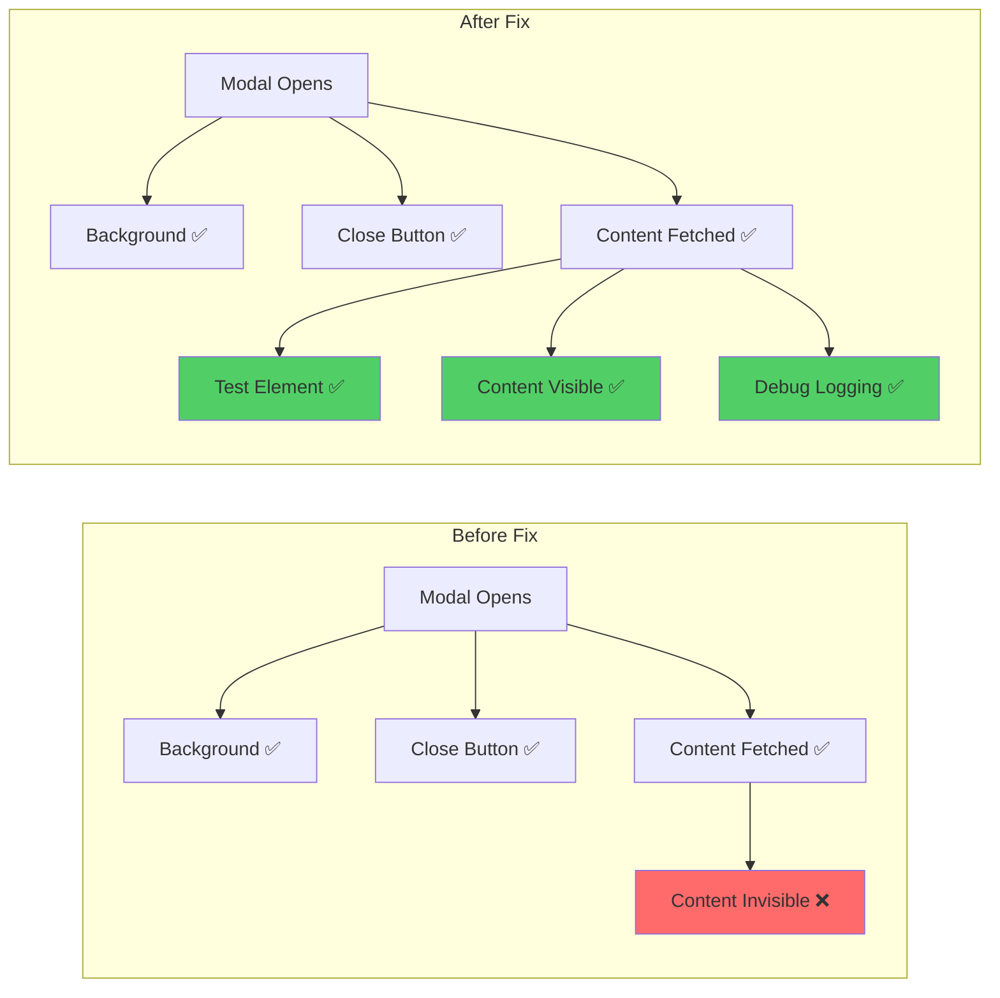

# Modal Content Visibility Fix - Architecture Diagram

## Current Problem Flow

## Solution Architecture

```mermaid
flowchart TD
    A[Enhanced Content Rendering] --> B[Phase 1: Debug Logging]
    A --> C[Phase 2: Container Fixes]
    A --> D[Phase 3: Text Styling]
    A --> E[Phase 4: Test Element]
    A --> F[Phase 5: Modal Container]
    A --> G[Phase 6: Error Handling]
    
    B --> B1[Log content container]
    B --> B2[Log DOM structure]
    B --> B3[Log computed styles]
    
    C --> C1[Z-index: 1002 !important]
    C --> C2[Position: relative !important]
    C --> C3[Background: rgba 0,0,0,0.85]
    C --> C4[Backdrop-filter: blur 5px]
    
    D --> D1[Color: white !important]
    D --> D2[Text-shadow for contrast]
    D --> D3[Element-specific styling]
    
    E --> E1[Red/Yellow test element]
    E --> E2[Z-index: 1003 !important]
    E --> E3[Verify container works]
    
    F --> F1[Modal content z-index: 1001]
    F --> F2[Overflow: visible]
    F --> F3[Min-height: 200px]
    
    G --> G1[Visible error messages]
    G --> G2[Debug information display]
    G --> G3[High contrast error styling]
    
    style A fill:#4ecdc4
    style B fill:#45b7d1
    style C fill:#96ceb4
    style D fill:#feca57
    style E fill:#ff9ff3
    style F fill:#54a0ff
    style G fill:#ff6b6b
```

## Z-Index Layer Strategy

## Implementation Flow

## Before vs After Comparison

This architecture ensures comprehensive coverage of all potential visibility issues while providing extensive debugging capabilities.
