# Modal Spinner Loading Issue - Fix Implementation Plan

## Problem Statement
The spinner in the shoelace-card modal appears when opening but never disappears, leaving users stuck in a loading state instead of showing the actual content.

## Root Cause Analysis

### Current Flow

```mermaid
flowchart TD
    A[User clicks Learn More] --> B[Modal opens]
    B --> C[Spinner created and shown]
    C --> D[fetchPlainHtml called]
    D --> E{Content fetch successful?}
    E -->|Yes| F[Content should replace spinner]
    E -->|No| G[Error should replace spinner]
    F --> H[✅ Content displayed]
    G --> I[✅ Error displayed]
    
    J[🐛 ACTUAL BUG] --> K[Spinner never gets replaced]
    K --> L[User sees infinite loading]
```


### Potential Failure Points
1. **Network Issues**: `.plain.html` files not accessible
2. **Fetch Failures**: Silent failures in `fetchPlainHtml()`
3. **DOM Replacement**: `modalContent.appendChild()` not executing
4. **Async Timing**: Race conditions in content loading
5. **Error Handling**: Exceptions preventing spinner replacement

## Implementation Plan

### Phase 1: Enhanced Debugging & Monitoring

#### 1.1 Add Comprehensive Logging
```javascript
// Enhanced debug logging throughout modal lifecycle
function debugLog(stage, message, data = null) {
  if (DEBUG_MODE) {
    console.log(`[MODAL-${stage}] ${message}`, data || '');
  }
}
```

#### 1.2 Network Request Monitoring
```javascript
// Track all fetch operations with detailed logging
// Monitor response status, timing, and content
// Log any network failures or timeouts
```

#### 1.3 DOM State Tracking
```javascript
// Monitor spinner creation, content replacement, and cleanup
// Track modalContent children changes
// Verify DOM manipulation success
```

### Phase 2: Robust Content Loading

#### 2.1 Enhanced fetchPlainHtml Function
```javascript
async function fetchPlainHtml(path) {
  debugLog('FETCH', `Starting fetch for: ${path}`);
  
  try {
    const url = `${path}.plain.html`;
    const controller = new AbortController();
    const timeoutId = setTimeout(() => controller.abort(), 10000); // 10s timeout
    
    const response = await fetch(url, {
      mode: 'cors',
      headers: { 'Accept': 'text/html' },
      signal: controller.signal
    });
    
    clearTimeout(timeoutId);
    
    if (!response.ok) {
      throw new Error(`HTTP ${response.status}: ${response.statusText}`);
    }
    
    const html = await response.text();
    debugLog('FETCH', 'Content loaded successfully', { size: html.length });
    return html;
    
  } catch (error) {
    debugLog('FETCH', 'Fetch failed', error);
    throw error;
  }
}
```

#### 2.2 Guaranteed Spinner Replacement
```javascript
async function loadModalContent(modalContent, contentPath) {
  debugLog('CONTENT', 'Starting content load process');
  
  try {
    // Ensure spinner exists
    const spinner = modalContent.querySelector('.shoelace-card-modal-loading');
    if (!spinner) {
      debugLog('CONTENT', 'WARNING: No spinner found to replace');
    }
    
    // Fetch content with timeout
    const htmlContent = await fetchPlainHtml(contentPath);
    
    if (htmlContent) {
      // Create content container
      const contentDiv = createContentContainer(htmlContent);
      
      // Replace spinner with content
      modalContent.innerHTML = ''; // Clear all content including spinner
      modalContent.appendChild(contentDiv);
      
      debugLog('CONTENT', 'Content successfully replaced spinner');
    } else {
      throw new Error('Empty content received');
    }
    
  } catch (error) {
    debugLog('CONTENT', 'Content loading failed, showing error', error);
    
    // Always replace spinner with error message
    modalContent.innerHTML = createErrorContent(contentPath, error);
  }
}
```

### Phase 3: Fallback & Recovery Mechanisms

#### 3.1 Timeout Protection
```javascript
// Implement maximum loading time before showing fallback
const LOADING_TIMEOUT = 8000; // 8 seconds max

setTimeout(() => {
  const spinner = modalContent.querySelector('.shoelace-card-modal-loading');
  if (spinner) {
    debugLog('TIMEOUT', 'Loading timeout reached, showing fallback');
    showTimeoutFallback(modalContent, contentPath);
  }
}, LOADING_TIMEOUT);
```

#### 3.2 Retry Mechanism
```javascript
async function fetchWithRetry(path, maxRetries = 2) {
  for (let attempt = 1; attempt <= maxRetries; attempt++) {
    try {
      debugLog('RETRY', `Attempt ${attempt}/${maxRetries} for ${path}`);
      return await fetchPlainHtml(path);
    } catch (error) {
      if (attempt === maxRetries) throw error;
      await new Promise(resolve => setTimeout(resolve, 1000 * attempt));
    }
  }
}
```

#### 3.3 Graceful Error Handling
```javascript
function createErrorContent(contentPath, error) {
  return `
    <div class="shoelace-card-modal-error">
      <h2>⚠️ Content Loading Error</h2>
      <p>Failed to load content from: <code>${contentPath}.plain.html</code></p>
      <p>Error: ${error.message}</p>
      <button onclick="location.reload()" class="retry-button">
        🔄 Retry
      </button>
    </div>
  `;
}
```

### Phase 4: Testing & Validation

#### 4.1 Test Scenarios
- ✅ Normal content loading
- ✅ Network failures (404, 500, timeout)
- ✅ Malformed content
- ✅ Very slow responses
- ✅ Multiple rapid modal opens
- ✅ Browser compatibility

#### 4.2 Success Criteria
- Spinner NEVER remains visible indefinitely
- Users always see either content or clear error message
- Loading states are responsive and informative
- Error recovery options are available

## File Changes Required

### Primary Files
1. **`build/shoelace-card/shoelace-card.js`**
   - Enhanced `fetchPlainHtml()` function
   - Improved `openImmersiveModal()` content loading
   - Added timeout and retry mechanisms
   - Comprehensive error handling

2. **`build/shoelace-card/shoelace-card.css`**
   - Error state styling
   - Loading timeout styling
   - Improved spinner positioning

### Implementation Order
1. Add enhanced debugging and logging
2. Implement robust content loading with timeouts
3. Add comprehensive error handling
4. Test all scenarios thoroughly
5. Clean up debug code for production

## Success Metrics
- 🎯 Zero instances of infinite spinner loading
- 🎯 Clear error messages for all failure cases
- 🎯 Maximum 8-second loading time before fallback
- 🎯 Graceful degradation for network issues
- 🎯 Improved user experience and reliability

This plan ensures the modal spinner issue is completely resolved with robust error handling and user-friendly fallbacks.
