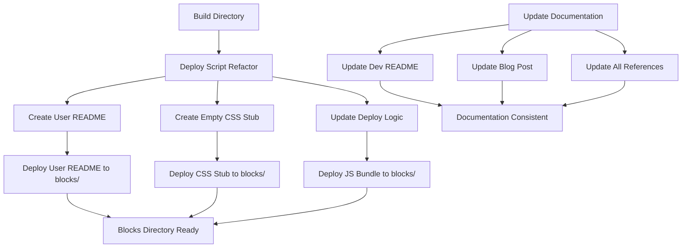

# Shoelace Card Deploy Script Refactor & Documentation Update Plan

## Overview

This plan addresses the refactoring of the [`build/shoelace-card/deploy.js`](build/shoelace-card/deploy.js) script and updates all related documentation to fix current issues and improve maintainability.

## Current Problems Identified

1. **Obsolete Code Transformation Logic**: Deploy script tries to remove/replace `loadCSS` and `loadScript` functions that don't exist in the current build architecture
2. **Wrong README Deployment**: Development-focused README is being deployed instead of user-focused documentation
3. **CSS Deployment Confusion**: Vite bundles CSS into JS, but deploy script tries to copy separate CSS file
4. **Documentation Inconsistencies**: References and cross-links across multiple documentation files are outdated

## Solution Architecture



## Implementation Plan

### Phase 1: File Reorganization in Build Directory

#### 1.1 Create CSS Stub File
**File**: `build/shoelace-card/shoelace-card-stub.css`
**Content**: 
```css
/* CSS bundled with JavaScript - not required */
```
**Purpose**: Satisfies EDS expectations for CSS file while explaining the bundled approach

#### 1.2 Rename Development README
**Action**: `build/shoelace-card/README.md` → `build/shoelace-card/DEV-README.md`
**Purpose**: Clearly identifies development-focused documentation

#### 1.3 Create User-Focused README
**Action**: Copy `blocks/shoelace-card/README.md` → `build/shoelace-card/USER-README.md`
**Purpose**: Provides user-focused documentation for deployment

### Phase 2: Deploy Script Refactoring

#### 2.1 Update Configuration
**Current**:
```javascript
filesToDeploy: [
  { source: 'shoelace-card.js', target: 'shoelace-card.js' },
  { source: 'shoelace-card.css', target: 'shoelace-card.css' },
  { source: 'README.md', target: 'README.md' }
]
```

**New**:
```javascript
filesToDeploy: [
  { source: 'shoelace-card.js', target: 'shoelace-card.js' },
  { source: 'shoelace-card-stub.css', target: 'shoelace-card.css' },
  { source: 'USER-README.md', target: 'README.md' }
]
```

#### 2.2 Remove Obsolete Functions
- **Remove**: `updateRelativePaths()` function entirely
- **Remove**: Regex patterns for `loadCSS`/`loadScript` transformation
- **Remove**: All code transformation logic

#### 2.3 Simplify Deployment Process
- Keep file validation logic
- Keep directory creation logic  
- Keep deployment summary reporting
- Remove all code modification steps

### Phase 3: Documentation Updates

#### 3.1 Update Blog Post (`shoelace-card-blog.md`)
**Changes Required**:
- Fix all `spectrum-card` → `shoelace-card` references
- Update build script descriptions to reflect new approach
- Clarify CSS bundling approach (Vite inline bundling)
- Update deployment process documentation
- Fix any outdated technical details

#### 3.2 Update Cross-References
**Files to Check**:
- `build/shoelace-card/DEV-README.md` (renamed file)
- Any other documentation files with links
- Package.json scripts if they reference documentation

**Actions**:
- Fix broken links between documentation files
- Update references to reflect new file structure
- Ensure consistency across all documentation

### Phase 4: Final File Structure

```
build/shoelace-card/
├── shoelace-card.js              # Bundled component (unchanged)
├── shoelace-card-stub.css        # NEW: CSS stub with comment
├── DEV-README.md                 # RENAMED: Development documentation
├── USER-README.md                # NEW: User-focused documentation
├── deploy.js                     # REFACTORED: Simplified deployment
├── package.json                  # Unchanged
├── vite.config.js               # Unchanged
└── index.html                   # Unchanged

blocks/shoelace-card/
├── shoelace-card.js             # Deployed bundle
├── shoelace-card.css            # Deployed CSS stub
├── README.md                    # Deployed user documentation
└── test.html                    # Preserved existing file
```

### Phase 5: Implementation Steps

1. **Create CSS Stub File**
   - Create `build/shoelace-card/shoelace-card-stub.css`
   - Add comment explaining CSS is bundled

2. **Reorganize README Files**
   - Rename `build/shoelace-card/README.md` to `DEV-README.md`
   - Copy `blocks/shoelace-card/README.md` to `build/shoelace-card/USER-README.md`

3. **Refactor Deploy Script**
   - Update `filesToDeploy` configuration
   - Remove `updateRelativePaths()` function
   - Remove all regex transformation patterns
   - Simplify to pure file copying operations

4. **Update Blog Post**
   - Fix spectrum-card references throughout
   - Update deployment process descriptions
   - Clarify CSS bundling approach
   - Correct any technical inaccuracies

5. **Fix Cross-References**
   - Update links in DEV-README.md
   - Fix any other broken documentation links
   - Ensure all references point to correct files

### Phase 6: Validation Steps

1. **Test Deploy Script**
   - Run `node deploy.js` from build directory
   - Verify no errors occur
   - Check that correct files are copied to blocks directory
   - Confirm no code transformation happens

2. **Validate Documentation**
   - Check all links work correctly
   - Verify user documentation is clear and actionable
   - Ensure development documentation is complete
   - Test that blog post references are accurate

3. **Verify File Structure**
   - Confirm blocks directory has correct files
   - Check that CSS stub is deployed correctly
   - Validate README deployment works as expected

## Expected Benefits

### Technical Benefits
- **Simplified Deploy Process**: Removes unnecessary complexity
- **Accurate CSS Handling**: Acknowledges bundled CSS approach
- **Maintainable Architecture**: Easier to understand and modify
- **EDS Compatibility**: CSS stub satisfies EDS file expectations

### Documentation Benefits
- **Clear Separation**: User vs developer documentation clearly distinguished
- **Consistent References**: All cross-links work correctly
- **Accurate Information**: Technical details match actual implementation
- **Better User Experience**: User-focused docs are more actionable

### Development Benefits
- **Reduced Confusion**: Deploy script does what it says
- **Faster Deployment**: No unnecessary processing steps
- **Better Debugging**: Simpler logic is easier to troubleshoot
- **Future-Proof**: Architecture supports easy modifications

## Success Criteria

- [ ] Deploy script runs without errors
- [ ] Correct files deployed to blocks directory
- [ ] No code transformation occurs during deployment
- [ ] User documentation is clear and actionable
- [ ] Development documentation is comprehensive
- [ ] All cross-references work correctly
- [ ] Blog post accurately reflects current implementation
- [ ] CSS stub properly explains bundled approach

## Risk Mitigation

- **Backup Current Files**: Before making changes, ensure all current files are backed up
- **Test Incrementally**: Test each phase before proceeding to the next
- **Validate Links**: Check all documentation links after updates
- **Review Content**: Ensure no important information is lost during reorganization

This plan provides a comprehensive approach to fixing the current issues while improving the overall maintainability and clarity of the shoelace-card component deployment and documentation system.
